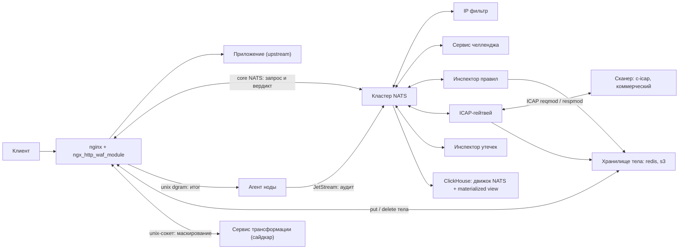
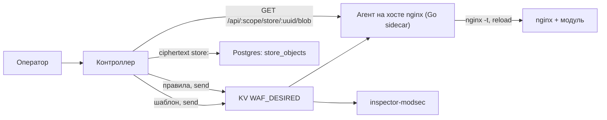
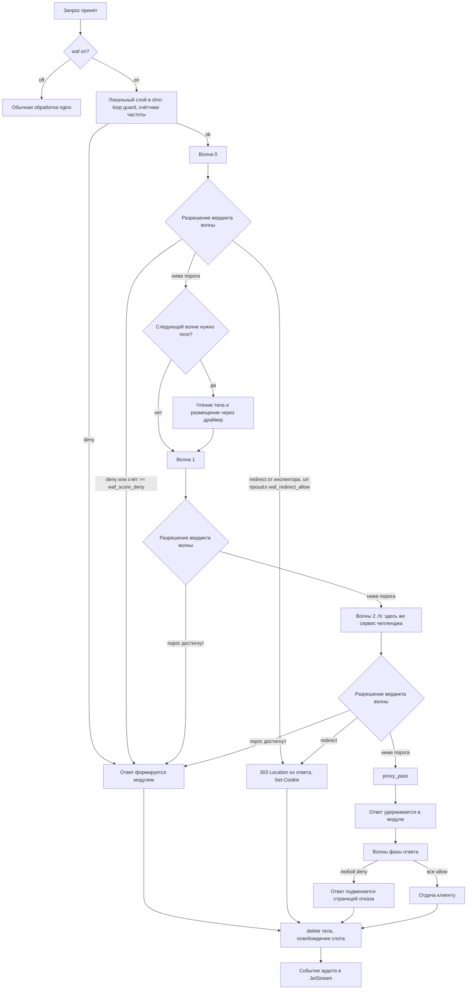

# Архитектура

## Компоненты



Плоскость управления к горячему пути не подмешивается: оператор работает с контроллером,
чувствительные файлы лежат ciphertext в Postgres, на хосте nginx их собирает агент.



Модуль — единственный компонент, который знает про фазы nginx, буферы и дедлайны. Инспекторы знают
только протокол сообщений и, при необходимости, способ получить тело по локатору. Ни один инспектор
не обращается к nginx напрямую. Контроллер тоже: он не ходит в воркеры и не кладёт PEM в шаблон.
Раскатка шаблона nginx — [config-distribution.md](config-distribution.md).
Правила инспектора — [inspector-config-distribution.md](inspector-config-distribution.md).

Сервис трансформации стоит отдельно от инспекторов: он не голосует, а преобразует тело перед
размещением. Основное применение — маскирование, чтобы приватные данные не попадали в контур WAF
вообще. Он необязателен и подключается отдельной директивой, см.
[body-transform.md](body-transform.md).

## Поток запроса



Четыре свойства этого потока стоит отметить отдельно.

Решение о пропуске и отказе принимается модулем, а не инспектором. Инспектор либо утверждает факт
(`deny`), либо оценивает подозрительность числом (`score`); порог, при котором сумма оценок становится
блокировкой, живёт в конфигурации маршрута. Это позволяет менять политику на отдельном location, не
трогая ни один сервис детекта, и видеть её целиком в одном месте. Модель — в
[verdict-protocol.md](verdict-protocol.md#скоринг).

Ровно одно решение модулю не принадлежит — челлендж. Из накопленного счёта он выводит только отказ, а
требование доказать, что клиент человек, приходит готовым вердиктом `redirect` от сервиса, который
челлендж и ведёт: только тот знает, доступна ли проверка, сколько попыток клиент потратил и на какой
адрес его вести. Модуль оставляет за собой границу — `waf_redirect_allow` маршрута — и порядок
ступеней, в котором отказ стоит выше редиректа. Отсутствие такого сервиса на маршруте ничем не
отличается от отсутствия любого другого инспектора: волна не публикуется, редиректов не возникает.

Тело читается настолько поздно, насколько возможно — только когда его требует очередная волна. Для
заблокированного на волне 0 запроса тело не читается ни в память, ни в хранилище. Если модуль
отвечает, не прочитав тело, он обязан вызвать `ngx_http_discard_request_body()`, иначе keepalive-
соединение рассинхронизируется.

Ответ удерживается в модуле всегда, когда включены инспекторы фазы ответа. Иначе заблокировать его
невозможно: после отправки заголовков решение уже не изменить. Отсюда обязательный лимит буфера и
явный список исключений для стриминга.

Событие аудита публикуется после разрешения вердикта и никогда не входит в набор ожидания.

## Два класса инспекторов

Инспекторы разделяются по тому, что именно движется по сети.

**Решающие** получают описание запроса и возвращают вердикт — факт или оценку. Стоимость —
round-trip на каждый запрос. Сюда относятся разбор правил, ICAP, DLP, репутация, сервис челленджа.

**Поставщики данных** ничего не решают по запросу: они публикуют состояние, а решение принимается
локально в модуле по данным в разделяемой памяти. Стоимость — ноль сетевых операций в горячем пути.
Сюда естественно ложатся списки адресов и сетей, гео-таблицы, наборы шаблонов User-Agent, пороги
лимитов, секреты для проверки подписей.

В текущей конфигурации проекта IP фильтр реализован как решающий, то есть с
round-trip на каждый запрос. Это осознанное решение, у него есть цена, которую нужно учитывать при
сайзинге: сервис адреса обслуживает полный RPS всего флота, а каждый клиентский запрос порождает
минимум четыре сообщения на шине. Из этого следуют два требования.

Первое: волна 0 должна быть минимальной по составу, потому что именно она видит весь трафик,
включая мусорный.

Второе: перед волной 0 обязателен локальный слой в разделяемой памяти. Он не заменяет инспектора, а
режет то, что не должно доходить даже до шины: явный флуд по частоте, адреса из локальных наборов,
запросы с известным маркером. Исход здесь только «пропустить» или «отказать» — увести клиента на
челлендж локальный слой не может, потому что решает про челлендж сервис. Без этого слоя шина сама
становится целью атаки, потому что усиливает один клиентский запрос в четыре и более внутренних.

Модель поставщика данных остаётся в проекте как способ вынести часть решений в локальный слой
позже, без изменения протокола: инспектор просто начинает публиковать снапшот и дельты в поток
JetStream, а модуль применяет их в свою shm-зону. Подробности в
[inspectors.md](inspectors.md#поставщик-данных).

## Модель воркеров

Модуль работает в каждом рабочем процессе nginx независимо, сколько бы их ни было. Из этого
вытекает три требования.

**Идентичность инбокса.** Каждый воркер держит своё соединение с шиной и свою подписку на инбокс
ответов. Имя инбокса должно быть уникально не только между воркерами, но и между поколениями
конфигурации: при `reload` старые и новые воркеры какое-то время живут одновременно, и номера слотов
у них совпадают. В имя входят идентификатор узла, pid и случайный nonce процесса:

```
_INBOX.waf.<node_id>.<pid>.<nonce>
```

Инбокс разделён на ветки по назначению, и каждая ветка — своя подписка:

```
<inbox>.v.<request_id>.<inspector>   вердикт инспектора
<inbox>.js.<n>                       ответ keeper на снапшот или хвост набора n
```

Вердикты и ответы keeper покрыты шаблонами `<inbox>.v.>` и `<inbox>.js.>`: адрес вердикта известен
только в момент публикации, и подписываться на каждый запрос отдельно было бы дороже самой доставки.
Дельты и тики наборов приходят не в инбокс, а подпиской на subject набора `waf.sets.<имя>`
([keeper.md](https://github.com/exemt/placitum-keeper/blob/develop/docs/spec.md)); род сообщения определяется идентификатором подписки, и только вердикт
разбирается по адресу — номер инспектора отдельным токеном нужен для случая «нет подписчиков»,
когда тела в ответе нет вовсе и понять, о ком речь, можно только по адресу.

**Разделяемая память.** Счётчики, гистограммы латентности по инспекторам, состояние circuit breaker,
loop guard и локальные списки живут в `ngx_shm_zone`. Иначе каждый воркер независимо переучивается,
что инспектор недоступен, и отключает его в разное время, а наблюдаемость размазывается по процессам
и становится бесполезной.

**Соединения и перезагрузка.** Тридцать два воркера на двадцати инстансах дают шестьсот сорок
подключений к NATS — для него это немного. При `reload` завершающийся воркер перестаёт публиковать
новые запросы и дренирует висящие вердикты с отдельным таймаутом; по его истечении оставшиеся
запросы обрабатываются по политике отказа, а не бросаются. Кто инициирует `reload` на флоте и как
контроллер узнаёт, что узлы переехали — [config-distribution.md](config-distribution.md).

## Слот ожидания и жизненный цикл

Слот ожидания — структура, которая связывает идентификатор запроса на шине с запросом nginx. Он
живёт в памяти воркера, а не в пуле запроса. Это принципиально: ответ инспектора может прийти после
дедлайна, после блокировки и после освобождения `r->pool`, и указатель на запрос в колбэке шины
означал бы use-after-free. Идентификатор содержит поле поколения, поэтому поздний ответ просто не
находит слот и отбрасывается со счётчиком.

Пока модуль ждёт вердикт, клиент может уйти. На время ожидания ставится `ngx_http_test_reading`,
иначе оборванные соединения продолжают занимать слоты; при сотнях запросов в полёте это заметно.

Технические детали ожидания в фазах nginx — в [execution-model.md](execution-model.md#реализация-ожидания-в-фазах-nginx).

## Границы модели

Модель запрос-ответ покрывает HTTP полностью, включая HTTP/2 и HTTP/3: nginx превращает каждый поток в
отдельный запрос, и модуль работает без изменений. Но у неё есть край — трафик, у которого нет понятия
завершённого тела: WebSocket после апгрейда, стриминговые вызовы gRPC, `text/event-stream`. Для них
вердикт выносится не один раз, а по каждому кадру, и это отдельная модель со своей ценой: в режиме
удержания пропускная способность соединения ограничена величиной, обратной времени round-trip.

Подробно — в [streaming.md](streaming.md).
