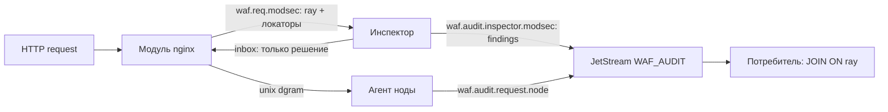
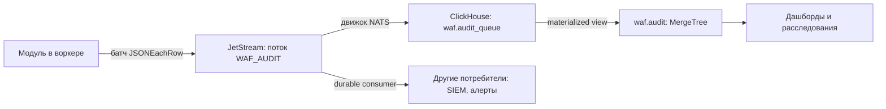

# Аудит

Сейчас в поток пишут инспектор и агент, склеиваем по `ray`. Каталог полей, батчинг
`JSONEachRow` и ClickHouse ниже — целевой контур этапа 8, он этот конверт не
отменяет.

## Писатели

Итог запроса знает модуль в воркере, но в `WAF_AUDIT` он не пишет: логирование
не его задача. Воркер кладёт компактный JSON на unix-сокет
(`waf_agent_socket`), один `sendto` без ожидания. Сайдкар собирает
`kind=request` и публикует на `waf.audit.request.<node>`. Детали находки —
инспектор. Поле `audit` ответа модуль по-прежнему не хранит.



| Subject | Писатель | Когда |
| --- | --- | --- |
| `waf.audit.request.<node_id>` | агент | модуль отдал итог на `waf_agent_socket`; агент пишет в поток |
| `waf.audit.inspector.<name>` | инспектор | один раз на инспекцию, **после** ответа в inbox |

Публикация — обычный `PUB` на subject потока, fire-and-forget. Промах JetStream
не двигает дедлайн волны. Локальный deny без инспекторов: есть только
`kind=request` — волны не было, спрашивать некого.

### Конверт

Одно сообщение — один JSON-объект. Общие поля:

```json
{
  "v": 1,
  "kind": "request | inspector",
  "ts": "2026-08-15T21:42:31.660Z",
  "ray": "11d4ea9c-80b2-4c7e-9f01-6a5b4c3d2e10",
  "node": "edge-01",
  "phase": "request"
}
```

`kind` дублирует ветку subject. Незнакомые поля потребитель пропускает.
Склейка — по `(node, ray, phase)`.

### `kind=request`

Весь контекст запроса: это единственное сообщение, из которого известно, что за
запрос был. Произвольный JSON инспектора сюда не копируется.

Схема — [agent.schema.ts](messages/agent.schema.ts), разбор —
[module-agent.md](messages/module-agent.md). Модуль пишет её целиком, агент
дописывает `v` и `kind` и публикует как есть.

```json
{
  "v": 1,
  "kind": "request",
  "ray": "11d4ea9c-80b2-4c7e-9f01-6a5b4c3d2e10",
  "node": "edge-01",
  "phase": "request",
  "ts": "2026-08-15T21:42:31.660Z",
  "client_ip": "203.0.113.77",
  "client_port": 54233,
  "tls": { "version": "TLSv1.3", "sni": "shop.example.com" },
  "http": {
    "method": "POST",
    "scheme": "https",
    "host": "shop.example.com",
    "uri": "/api/orders",
    "version": "HTTP/1.1",
    "args_size": 0,
    "headers_size": 962,
    "headers_count": 11,
    "body_size": 812,
    "status": 403
  },
  "route": { "server_name": "shop.example.com", "location": "/api/" },
  "verdict": "deny",
  "code": "score",
  "by": "module",
  "score": { "total": 80, "deny_at": 50 },
  "inspectors": {
    "module": { "verdict": "deny" },
    "modsec": { "verdict": "score", "score": 80, "latency_ms": 4 }
  },
  "waf_latency_us": 9100
}
```

Три вопроса — три поля. Плоских `deny_*` / `by_score` / `fail_reason` нет.

- `verdict`: `allow` | `deny` | `redirect`. Решение **модуля**, не апстрима.
- `code` — почему, закрытый набор из восьми значений; нет ровно на `allow`.
  Срыв волны — `fail_timeout` / `fail_absent` / `fail_bus` / `fail_body`, а не
  замаскированный `allow`.
- `by` — ключ в карте `inspectors`, чей вердикт стал итогом. Локальный бан,
  порог и срыв волны дают `module`; отказ инспектора — его имя, и только тогда
  `code` равен `inspector`.
- Итог модуля лежит в той же карте под ключом `module`, форма записи одна на
  всех, поэтому `verdict === inspectors[by].verdict` — всегда.
- Промолчавший участник тоже в карте, со `state` вместо вердикта.
- `http.status` — то, что уйдёт клиенту после apply (каталог deny / код
  редиректа). На `allow` фазы запроса апстрим ещё не ответил, поле 0.
- Запись фазы запроса с `waf_archive request … when=` на маршруте с
  `waf_inspect response` уходит не сразу, а вместе с исходом маршрута — после
  фазы ответа (или в конце запроса, если фазы ответа не случилось): набор
  архива в ней зависит от того, чем кончился ответ
  ([directives/list/archive.md](directives/list/archive.md#на-фазе-ответа)).
  У такой записи `upstream_status` уже известен; `status` остаётся 0.
  Порядок записей одного ray в аудите — запрос, затем ответ.

### `kind=inspector`

Всё, чем инспектор объясняет свой вердикт. В ответе модулю этого нет и не
должно быть: модуль подробностями не пользуется, а на горячем пути они раздувают
ответ. Схема — [messages/inspector-audit.schema.ts](messages/inspector-audit.schema.ts).

```json
{
  "v": 1,
  "kind": "inspector",
  "ts": "2026-08-14T11:00:00.123Z",
  "ray": "11d4ea9c-80b2-4c7e-9f01-6a5b4c3d2e10",
  "node": "edge-01",
  "phase": "request",
  "inspector": "modsec",
  "profile": "default",
  "verdict": "score",
  "score": 80,
  "engine_ms": 2.4,
  "findings": [
    {
      "code": "crs-942100",
      "severity": "critical",
      "target": "args",
      "rule": "942100",
      "evidence": "' or 1=1"
    }
  ],
  "engine": {
    "crs_anomaly_score": 15,
    "crs_threshold": 5,
    "crs_would_block": true,
    "matched": [{ "id": 942100, "severity": "critical", "msg": "...", "data": "..." }]
  }
}
```

Ключ унификации — `findings[]`: одна форма покрывает правило CRS у `modsec`,
совпадение списка у `ip`, класс уязвимости у `vlai`, нарушение контракта у
`json`, и потребитель разбирает находку, не зная, кто её прислал. `target`
говорит, где нашли (`uri`, `args`, `body`, `conn`, `header:<имя>`,
`cookie:<имя>`), при возможности со смещением; `severity` — общая шкала, чтобы
находки разных движков сортировались вместе; `engine` — открытый мешок под своё.

`inspector` — имя **записи реестра** (`waf_inspector`), а не имя сервиса, и
это то же имя, что стоит ключом в `inspectors` у `kind=request`. Записью
реестра маршрут отличает профили одного сервиса (`waf_inspector modsec-strict
subject=waf.req.modsec profile=strict` — в аудите `modsec-strict`, не
`modsec`), так что подмена её именем сервиса склеила бы разные инспекции в
одну. Сервис берёт имя из пришедшего сообщения, а не из своей конфигурации:
под каким именем процесс объявлен в nginx, знает только само сообщение.

`score` — калиброванные 0..100 протокола, и он обязан совпадать с
`inspectors[<имя>].score` в `kind=request`: разошлись — значит, событие относится
к другой инспекции, и связь по `ray` проверить нечем. `engine.crs_anomaly_score`
— сырой inbound anomaly CRS. Штатный CRS в DetectionOnly отвечает `score` +
`CRS_ANOMALY`; блок по порогу ставит модуль (`code=score`). Инспектор без находок
тоже пишет событие с пустым `findings`: иначе «не вызвали» и «чисто» не
различить. Subject приезжает в поле `audit_subject` сообщения модуля, а не зашит
в сервисе, и `null` там означает, что деталей с этого инспектора не ждут.

### Как читать один запрос

```text
kind=request    WHERE ray=11d4ea9c-80b2-4c7e-9f01-6a5b4c3d2e10
kind=inspector  WHERE ray=11d4ea9c-80b2-4c7e-9f01-6a5b4c3d2e10
```

`ray` — UUID запроса, сквозной от волны до записи лога. `node` при нём нужен не
для уникальности, а чтобы не искать по всему флоту. `rid` в аудите не участвует
вовсе: это слот воркера, он переиспользуется после освобождения.

Типичная картина порога: модуль `verdict=deny`, `code=score`, `by=module`,
`inspectors.modsec.score=80`; ModSec `verdict=score`,
`engine.crs_anomaly_score=15`, `findings=[crs-942100, …]`.

В [deploy](../deploy) поток создаётся скриптом `t/streams.sh` (лимиты под
локальный JetStream 1GB, не 500GB прод-спеки). Слушать:

```sh
docker compose exec -T nats-box nats stream info WAF_AUDIT
docker compose exec -T nats-box nats sub 'waf.audit.>'
```

## Конвейер этапа 8



Ключевые свойства:

- Аудит никогда не входит в набор ожидания и никогда не задерживает запрос. Публикация — fire and
  forget.
- Собственный потребитель не нужен: ClickHouse читает NATS родным движком таблицы.
- Доставка at-least-once, поэтому дубликаты возможны и убираются на стороне ClickHouse.
- JetStream выступает буфером: недоступность ClickHouse не приводит к потере событий, они лежат в
  потоке до восстановления в пределах retention.

## Каталог полей записи

Схема записи фиксирована: модуль пишет `kind=request` целиком
([messages/agent.schema.ts](messages/agent.schema.ts)), настраиваемого формата (`waf_log_format`)
нет -- он снят вместе с `waf_audit`. Каталог ниже -- поля этой записи и их колонки в ClickHouse.

Сообщение публикуется как `JSONEachRow` — по одному объекту на строку, батчем:

```
{"ts":"2026-08-13T08:41:12.318Z","rid":"3f2a9c1e00000017","node":"edge-07","client_ip":"203.0.113.42","method":"POST","host":"shop.example.com","uri":"/api/orders","status":403,"verdict":"deny","deny_code":"SQLI_UNION_SELECT","inspectors":["ip","sqli","repu"],"inspectors_verdict":{"sqli":{"verdict":"deny","code":"SQLI_UNION_SELECT"}},"inspectors_latency":{"ip":1.2,"sqli":4.1,"repu":2.2},"score_total":0,"scores":{},"body_size":18342,"body_sha256":"9f86d081884c7d65...","waf_latency_us":8300}
{"ts":"2026-08-13T08:41:12.402Z","rid":"3f2a9c1e00000018","node":"edge-07","client_ip":"198.51.100.9","method":"GET","host":"shop.example.com","uri":"/api/search","status":403,"verdict":"deny","deny_code":"SCORE_THRESHOLD","score_total":105,"score_deny_at":100,"score_top":"sqli","scores":{"sqli":70,"repu":50,"proto":20},"scores_advisory":{"ml":80},"inspectors":["agent","ip","sqli","repu","proto","ml"],"inspectors_verdict":{"agent":{"verdict":"deny","code":"SCORE_THRESHOLD"},"sqli":{"verdict":"score","score":70},"repu":{"verdict":"score","score":50},"proto":{"verdict":"score","score":20}},"waf_latency_us":9100}
{"ts":"2026-08-13T08:41:12.503Z","rid":"3f2a9c1e00000019","node":"edge-07","client_ip":"198.51.100.9","method":"GET","host":"shop.example.com","uri":"/cart","status":303,"verdict":"redirect","redirect_inspector":"challenge","redirect_url":"/waf/captcha?rd=%2Fcart","score_total":75,"score_deny_at":100,"scores":{"repu":50,"proto":25},"inspectors":["ip","repu","proto","challenge"],"waf_latency_us":11200}
```

Второе событие — блокировка по порогу: виновника нет, есть раскладка. Ни один инспектор не набрал
сотню в одиночку, `repu` вошёл в сумму с весом 0.5, а пассивный `ml` в сумму не вошёл вовсе.

Третье — челлендж, и по нему видно, что решение принял не модуль: счёт 75 при пороге 100 ни к чему не
обязывает, а `redirect_inspector` называет того, кто счёл нужным потребовать проверку. Пара
`score_total` и `score_deny_at` в событии редиректа тем и полезна: она показывает, в какой полосе
сервис принимает свои решения, и это единственный способ подобрать его порог по данным.

## Каталог полей

### Идентификация и время

| Поле | Тип | Описание |
| --- | --- | --- |
| `ts` | DateTime64(3) | Время начала обработки запроса |
| `rid` | String | Идентификатор запроса, уникален в пределах узла и поколения процесса |
| `node` | LowCardinality(String) | Значение `waf_node_id` |
| `worker_pid` | UInt32 | Pid воркера. Полезно при разборе аварий отдельных процессов |

### Соединение

| Поле | Тип | Описание |
| --- | --- | --- |
| `client_ip` | IPv6 | Адрес клиента, IPv4 отображается в IPv6 |
| `client_port` | UInt16 | Порт клиента |
| `client_asn` | UInt32 | Автономная система, если данные доступны локальному слою |
| `client_country` | LowCardinality(String) | Код страны |
| `server_ip` | IPv6 | Адрес, на котором принято соединение |
| `server_port` | UInt16 | Порт |
| `tls_version` | LowCardinality(String) | Версия TLS |
| `tls_cipher` | LowCardinality(String) | Шифр |
| `tls_sni` | String | SNI |
| `tls_ja4` | String | Отпечаток рукопожатия |
| `http_version` | LowCardinality(String) | Версия протокола |

### Запрос

| Поле | Тип | Описание |
| --- | --- | --- |
| `method` | LowCardinality(String) | Метод |
| `scheme` | LowCardinality(String) | Схема |
| `host` | String | Значение заголовка Host |
| `uri` | String | Путь без строки запроса |
| `args` | String | Строка запроса целиком. Может содержать персональные данные |
| `args_hash` | String | SHA-256 строки запроса. Позволяет группировать без хранения значений |
| `user_agent` | String | Заголовок User-Agent |
| `referer` | String | Заголовок Referer |
| `headers` | Map(String,String) | Заголовки целиком. Объёмно, применяйте с сэмплированием |
| `header_count` | UInt16 | Число заголовков |
| `route_server` | LowCardinality(String) | Применившийся server_name |
| `route_location` | LowCardinality(String) | Применившийся location |

### Тело

Что из тела попадает в запись, задаёт `waf_preview body=` ([directives/list/preview.md](directives/list/preview.md)).

| Поле | Тип | Описание |
| --- | --- | --- |
| `body_size` | UInt64 | Размер тела запроса |
| `body_type` | LowCardinality(String) | Content-Type |
| `body_sha256` | String | Хеш тела. Сопоставляет события без хранения содержимого |
| `body_prefix` | String | Префикс тела при `waf_preview body=<size>` |
| `body_store` | LowCardinality(String) | Где тело лежит: `archive`, если его забрал агент. Пусто, если удалено вместе с вердиктом |
| `body_key` | String | Ключ в хранилище. Непуст только при `waf_archive request`: по нему тело и достают при разборе |
| `body_archive` | LowCardinality(String) | Класс хранения. По нему видно, по какому правилу объект удалят |
| `body_truncated` | UInt8 | Тело было усечено |
| `body_transformed` | UInt8 | Тело прошло сервис трансформации |
| `body_transform_rules` | Array(LowCardinality(String)) | Какие правила маскирования применились. Без этого поля пропущенную в замаскированном поле атаку объяснить невозможно |
| `body_transform_result` | LowCardinality(String) | `transformed`, `unchanged`, `unparsable`, `too_large`, `error` |
| `rsp_body_size` | UInt64 | Размер тела ответа |
| `rsp_body_sha256` | String | Хеш тела ответа |

### Решение

| Поле | Тип | Описание |
| --- | --- | --- |
| `verdict` | LowCardinality(String) | `allow`, `deny`, `redirect`, `timeout_pass`, `timeout_block`, `bypass` |
| `phase` | LowCardinality(String) | Фаза, в которой принято итоговое решение |
| `deny_code` | LowCardinality(String) | Машинный код причины. Значение `SCORE_THRESHOLD` означает блокировку по сумме, а не по вердикту конкретного инспектора |
| `deny_reason` | String | Текст причины |
| `deny_inspector` | LowCardinality(String) | Не на проводе. Если колонка останется — выжимка из `inspectors_verdict`. Пусто при пороге: там ключ `agent` |
| `deny_rule` | String | Не на проводе. Правило инспектора — в `kind=inspector`, не в якоре |
| `deny_response` | LowCardinality(String) | Применённая запись каталога ответов |
| `redirect_url` | String | Применённая цель редиректа, как её прислал инспектор. Не `LowCardinality`: адрес обычно несёт параметр возврата и потому уникален для запроса |
| `redirect_inspector` | LowCardinality(String) | Кто назначил редирект. Модуль редирект не назначает, поэтому поле пусто быть не может |
| `overrides` | Map(String,String) | Применённые переопределения заголовков |

### Счёт

Без этих полей блокировку по порогу невозможно ни объяснить пользователю, ни разобрать самому:
единственное, что о ней известно, — что суммы хватило.

| Поле | Тип | Описание |
| --- | --- | --- |
| `score_total` | Int32 | Итоговая сумма: очки боевых и совещательных как присланы, у совещательного `deny` — сто |
| `scores` | Map(String,Int32) | Что легло в сумму от каждого обязательного и совещательного инспектора |
| `scores_advisory` | Map(String,Int32) | То же для `mode=passive` (имя поля историческое). В `score_total` не входит, но позволяет посчитать, каким был бы счёт после перевода в `active` |
| `score_top` | LowCardinality(String) | Наибольший вкладчик. При равенстве — первый по порядку объявления |
| `score_deny_at` | UInt32 | Действовавший порог блокировки. Задаётся на маршруте, поэтому без этого поля события разных location несопоставимы |
| `rsp_score_total` | Int32 | Сумма фазы ответа. Считается отдельно от фазы запроса |

### Инспекторы

| Поле | Тип | Описание |
| --- | --- | --- |
| `inspectors` | Array(LowCardinality(String)) | Кого опрашивали |
| `inspectors_verdict` | Map(String,String) | На проводе — объект `{verdict, code?, score?}` на ключ. Локальный слой и порог — ключ `agent` |
| `inspectors_latency` | Map(String,Float32) | Латентность каждого в миллисекундах |
| `inspectors_timeout` | Array(LowCardinality(String)) | Кто не ответил в срок |
| `inspectors_absent` | Array(LowCardinality(String)) | У кого не было подписчиков |
| `waves` | UInt8 | Число исполненных волн |
| `inspector_audit` | JSON | Объединённое содержимое полей `audit` из ответов |

### Результат

| Поле | Тип | Описание |
| --- | --- | --- |
| `status` | UInt16 | Итоговый код, отданный клиенту |
| `upstream_status` | UInt16 | Код приложения, если запрос до него дошёл |
| `grpc_status` | Int16 | Код `grpc-status` из трейлеров. Для gRPC `upstream_status` равный 200 ничего не говорит об успехе вызова |
| `grpc_method` | LowCardinality(String) | Имя метода из `:path` |
| `waf_latency_us` | UInt32 | Добавленная модулем латентность в микросекундах |
| `waf_req_latency_us` | UInt32 | Только фаза запроса |
| `waf_rsp_latency_us` | UInt32 | Только фаза ответа |
| `body_wait_us` | UInt32 | Время, потраченное на чтение и размещение тела |
| `upstream_ms` | Float32 | Время ответа приложения |
| `bytes_sent` | UInt64 | Отдано клиенту |
| `client_aborted` | UInt8 | Клиент отключился во время ожидания вердикта |

### Кадры

Записи фазы кадров WebSocket. Их две: `phase=frame` на кадр и `phase=session` на соединение при его
закрытии. Что пишется, решает `waf_audit_frames` на маршруте: `deny` (умолчание) — только кадр, у
которого есть что сказать (отказ, подмена, счёт больше нуля), `all [sample=n]` — каждый n-й
спрошенный кадр, `off` — ни кадра, ни сессии. Событие на каждый кадр по объёму сопоставимо с самим
трафиком: `all` — для узкого набора маршрутов и на время отладки.

Соединение — один запрос: рукопожатие, все его кадры и сессия лежат под одним `ray`, и фильтр
`?ray=` собирает их одной строкой. Кадр внутри соединения адресуется стороной и номером — они в
ключе склейки таблицы (`(node, ray, phase, frame_direction, frame_seq)`, в ключе сортировки он
идёт вслед за `ts`), иначе
ReplacingMergeTree сложил бы все кадры соединения в одну запись; у остальных фаз сторона пуста и
номер ноль. Ручки одной записи берут кадр параметром `?phase=frame&frame=<direction>:<seq>`. Тот
же адрес несёт событие `kind=inspector` (секция `frame`), и находки инспекторов на кадре лежат в
`audit_finding` под тем же ключом с теми же двумя колонками. `conn_id` секций на проводе равен
`ray` и остаётся для инспекторов (ось `conn` счётчика).

Секция `frame` записи кадра (на проводе — `"frame":{…}`):

| Поле | Тип | Описание |
| --- | --- | --- |
| `frame_direction` | LowCardinality(String) | `c2s` или `s2c`; в ключе таблицы |
| `frame_seq` | UInt64 | Номер кадра в своём направлении, включая контрольные и прошедшие мимо инспекции; в ключе таблицы |
| `frame_opcode` | LowCardinality(String) | `text`, `binary`, `continuation`, … |
| `frame_size` | UInt32 | Полезная нагрузка, байт |
| `frame_fin` | UInt8 | Кадр целый (`1`) или фрагмент |
| `frame_rewritten` | UInt8 | Полезная нагрузка подменена по секции `rewrite` |
| `frame_preview`, `frame_preview_truncated` | String, UInt8 | Срез полезной нагрузки, как `body_preview`: только в карточке записи |
| `fragments` (на проводе) | — | Из скольких кадров собрано сообщение (`waf_frame_reassemble`); у кадра как пришёл поля нет. `frame_seq` у собранного — номер первого фрагмента |
| `cached` (на проводе) | — | `true` — вердикт взят из кеша по хешу (`waf_frame_cache`): инспекторов у записи нет, `by = module`, в логе `reason "FRAME_CACHE"` |

Секция `session` записи соединения. `verdict` у неё `deny` с `code = ws_close`, если соединение
закрыл модуль (`close_reason = waf_deny`), иначе `allow`; участников у сессии нет (`inspectors`
пуст, карточка без находок — они у кадров), просьбы соседей (`actions`) пишутся только у
рукопожатия, кадры их не повторяют:

| Поле | Тип | Описание |
| --- | --- | --- |
| `session_frames_c2s`, `session_frames_s2c` | UInt64 | Кадров по направлениям |
| `session_bytes_c2s`, `session_bytes_s2c` | UInt64 | Байт полезной нагрузки, дошедшей до получателя |
| `session_denied` | UInt32 | Кадров с отказом |
| `session_rewritten` | UInt32 | Кадров с подменой |
| `frames_cached`, `messages_reassembled`, `control_dropped` (на проводе) | — | Вердиктов из кеша, сообщений, собранных из фрагментов, и ping/pong, отброшенных ограничителем `waf_frame_control_rate`; в таблицу пока не пишутся |
| `session_close_code` | UInt16 | Код кадра Close; `0` — соединение оборвалось без него |
| `session_close_reason` | LowCardinality(String) | `peer` — сторона прислала Close или закрыла соединение; `waf_deny` — закрыл модуль по политике; `timeout` — клиент или апстрим замолчали; `error` — внутренняя ошибка волны. Подробность (`policy`, `client timed out`, …) — в секции на проводе `close_why` |
| `session_duration_ms` | UInt32 | Время жизни соединения после `101` |

Записи запроса и ответа этих колонок не заполняют: сторона пуста, счётчики нули. Миграция —
`017_audit_frames.sql` (позвоночник) и `018_audit_finding_frames.sql` (находки): колонки и новый ключ сортировки одним `ALTER` на таблицу, по файлу на таблицу — логгер исполняет файл одним запросом (`MODIFY ORDER BY`
принимает только колонки, добавленные тем же запросом), первичный ключ остаётся прежним
префиксом.

## Приватность

Аудит — самый вероятный канал утечки в этой архитектуре: события живут месяцами, доступ к ним шире,
чем к трафику, и попадают они в систему, которая проектировалась под аналитику, а не под хранение
секретов.

По умолчанию хешируются `cookie`, `authorization`, `set-cookie`, `proxy-authorization`. Список
задаёт `waf_capture … mask=` / `deny=` и наследуют archive и preview; уменьшать его без явного
основания не следует.

Тот же список запрещён к записи в превью заголовков, и запрет там снимается только целиком —
`waf_preview headers ... deny=none`. Иначе список запрета на маршруте пришлось бы перечислять
полностью на каждом уровне, а забытое имя означало бы `Authorization` в аналитической базе.

Практические правила:

- `args_hash` вместо `args`, если строка запроса может содержать токены или персональные данные. То же
  относится и к `redirect_url`: сервис челленджа обычно кладёт в параметр возврата исходный URI, поэтому
  вместе со строкой запроса там оказывается и то, что вы решили не писать в `args`.
- `body_sha256` вместо `body_prefix`. Хеш позволяет и сгруппировать события, и подтвердить
  идентичность тела, не храня его.
- Тело целиком в записи аудита -- практически всегда неверный выбор. Если тело нужно для разбора инцидентов,
  правильный механизм — `waf_archive request` (см. [ниже](#архив-полезной-нагрузки)) с отдельным
  сроком хранения и отдельными правами доступа, а не колонка в аналитической базе.
- Retention задаётся на уровне таблицы ClickHouse через TTL и должен соответствовать требованиям к
  обработке персональных данных, а не удобству аналитики.

## Превью запроса

Три колонки записи содержат срез самого запроса: `headers_preview`, `args_preview`, `body_preview`.
Это ось поиска, а не хранения — она отвечает на «найти все запросы с таким заголовком» и «где в теле
встречалось это слово», тогда как локатор ниже отвечает на «достать содержимое вот этого запроса».

Когда инспектор подменил тело (секция `rewrite`), `body_preview` по умолчанию показывает оригинал, а
`waf_preview <фаза> body=<size> source=sent` — доставленную получателю версию; в этом случае к
записи добавляется `body_preview_source: "sent"`, а оригинал уезжает в архив (`waf_archive`). Так
запись отвечает на «что мы отдали», а архив — на «что пришло»
([directives/list/preview.md](directives/list/preview.md#sourcesent--что-показать-при-подмене)).

```nginx
waf_preview headers=30k/1k args=8k/1k body=10k;
waf_preview headers deny=x-internal-token;
```

Объём задаёт конфигурация, а не клиент: сумма бюджетов маршрута — это прирост датаграммы агенту, и
она проверяется на `nginx -t` против потолка в 8 МБ. Заголовок на мегабайт поэтому не становится ни
нагрузкой на шину, ни строкой в базе; в записи от него останется то, что уместилось в бюджет.

Размер обязателен: без него `nginx -t` отказывает. Больше прочитанного в превью не попадёт ни при
каком бюджете (`large_client_header_buffers` для заголовков и строки запроса,
`min(client_max_body_size, waf_body_limit)` для тела), а названный сверх предела размер — ошибка
при `nginx -t`.

Что стоит помнить, включая превью:

- Это изменение приватности записи, а не только её объёма. Секреты из списка маскирования в превью
  не попадают, но `x-api-key`, путь с идентификатором клиента и содержимое формы — попадают, и живут
  ровно столько, сколько живёт таблица. Сузить состав можно аргументом `allow=` у
  `waf_preview headers`, расширить запрет — `deny=`.
- Значения параметров не декодированы намеренно: `?q=%3Cscript%3E` и `?q=<script>` — разные улики, и
  различать их обязана запись, а не тот, кто её читает.
- Бюджет секции по-прежнему режет по целым парам: пара, не влезающая в остаток, не пишется вовсе.
  Потолок на элемент (`item_max`, только у `headers` и `args`) режет иначе: если имя занимает больше
  половины потолка — пара выбрасывается целиком; иначе значение обрезается по границе UTF-8 и
  помечается урезанным, чтобы поиск по подстроке не принял префикс за оригинал.
- Заданное превью само означает «извлечь»: объект окажется в записи, даже если его не просит ни один
  инспектор. Для тела это ещё и чтение в горячем пути. Умолчание у всех трёх объектов — `off`.
- Превью не заменяет архив. В нём нет ни полноты, ни контрольной суммы, ни срока хранения,
  отличного от срока таблицы; для разбора инцидента по оригиналу — `waf_archive request` ниже.

## Архив полезной нагрузки

Тело, сырые заголовки и строка запроса целиком в запись не попадают ни при каких настройках: в ней
едет локатор — размер, хеш и адрес объекта, — а из содержимого только ограниченное превью выше. По умолчанию объект удаляется вместе с вердиктом, и в записи
остаётся описание без адреса. `waf_archive request` меняет судьбу названных объектов: модуль их не
удаляет, а агент перекладывает в архив и подменяет в записи адресацию на архивную. Строки одного
уровня складываются по объектам: `ttl=` и размер (`body=8k`) называются каждому отдельно.

```nginx
location /api/orders {
    waf_archive request headers ttl=180d when=deny;
    waf_archive request body    ttl=180d when=deny;
}
```

Названный здесь объект снимается потому, что его назвали: ни `waf_capture`, ни набор инспекторов
архиву не указ, и тело ради него читается принудительно.

В опубликованной записи это выглядит так (полные примеры — в
[messages/examples/](messages/examples), `agent-archive.json` до и `agent-archive-published.json`
после обработки агентом):

```json
"store": {
  "headers": { "size": 96, "store": "archive", "driver": "s3",
               "key": "2026/08/15/nginx-1/3f9c1e77-....hdr",
               "expires_at": 1802304000 },
  "args": null,
  "body": { "size": 4096, "sha256": "9f86d081...", "store": "archive", "driver": "s3",
            "key": "2026/08/15/nginx-1/3f9c1e77-....body",
            "expires_at": 1802304000 },
  "archive": { "headers": 15552000, "body": 15552000 }
}
```

Три свойства этой схемы стоит держать в голове при чтении записей.

Срок хранения остаётся в записи и после того, как локаторы стали архивными: `archive` — это секунды,
названные в `ttl=` (`0` означает «вечно»). Сам по себе он ничего не открывает, но по нему видно, по
какому правилу объект будет удалён, — иначе срок жизни ссылки пришлось бы выяснять в конфигурации
бакета. В ключе срока нет: удалением занимается lifecycle-правило по тегу `waf-retain-ttl`, и
переносить ту же величину ещё и в имя значило бы иметь два источника правды.

Ссылка может указывать на объект, которого уже нет: срок задаётся lifecycle-правилом, а запись живёт
своей жизнью. Это не рассинхронизация, а нормальный исход — у записи и у полезной нагрузки разный
срок хранения по построению, и именно ради этого они разделены.

Сам срок в записи есть: `expires_at` архивного локатора — то, что назвало хранилище в
`x-amz-expiration`, когда агент кладёт объект. По нему читатель отличает «объект на месте» от
«объекта уже нет», не обращаясь к бакету: поиск на истёкшем сроке отвечает `ttl_expired` сразу.
Поля нет — правила удаления в бакете не заведено, и тогда единственный способ узнать судьбу
объекта — прийти за ним.

Отсутствие полезной нагрузки записывается явно. `expired` — объект не дожил до агента; `empty` —
требовался и оказался пуст; `overload` — очередь архивации была полна, `PUT` не пробовали;
`archive_error` — `PUT` не удался. Событие публикуется во всех случаях: терять запись из-за проблем с
архивом было бы обменом важного на второстепенное.

Управление объёмом — на стороне маршрута, а не хранилища. `when=` сужает архивацию до
заблокированного, `ttl=` задаёт срок, набор объектов перечисляется поимённо. Порядки
величин — в [deployment.md](deployment.md#архив-три-бакета); при десяти тысячах запросов в секунду
разница между «архивировать всё» и «архивировать заблокированное» измеряется сотнями гигабайт в
сутки.

## Поток JetStream

Прод:

```bash
nats stream add WAF_AUDIT \
  --subjects 'waf.audit.>' \
  --storage file \
  --retention limits \
  --max-age 24h \
  --max-bytes 500GB \
  --replicas 3 \
  --discard old \
  --dupe-window 2m
```

Локальный [deploy](../deploy): `t/streams.sh` создаёт тот же subject с
`--max-bytes 256MB` и одной репликой — под `max_file_store: 1GB` в
`nats-server.conf`.

Пояснения к выбору параметров:

- Retention суточный: JetStream здесь буфер, а не хранилище. Долгое хранение — в ClickHouse.
- `--discard old` предпочтительнее отказа в публикации: при переполнении лучше потерять самые старые
  события аудита, чем начать влиять на обработку трафика.
- Три реплики закрывают требование к репликации шины из исходной постановки задачи.
- Отдельный поток от горячего пути обязателен: аудит объёмный, и его нагрузка не должна касаться
  доставки вердиктов.

### Пачка

Публикация каждого события отдельным сообщением на скорости десятков тысяч запросов в секунду даёт
столько же сообщений в секунду с узла и приводит ClickHouse к состоянию «too many parts»: партия из
одного сообщения — это партия из одной строки.

Поэтому агент копит записи и отправляет их пачками. Границы три, отправляет первая сработавшая:
двести пятьдесят шесть записей, полмегабайта, пятьдесят миллисекунд. Субъект и поток те же
(`waf.audit.request.<node>`), новый только вид конверта:

```json
{
  "v": 1,
  "kind": "batch",
  "node": "edge-01",
  "items": [ { "v": 1, "kind": "request", "…": "…" }, "…" ]
}
```

`items` — это ровно те байты, которые уехали бы отдельными сообщениями, элемент в элемент. Отсюда
два свойства: потребителю не нужен новый разбор записи, а писатель, который ещё не научился пачкам,
остаётся совместим — оба вида едут по одному subject и разбираются одним `kind`.

Буфер агента не бесконечен: при недоступной шине он режет голову и считает потерянное. Счётчик
уезжает в кадр пульса (`audit_dropped`) — молча терять аудит нельзя.

Записи инспекторов (`kind=inspector`) пока едут по одной: пачка у них будет своя и той же формы.

## ClickHouse

### Таблица-очередь

```sql
CREATE TABLE waf.audit_queue
(
    ts                 DateTime64(3),
    rid                String,
    node               LowCardinality(String),
    client_ip          IPv6,
    client_asn         UInt32,
    client_country     LowCardinality(String),
    method             LowCardinality(String),
    scheme             LowCardinality(String),
    host               String,
    uri                String,
    args_hash          String,
    user_agent         String,
    route_server       LowCardinality(String),
    route_location     LowCardinality(String),
    status             UInt16,
    upstream_status    UInt16,
    verdict            LowCardinality(String),
    phase              LowCardinality(String),
    deny_code          LowCardinality(String),
    deny_inspector     LowCardinality(String),
    deny_rule          String,
    redirect_url       String,
    redirect_inspector LowCardinality(String),
    score_total        Int32,
    score_deny_at      UInt32,
    score_top          LowCardinality(String),
    scores             Map(String, Int32),
    scores_advisory    Map(String, Int32),
    inspectors         Array(LowCardinality(String)),
    inspectors_verdict Map(String, String),
    inspectors_latency Map(String, Float32),
    inspectors_timeout Array(LowCardinality(String)),
    waves              UInt8,
    body_size          UInt64,
    body_type          LowCardinality(String),
    body_sha256        String,
    body_store         LowCardinality(String),
    body_key           String,
    body_truncated     UInt8,
    waf_latency_us     UInt32,
    body_wait_us       UInt32,
    upstream_ms        Float32,
    bytes_sent         UInt64,
    client_aborted     UInt8,
    tls_version        LowCardinality(String),
    tls_ja4            String,
    ext                JSON
)
ENGINE = NATS
SETTINGS nats_url = 'nats-1:4222,nats-2:4222,nats-3:4222',
         nats_subjects = 'waf.audit.>',
         nats_format = 'JSONEachRow',
         nats_queue_group = 'clickhouse',
         nats_num_consumers = 4,
         nats_max_block_size = 65536,
         nats_flush_interval_ms = 1000,
         nats_handle_error_mode = 'stream',
         input_format_skip_unknown_fields = 1,
         date_time_input_format = 'best_effort';
```

Две настройки заслуживают внимания отдельно.

`input_format_skip_unknown_fields = 1` — это то, что делает схему совместимой с новыми версиями
записи: агент или модуль добавляют поле, и события начинают содержать то, чего нет в таблице; без
этой настройки вставка бы падала целиком. Схему таблицы имеет смысл держать надмножеством
всех полей каталога, а действительно произвольные поля отправлять в колонку `ext` типа `JSON`.

`nats_handle_error_mode = 'stream'` направляет ошибки разбора в виртуальные колонки вместо остановки
потребления. Без этого одно битое сообщение останавливает весь конвейер аудита.

### Целевая таблица

```sql
CREATE TABLE waf.audit
(
    ts                 DateTime64(3),
    rid                String,
    node               LowCardinality(String),
    client_ip          IPv6,
    client_asn         UInt32,
    client_country     LowCardinality(String),
    method             LowCardinality(String),
    host               String,
    uri                String,
    args_hash          String,
    user_agent         String,
    route_server       LowCardinality(String),
    route_location     LowCardinality(String),
    status             UInt16,
    upstream_status    UInt16,
    verdict            LowCardinality(String),
    phase              LowCardinality(String),
    deny_code          LowCardinality(String),
    deny_inspector     LowCardinality(String),
    deny_rule          String,
    redirect_url       String,
    redirect_inspector LowCardinality(String),
    score_total        Int32,
    score_deny_at      UInt32,
    score_top          LowCardinality(String),
    scores             Map(String, Int32),
    scores_advisory    Map(String, Int32),
    inspectors         Array(LowCardinality(String)),
    inspectors_verdict Map(String, String),
    inspectors_latency Map(String, Float32),
    inspectors_timeout Array(LowCardinality(String)),
    waves              UInt8,
    body_size          UInt64,
    body_type          LowCardinality(String),
    body_sha256        String,
    body_store         LowCardinality(String),
    body_key           String,
    body_truncated     UInt8,
    waf_latency_us     UInt32,
    body_wait_us       UInt32,
    upstream_ms        Float32,
    bytes_sent         UInt64,
    client_aborted     UInt8,
    tls_version        LowCardinality(String),
    tls_ja4            String,
    ext                JSON,
    ingested_at        DateTime DEFAULT now()
)
ENGINE = ReplacingMergeTree(ingested_at)
PARTITION BY toDate(ts)
ORDER BY (toStartOfHour(ts), verdict, host, rid)
TTL toDate(ts) + INTERVAL 90 DAY DELETE
SETTINGS index_granularity = 8192;

CREATE MATERIALIZED VIEW waf.audit_mv TO waf.audit AS
SELECT * FROM waf.audit_queue;
```

`ReplacingMergeTree` с `rid` в ключе сортировки решает проблему дубликатов, неизбежных при доставке
at-least-once. Дедупликация происходит при слиянии, поэтому запросы, требующие точного счёта, должны
использовать `FINAL` или `GROUP BY rid`. Для типичных дашбордов, где расхождение в доли процента
несущественно, `FINAL` не нужен и его стоит избегать: он заметно дороже.

Ключ сортировки начинается с часа, а не с точного времени: это даёт хорошее сжатие и эффективную
фильтрацию по времени, оставляя `verdict` и `host` вторыми по селективности для типичных запросов.

### Типовые запросы

Динамика блокировок по причинам:

```sql
SELECT toStartOfMinute(ts) AS t, deny_code, count() AS c
FROM waf.audit
WHERE ts > now() - INTERVAL 1 HOUR AND verdict = 'deny'
GROUP BY t, deny_code
ORDER BY t, c DESC;
```

Латентность инспекторов по квантилям — основной инструмент подбора таймаутов:

```sql
SELECT
    arrayJoin(mapKeys(inspectors_latency))   AS inspector,
    quantile(0.50)(inspectors_latency[inspector]) AS p50,
    quantile(0.99)(inspectors_latency[inspector]) AS p99,
    quantile(0.999)(inspectors_latency[inspector]) AS p999,
    max(inspectors_latency[inspector])       AS worst
FROM waf.audit
WHERE ts > now() - INTERVAL 1 DAY
GROUP BY inspector
ORDER BY p99 DESC;
```

Кандидаты в ложные срабатывания — адреса, где блокировки перемешаны с успешной работой:

```sql
SELECT client_ip, countIf(verdict = 'deny') AS denies,
       countIf(verdict = 'allow') AS allows, groupUniqArray(10)(deny_code) AS codes
FROM waf.audit
WHERE ts > now() - INTERVAL 1 DAY
GROUP BY client_ip
HAVING denies > 5 AND allows > 50
ORDER BY denies DESC
LIMIT 100;
```

Оценка ущерба от политики fail-open:

```sql
SELECT toStartOfHour(ts) AS t, countIf(verdict = 'timeout_pass') AS passed_blind,
       arrayJoin(inspectors_timeout) AS who, count() AS timeouts
FROM waf.audit
WHERE ts > now() - INTERVAL 1 DAY
GROUP BY t, who
ORDER BY t;
```

Распределение счёта против действующего порога — основной инструмент подбора `waf_score_deny`.
Интересна не средняя величина, а плотность у самого порога: если она высока, порог стоит в месте,
где решение определяется шумом.

```sql
SELECT route_location,
       any(score_deny_at)                        AS deny_at,
       quantile(0.50)(score_total)               AS p50,
       quantile(0.99)(score_total)               AS p99,
       countIf(abs(score_total - score_deny_at) <= 10) AS near_edge,
       count()                                   AS total
FROM waf.audit
WHERE ts > now() - INTERVAL 1 DAY AND score_deny_at > 0
GROUP BY route_location
ORDER BY near_edge DESC;
```

Проверка пассивного инспектора перед переводом в обязательные:

```sql
SELECT inspectors_verdict['ml'] AS ml_verdict, verdict AS final, count() AS c
FROM waf.audit
WHERE ts > now() - INTERVAL 1 DAY AND has(inspectors, 'ml')
GROUP BY ml_verdict, final
ORDER BY c DESC;
```

## Сайзинг аудита

Оценка на порядок: событие с указанным выше набором полей — примерно от восьмисот байт до полутора
килобайт в JSON. При десяти тысячах запросов в секунду и полном аудите это порядка десяти мегабайт в
секунду, около восьмисот гигабайт в сутки до сжатия. В ClickHouse колоночное сжатие с
`LowCardinality` даёт обычно от восьми до пятнадцати раз, то есть порядка шестидесяти-ста гигабайт в
сутки на диске.

Отсюда практическая политика -- сэмплирование: полный аудит блокировок, редиректов и таймаутов
плюс процент разрешённого трафика. Рычаг -- `waf_audit_sample`
([directives/list/audit_sample.md](directives/list/audit_sample.md)), наследуемый и
переопределяемый на маршруте; умолчание -- сто процентов, то есть включение модуля журнал не
прореживает.

Прорежается только то, что нечем объяснить. Отказы, редиректы, сорванные политикой волны,
молчание спрошенного инспектора и запросы, отдавшие объекты в архив, пишутся при любом значении:
последнее -- не вежливость, а обязанность, потому что объекты архива снимает с обменника агент, и
выброшенная запись оставила бы их лежать до истечения TTL.

Сэмпл и пачка убирают разное и потому не заменяют друг друга: пачка снимает стоимость сообщений,
сэмпл -- стоимость строк. Объём держат ещё бюджеты `waf_preview` и TTL таблицы.
