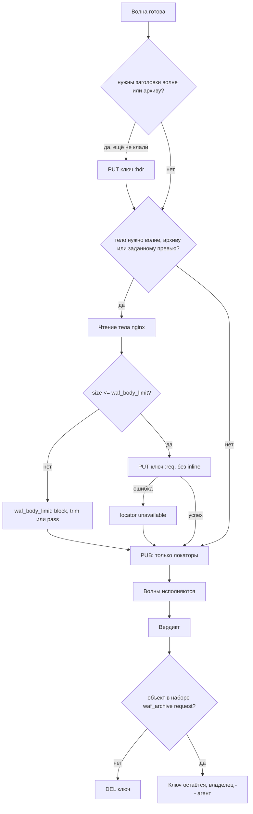

# Хранилище тела

Содержимое запроса в сообщение не помещается: тело, сырые заголовки и строка запроса кладутся в один
store тремя ключами, а в волне едут только локаторы. Что видят инспекторы маршрута, решает
`waf_capture` — одно на всех. `needs=` у инспектора нет.

Реализовано в модуле: отложенное чтение, драйверы `none`, `inline`, `redis`, три локатора
(тело, `:hdr` и `:arg`), `waf_body_max_holds` (каждый объект), явное удаление всех
ключей после вердикта и удержание тех, которые забирает агент (`waf_archive request`).
`waf_body_inline_max` снята: на горячем пути она не читалась ни разу. Драйвер `inline` в конфиге
остаётся, на горячем пути не используется. Фаза ответа реализована: тело ответа кладётся из удержанной цепочки, архив и превью у неё свои
(`waf_archive response`, `waf_preview response`), запись фазы запроса с `when=` откладывается до
исхода маршрута; прогон — `tests/runner/scenarios/response.mjs`. Не реализованы трансформация
(этап 11), шифрование, потоковое размещение. Что именно расходится с описанным здесь — в
[nginx/module/known-issues.md](nginx/module/known-issues.md) и
[nginx/module/directives.md](nginx/module/directives.md); прогон —
`tests/body`.

## Три независимых решения

Смешивание этих решений в одну директиву — самая частая ошибка проектирования в этой области. Они
ортогональны, и каждое отвечает на свой вопрос.

| Решение | Директива | Вопрос |
| --- | --- | --- |
| Что видят инспекторы | `waf_capture` | Тело, заголовки, строка запроса: сколько кладём, mask/deny до обменника. Все инспекторы маршрута видят одно |
| Где всё это лежит, пока идёт запрос | `waf_store` | Один внешний обменник на конфигурацию. Драйвер `inline` на горячем пути не участвует |
| В каком виде оно попадает в контур | `waf_body_transform` | Оригинал или обработанная сервисом маскирования копия. См. [body-transform.md](body-transform.md) |
| Что попадает в запись аудита | `waf_preview` | Срез для поиска в ClickHouse; у него другой срок жизни и другой уровень доступа |
| Что переживёт запрос | `waf_archive request` | Какие объекты не удаляются после вердикта, а уезжают в архив под разбор инцидентов |

### Что в сообщении и что в Redis

`waf_capture` — что едет инспекторам. Archive и preview в сообщение не добавляют.

В Redis до волн — put в размере capture; `reload` archive и preview докладывает оригинал после
вердикта в `max` своих размеров, и только когда он кому-то нужен (на исходе, где `when=` объект не
берёт, второго put нет). Маршрут с `waf_capture` без body и `waf_archive request reload body`
кладёт тело для агента после вердикта; у инспекторов `store.body` — `null`. Тело в capture — put до
первой волны. Тело только в archive — волну 0 не блокирует. Превью тела читает этот префикс, не
второй проход по запросу.

### О названии

Директива `logbody` смешала бы решение о захвате с решением об аудите. «Log» относится к аудиту, но
управлять пришлось бы доступностью тела для инспекторов, что к логированию отношения не имеет.
Поэтому они разделены.

`waf_request_body_access on|off` из ModSecurity и Coraza какое-то время жил синонимом `waf_capture
body`. Синоним снят: одно решение под двумя именами читается как два разных, а термин из чужого WAF
здесь и не значил того же — у нас снимаются три объекта, а не один.

`waf_preview body=<size>` отвечает за то, что из тела уезжает в запись аудита: префикс заданного
размера, а размер и хеш запись несёт всегда. Чаще всего в лог нужен не body, а его хеш и размер,
чтобы сопоставить события, не создавая обменник персональных данных.

## Роли хранилища

Хранилище используется в двух совершенно разных режимах, и один драйвер редко подходит для обоих.

**Синхронное размещение для инспекции** — `waf_store`. Находится в горячем пути: пока тело не
размещено, волна не публикуется, запрос стоит. Латентность драйвера напрямую входит в бюджет запроса.
Обменник один на конфигурацию и объявляется в `http`: маршруту выбирать не из чего, а значит, и нечего
перепутать. Второй `waf_store` — `is duplicate`, отсутствующий при непустом `waf_capture` или
архиве — ошибка при `nginx -t`.

**Асинхронная архивация для разбора инцидентов** — `waf_archive request <objects>`. Модуль в ней не
участвует ни одним сетевым вызовом: он просто **не удаляет** названные объекты из обменника и пишет их
срок хранения в запись аудита. Владение ключами переходит агенту, тот перекладывает объекты в архив,
подменяет в записи локаторы на архивные и только потом чистит обменник. Строка настраивает только
названные в ней объекты, строки одного уровня складываются; размер на объекте (`body=8k`) режет агент
перед записью, а не модуль. Подробности — в
[messages/module-agent.md](messages/module-agent.md#обменник) и
[audit.md](audit.md#архив-полезной-нагрузки).

Так закрывается требование «кто-то хочет S3»: S3 в горячем пути — это десятки миллисекунд на PUT,
больше всего остального бюджета вместе взятого. Вынесенный за пределы запроса, в процесс, которому
никто не отвечает 502, он в роли архива оптимален.

**Локальное промежуточное размещение** — `waf_body_staging <store>`. Существует только когда подключён
сервис трансформации: оригинал тела лежит там, пока сервис его обрабатывает. Обязан быть локальным, см.
[body-transform.md](body-transform.md#staging-store).

```nginx
http {
    # Ровно один на конфигурацию, имени нет.
    waf_store driver=redis url=redis://redis-1:6379,redis-2:6379
              ttl=30s retain_ttl=5m max=8m;

    server {
        location /api {
            waf_capture request headers args body;          # синхронно, в бюджете запроса

            waf_archive request headers ttl=180d when=deny;
            waf_archive request body    ttl=180d when=deny;  # строки уровня складываются
        }
    }
}
```

`ttl=180d` уезжает на провод секундами и становится тегом объекта в архиве; удаляет объект
lifecycle-правило бакета, настроенное на этот тег. Ни бакета, ни реквизитов, ни адреса модуль не
знает — см. [deployment.md](deployment.md#архив-три-бакета). Без `ttl=` объект хранится вечно, и это
осознанное умолчание: срок стирания данных — решение, которое лучше принимать явно, чем получить по
чужому дефолту.

`retain_ttl` — страховка на случай, если агент до объекта не дошёл: `ttl=30s` хватает на волну, но не
на то, чтобы под нагрузкой сделать GET и PUT. Удерживаемый объект кладётся сразу с длинным сроком,
потому что маршрутная политика известна до `put`. Штатно ключ убивает агент, а не срок.

## Локатор

В сообщение инспектору едет либо локатор, либо `null`. Поля `inline` нет. Единый формат для всех
трёх объектов и всех драйверов, и это главное его свойство: инспектор во время инспекции и логер при
разборе инцидента достают что угодно одним и тем же кодом. Заголовки и строка запроса — тот же
объект без `sha256` / `complete` / `truncated` / `encoding`, ключ с суффиксом `:hdr` и `:arg`:

```json
"store": {
  "headers": {
    "store": "hot",
    "driver": "redis",
    "key": "w7:3f2a9c1e00000017:req:hdr",
    "size": 412
  },
  "args": {
    "store": "hot",
    "driver": "redis",
    "key": "w7:3f2a9c1e00000017:req:arg",
    "size": 23
  }
}
```

Заголовки лежат JSON-массивом пар: порядок получения значим, а дубликаты имён (`Set-Cookie`,
`Forwarded`) в объекте потерялись бы. Строка запроса лежит **сырой, как пришла**: кодировки,
повторяющиеся ключи, `;` против `&`, вложенные структуры — это интерпретация, и модуль, выбрав одну,
навязал бы её всем инспекторам; в инциденте же разбирают то, что пришло по проводу.

Объект в обменнике один на волну, и разным инспекторам разные его части не выдать — поэтому
пофамильного списка заголовков у инспектора нет: `needs` без `headers` даёт `null`, даже если блоб
лежит для других, а кому нужна часть — фильтрует у себя после GET.

Тело:

```json
"body": {
  "store": "hot",
  "driver": "redis",
  "key": "w7:3f2a9c1e00000017:req",
  "size": 18201,
  "sha256": "9f86d081884c7d65...",
  "processed_sha256": "1b4f0e9851971998...",
  "transformed": true,
  "complete": true,
  "truncated": false,
  "encoding": "identity",
  "expires_at": 1755164400,
  "hint": null
}
```

| Поле | Описание |
| --- | --- |
| `store` | Имя store из конфигурации. Инспектор по нему выбирает способ доступа |
| `driver` | Тип драйвера. Инспектор может использовать его для выбора клиента |
| `key` | Ключ внутри хранилища. Для `redis` — ключ, для `s3` — объект относительно `prefix` |
| `size` | Размер размещённых данных в байтах |
| `sha256` | Контрольная сумма оригинала. Связывает событие с архивом и подтверждает, что прислал клиент |
| `processed_sha256` | Контрольная сумма размещённых данных. Присутствует только при `transformed: true`; по ней инспектор кеширует вердикт по тому, что реально видел |
| `transformed` | Тело прошло сервис трансформации, то есть отличается от полученного от клиента |
| `complete` | Тело размещено целиком |
| `truncated` | Размещён только префикс: тело превысило лимит, а политика — `trim` |
| `encoding` | `identity` либо исходный `Content-Encoding`, если тело не разжималось |
| `expires_at` | Unix-время, после которого локатор недействителен |
| `hint` | Необязательная подсказка драйвера: у `redis` это адрес узла, на который лёг ключ |

Необязательные поля отсутствуют, а не приезжают пустыми: `sha256` — когда хеш не считался,
`expires_at` — у драйвера без TTL, `hint` — когда драйверу нечего подсказать. `processed_sha256` и
`transformed` появятся вместе с трансформацией.

Адресация — `store`, `driver`, `key`, `expires_at`, `hint` — присутствует ровно тогда, когда по ней
действительно можно что-то достать. В сообщении инспектору она есть всегда: объект лежит и ждёт. В
записи аудита её нет, если объект удалён по вердикту, и она архивная (`"store": "archive"`,
`"driver": "s3"`), если объект забрал агент.

В архивной адресации `expires_at` — срок из lifecycle-правила бакета: хранилище называет его в
`x-amz-expiration` тем же ответом на `PUT`, и агент переносит это в запись. Спросить больше некого —
срок из `ttl=` — это только тег, по которому правило сработает, — а знать дату нужно тому, кто откроет
карточку через месяц: по нему видно, лежит ли объект ещё на месте, и незачем идти за тем, чего уже
нет. Правила в бакете нет — поля тоже нет, и это не то же, что истёкший срок. `hint` в архив не
переезжает: узла у объекта там не бывает. Описательные поля — размер, хеш, полнота, кодировка,
блок `enc` — не меняются ни при удалении, ни при переезде: они верны независимо от того, где объект
лежит и лежит ли вообще.

Особые значения:

```json
"body": null
```
Содержимого нет: объекта нет в `waf_capture` маршрута,
текущая волна его не запрашивала, либо класть было нечего (запрос без тела, пустая строка запроса).
Снятый ради архива объект инспектор тоже видит как `null`: маршрут его для волны не разрешал.
Различать эти случаи инспектору незачем — во всех содержимого он не получит.

```json
"body": { "unavailable": "oversize", "size": 41943040, "declared_size": 41943040 }
```
Тело есть, но недоступно. Значения: `oversize`, `store_error`, `store_unconfigured`,
`streaming_not_supported`, `transform_failed`. Инспектор обязан обработать этот случай явно; со стороны
модуля срабатывает `waf_exception … body` либо, для последнего значения,
`waf_on_transform_error`.

Ещё два значения ставит агент, и только в записи аудита — инспектор их не увидит, потому что к
моменту их появления волны давно закончились: `expired` — объекта в обменнике уже не было, когда агент
до него добрался; `empty` — объект требовался и оказался пуст; `overload` — очередь архивации
была полна, `PUT` не пробовали; `archive_error` — `PUT` не удался или бакет для этого вида не
настроен. Во всех случаях запись публикуется: теряется полезная нагрузка, не событие.

## Встроенные драйверы

| Драйвер | Класс латентности | Читатели | Предел объекта | Репликация | Удаление | Применение |
| --- | --- | --- | --- | --- | --- | --- |
| `none` | — | нет | — | — | — | Нет внешнего store; `headers != none` или `body` кроме `none` — ошибка `nginx -t` |
| `inline` | local | все | — | не нужна | не нужно | В конфиге остаётся, горячий путь его не вызывает |
| `redis` | network | все | 512 МБ, практически 8 МБ | асинхронная | явное | Основной вариант |

Драйвера `s3` в модуле нет и не планируется: единственной его ролью был архив, а архив теперь пишет
агент — из процесса, где блокирующий PUT на десятки миллисекунд никому не мешает. См.
[nginx/module/unsupported.md](nginx/module/unsupported.md).

Класс латентности — не документационная пометка, а поле драйвера, которое участвует в валидации
конфигурации, см. [ниже](#валидация-конфигурации).

### none

Тело и заголовки не размещаются. Инспектор с `headers != none` или с любой потребностью в теле при
store `none` / `inline` — ошибка `nginx -t`.

Это правильный выбор по умолчанию для маршрутов без инспекторов, которым нужны заголовки или тело.

### inline

Формально не хранилище. Директива и драйвер остаются в конфигурации, чтобы не ломать уже написанные
`nginx.conf`. Горячий путь их не вызывает: мелкое тело тоже уходит во внешний store. Store `inline`
для маршрута с `headers != none` или `body` кроме `none` — та же ошибка `nginx -t`, что у `none`.

### redis

Основной драйвер для случая «инспекторы на отдельных машинах».

```nginx
waf_store driver=redis
          url=redis://redis-1:6379,redis-2:6379
          ttl=30s
          max=8m
          pool=8
          connect_timeout=200ms
          op_timeout=50ms
          reconnect_wait=500ms
          user=waf
          password_file=/etc/waf/redis.pass
          db=0
          retain_ttl=5m;
```

`op_timeout` обязан быть заметно меньше `waf_deadline`: размещение тела — часть бюджета запроса, и
хранилище, отвечающее дольше, должно превращаться в `unavailable`, а не съедать бюджет инспекторов.
Пароль берётся из файла, а не из директивы: конфигурация nginx читается кем угодно, у кого есть доступ
к образу, а `password=` отвергается при проверке конфигурации именно поэтому.

Свойства: репликация есть, значения до 512 МБ (практически стоит держаться в пределах единиц
мегабайт), политика вытеснения задаётся явно. В отличие от memcached, тут не бывает молчаливого
вытеснения нужного ключа под давлением памяти — при `maxmemory-policy noeviction` запись честно
вернёт ошибку, которую можно обработать по `waf_exception … body`. Для WAF это критично: тихая
потеря тела означает тихое отключение проверки.

Цена — один дополнительный round-trip до публикации волны и второй у каждого инспектора при чтении.
Инлайна на горячем пути нет: мелкое тело тоже уходит во внешний store.

Несколько адресов в `url=` — это несколько соединений к одному набору данных (реплики за адресом
записи, прокси, несколько интерфейсов узла), а не шардирование: ключ уходит в соединение с самым
коротким конвейером, и читатель обязан найти его по своей конфигурации store. Кластер, Sentinel и TLS
не реализованы, и `cluster=`, `sentinel=`, `tls*=` отвергаются при проверке конфигурации, а не
игнорируются: конфигурация, выглядящая рабочей, — худший из исходов. `MOVED` в горячем пути — честный
`store_error` с записью в лог, а не второй round-trip в обход правила «`put` не повторяется».
`CROSSSLOT` при этом невозможен по построению: ключ в команде всегда один.

Неготовое соединение тоже даёт `store_error` немедленно, без ожидания: тело, размещения которого
запрос ждёт дольше своего дедлайна, всё равно бесполезно, а очередь ожидания на неподнятом соединении
— способ превратить недоступность хранилища в недоступность контура.

`retain_ttl=` — срок для объектов, которые заберёт агент. Применяется прямо в `put`: маршрутная
политика известна до размещения, и на маршруте, где архивация *возможна*, длинный срок ставится
всегда, даже при `when=deny`. Валидация требует `retain_ttl >= ttl`; при `ttl=0` (срока нет вовсе)
значение не имеет смысла и игнорируется.

## Интерфейс драйвера

Драйвер реализует запись и удаление. Чтения в интерфейсе нет: модуль никогда не читает тело обратно,
это делают инспекторы своими клиентами.

Единственное жёсткое требование — асинхронность. Драйвер работает в цикле событий nginx, и любая
блокирующая операция останавливает воркер вместе со всеми его соединениями. Это отсекает наивное
использование готовых SDK: подойдут только реализации на неблокирующих сокетах, зарегистрированных в
`ngx_event`, либо использующие пул upstream-соединений nginx.

```c
#define NGX_HTTP_WAF_BODY_CAP_REMOTE_READERS  0x0001  /* видно с других хостов */
#define NGX_HTTP_WAF_BODY_CAP_DELETE          0x0004
#define NGX_HTTP_WAF_BODY_CAP_TTL             0x0008
#define NGX_HTTP_WAF_BODY_CAP_GET             0x0020  /* чтение по ключу       */

typedef struct ngx_http_waf_body_op_s  ngx_http_waf_body_op_t;

struct ngx_http_waf_body_op_s {
    void                     *store_conf;   /* конфигурация экземпляра store */
    ngx_pool_t               *pool;
    ngx_log_t                *log;

    ngx_str_t                 rid;
    ngx_uint_t                phase;        /* ngx_http_waf_phase_e           */

    off_t                     len;

    ngx_str_t                 data;         /* тело, собранное одним буфером  */

    ngx_http_waf_locator_t    locator;      /* заполняется драйвером          */
    ngx_int_t                 status;       /* NGX_OK либо код ошибки         */

    void                    (*handler)(ngx_http_waf_body_op_t *op);
    void                     *data_ctx;
};

typedef struct {
    ngx_str_t     name;                     /* "redis"                        */
    ngx_uint_t    caps;
    off_t         max_object;

    /* конфигурация */
    void       *(*create_conf)(ngx_conf_t *cf);
    char       *(*set_option)(ngx_conf_t *cf, void *conf,
                              ngx_str_t *key, ngx_str_t *value);
    char       *(*validate_conf)(ngx_conf_t *cf, void *conf);
    ngx_int_t   (*init_worker)(ngx_cycle_t *cycle, void *conf);
    void        (*exit_worker)(ngx_cycle_t *cycle, void *conf);

    /* горячий путь: обе функции обязаны быть неблокирующими.
       Возврат NGX_AGAIN означает, что op->handler будет вызван позже. */
    ngx_int_t   (*put)(ngx_http_waf_body_op_t *op);
    ngx_int_t   (*del)(ngx_http_waf_body_op_t *op);
} ngx_http_waf_body_driver_t;

ngx_int_t ngx_http_waf_body_driver_register(ngx_http_waf_body_driver_t *drv);
```

Драйвер регистрируется в `preconfiguration` своего модуля, поэтому сторонний драйвер — это отдельный
динамический модуль nginx, который не требует пересборки основного.

Требования к реализации:

- `put` вызывается не более одного раза на тело и фазу. Повторов и ретраев модуль не делает: ретрай
  тела в горячем пути удваивает латентность в худший момент. Ретраи, если нужны, — внутри драйвера, в
  пределах `op_timeout`.
- Ключ генерирует модуль, не драйвер. Формат `<node>:<rid>:<phase>` для тела и
  `<node>:<rid>:<phase>:hdr` для заголовков.
- `del` вызывается один раз при разрешении вердикта. Драйвер без `CAP_DELETE` обязан полагаться на TTL
  или lifecycle.
- SHA-256 считает жизненный цикл, а не драйвер: тело собирается в один буфер (`op->data`), и драйвер
  получает только его. Потокового размещения в интерфейсе нет: до отказа от обязательного хеша
  оно экономило бы только память, а держать под него поля и возможности, которых ни один драйвер
  не объявляет, значило бы описывать интерфейс, которого не существует (`known-issues.md`).

## Жизненный цикл



Удаление выполняется явно при разрешении вердикта. TTL — только страховка на случай падения воркера
между `put` и `del`, а не основной механизм: при десятках тысяч запросов в секунду опора на TTL даёт
хранилищу пиковую нагрузку в произведении RPS на TTL.

«При разрешении вердикта» — это конец фазы, а не конец запроса: тело освобождается сразу, как только
решение принято, и не дожидается ответа апстрима. Точнее — сразу после того, как запись аудита
собрана: набор удерживаемых объектов зависит от окончательного вердикта, включая тот, который
назначила политика отказа. Уборка при разрушении пула запроса тоже есть, но она страховка от обрыва
соединения посреди размещения, а не обычный путь.

Удерживаемые объекты — исключение ровно в одном: модуль их не удаляет. Всё остальное для них
неизменно, включая учёт в `waf_body_max_holds`, который снимается там же, где и у остальных: держать
счётчик до конца работы агента модуль не может и не должен, он о нём ничего не знает. Если записи
аудита не будет вовсе (нет `waf_agent_socket`, запрос оборвался до вердикта), удерживать некому и
незачем — объект удаляется, как обычный.

Отдельный ограничитель — `waf_body_max_holds`: максимум одновременно размещённых объектов на воркер
(тело и заголовки считаются порознь). Он не про размер одного объекта, а про суммарный объём в
полёте. При исчерпании новые запросы идут по `waf_exception … body`.

## Отложенное чтение

Тело читается перед первой волной, которой оно нужно, а не в начале обработки. Это ключевая
оптимизация всей схемы: запрос, заблокированный по адресу на волне 0, не приводит ни к чтению тела,
ни к обращению к хранилищу. При атаке это разница между работающим и неработающим контуром.

Технические следствия:

- Обязателен `ngx_http_discard_request_body()` на всех путях раннего ответа. Пропуск приводит к
  рассинхронизации keepalive-соединения, и это проявляется как случайные ошибки на следующем запросе
  того же соединения.
- `proxy_request_buffering off` несовместим с любым инспектором, требующему полного тела: тело в этом
  режиме не буферизуется и пройдёт мимо. Валидация должна это отвергать; пока не отвергает.
- Чтение тела увеличивает `r->main->count`, а access-фаза декрементировать его не умеет. Поэтому после
  `ngx_http_read_client_request_body()` счётчик компенсируется явно, а колбэк, вызванный синхронно,
  отличается от вызванного из события: без этого разбор либо течёт счётчиком, либо возобновляет фазы
  из собственного стека.
- Тело фазы ответа готового временного файла не имеет; при необходимости файла модуль создаёт его сам
  через `ngx_create_temp_file`.

## Размер тела

Сколько тела кладём инспекторам — размер на `waf_capture request body` / `body=<size>`. Без `=` —
целиком. `body=4k` — не меньше 4k; если archive/preview уже берут больше, в обменнике `max`.

```nginx
waf_capture request headers args;          # инспекторам тела нет
waf_capture request headers args body=4k;  # все на маршруте видят префикс
waf_capture request headers args body;     # все видят тело целиком
```

Тело только в archive в сообщение не попадает. Волна без body в capture тело ради инспекторов
не читает.

## Шифрование

Тело — это, как правило, персональные данные, платёжные реквизиты или содержимое документов. Для
внешнего хранилища из этого следует практическое требование: хранилище не должно видеть открытый
текст.

```nginx
waf_body_encrypt on
                 key_file=/etc/waf/body.key
                 kid=2026-08;
```

При включении модуль шифрует тело перед `put` алгоритмом AES-256-GCM, а в локатор добавляются поля
шифрования:

```json
"body": {
  "store": "hot", "key": "w7:3f2a...:req", "size": 18374,
  "sha256": "...",
  "enc": { "alg": "AES-256-GCM", "kid": "2026-08", "nonce": "3f2a9c1e00000017a1b2c3d4" }
}
```

Ключ доставляется инспекторам вне этого канала — через их собственную систему секретов. В сообщении
едет только идентификатор ключа. Ротация выполняется добавлением нового `kid` при сохранении старого
для расшифровки на время жизни TTL.

Учитывайте цену: шифрование добавляет проход по телу и заметно на крупных загрузках. Для `s3`
практически обязательно. Хеши в локаторе считаются по открытому
тексту, чтобы инспекторы могли кешировать вердикты по содержимому.

Шифрование применяется после трансформации: иначе сервису маскирования пришлось бы выдать ключ, а он и
так самый привилегированный компонент системы.

## Валидация конфигурации

Все проверки выполняются при `nginx -t` и при загрузке конфигурации. Молчаливая деградация покрытия
недопустима: выключенная проверка тела, обнаруженная через месяц, хуже отказа стартовать.

| Проверка | Реакция |
| --- | --- |
| Непустой `waf_capture` или archive, а `waf_store` — `none` / `inline` / не объявлен | Ошибка |
| Store использует драйвер без `CAP_REMOTE_READERS`, а инспектор маршрута читает обменник по сети | Ошибка |
| Худший размер сообщения инспектору (из `large_client_header_buffers`) больше `payload_max=` шины | Ошибка: на пределе шина отвергла бы публикацию, а это потеря всей волны, а не части покрытия |
| `waf_body_limit` больше `max_object` драйвера | Ошибка |
| `waf_body_limit` больше `client_max_body_size` | Ошибка: модуль описывал бы чтение, которого nginx не допустит (`413`) |
| `proxy_request_buffering off` вместе с `waf_capture` / archive, которым нужно полное тело | Ошибка |
| `waf_body_encrypt on`, а файл ключа недоступен или короче требуемого | Ошибка |
| Драйвер staging-store имеет класс латентности не `local` | Ошибка: неотредактированное тело покидает хост |
| `waf_archive request` с непустым набором, а `waf_store` — `none` / `inline` / не объявлен | Ошибка: удерживать нечего и некому забирать |
| `waf on`, а `waf_agent_socket` не задан | Ошибка: аудит и превью не уезжают, конфигурация выглядела бы пишущей |
| `waf_archive request` на маршруте без инспекторов | Ошибка: вердикта там не будет, а значит, и записи аудита, к которой архив привязан |
| Названный размер превью больше абсолютного предела чтения своего объекта | Ошибка: описана запись, которой не бывает |
| Сумма трёх бюджетов превью больше потолка датаграммы агенту (8 МБ) | Ошибка: обрезанная датаграмма теряется у читателя молча |
| `retain_ttl` меньше `ttl` | Ошибка |
| Второй `waf_store` в конфигурации | Ошибка: обменник один на контур |
| `waf_capture` или `waf_archive` непусты, а `waf_store` не объявлен | Ошибка |
| Драйвер без `CAP_TTL` и без `CAP_DELETE` | Предупреждение о неизбежном росте объёма |

Пример диагностики:

```
nginx: [emerg] waf: inspectors require an external body store
       (not none/inline) for headers or the body

nginx: [emerg] waf: an inspect message on this route may reach 1310720 bytes,
       which does not fit the 1048576 byte bus payload limit; lower
       large_client_header_buffers (65536) or raise payload_max= in waf_bus
```

Второй случай — про то, что осталось инлайном. Путь запроса в обменник не выносится: он нужен каждому
инспектору для сопоставления правил, и вынос сделал бы round-trip обязательным даже для тех, кому
обменник не нужен вовсе. Обрезать его в рантайме нельзя — атака уехала бы в отсечённый хвост, — поэтому
худший размер считается из `large_client_header_buffers` и сверяется с пределом шины при `nginx -t`,
где проблеме и место.

Не проверяются пока три строки: `proxy_request_buffering off`, файл ключа `waf_body_encrypt` и класс
латентности staging-store — все три относятся к механизмам, которых в модуле нет. `waf_body_limit`
больше `client_max_body_size` — ошибка при `nginx -t`: тело сверх nginx-предела до модуля не доходит
(`413`), и конфигурация описывала бы чтение, которого не бывает. Ноль в `client_max_body_size` —
«без предела» у nginx, сравнивать не с чем. Превью обе величины читает: потолок секции тела —
`min(client_max_body_size, waf_body_limit)`, и названный сверх него размер отвергается.

## Настройки nginx, влияющие на тело

Драйверы работают поверх механизма чтения тела nginx, поэтому его настройки — часть конфигурации
хранилища, а не отдельная тема.

| Директива nginx | Влияние |
| --- | --- |
| `client_body_buffer_size` | Тела больше этого размера уходят в файл, и модуль читает их оттуда синхронно. Единственная настройка nginx, заметная в бюджете запроса |
| `client_body_temp_path` | Расположение файла. На tmpfs это чтение из страничного кеша, а не с диска, и тела не оказываются на диске вовсе. Правится в панели на уровне http («Дополнительные параметры» → «Клиент»); само монтирование — развёртывание ноды, панель его не делает. На стенде каталог смонтирован tmpfs в `deploy/docker-compose.yml` |
| `client_body_in_file_only` | Форсирует файл всегда, то есть переводит на путь чтения из файла даже мелкие тела. Для этого модуля бесполезно |
| `client_max_body_size` | Верхняя граница вообще. `waf_body_limit` не может быть больше |
| `proxy_request_buffering` | При `off` полного тела не существует; несовместимо с полным телом в `waf_capture` / archive |

## Распространение конфигурационных данных

Отдельно от тел существует обратный поток: списки, таблицы и пороги, которые инспекторы-поставщики
публикуют, а модуль применяет в разделяемую память для локальных проверок. Этот механизм не использует
драйверы тела и описан в [inspectors.md](inspectors.md#поставщик-данных).

Файлы, из которых nginx собирает рабочий конфиг (ключи, сертификаты, шаблон), — другой контур:
[config-distribution.md](config-distribution.md). Ciphertext лежит в Postgres контроллера, не в
Redis/S3 тел: другой канал, другой ключ, другой срок жизни.
