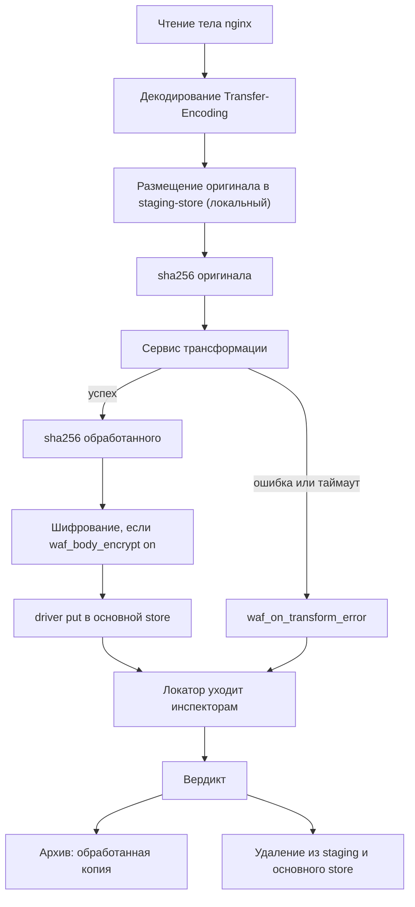

# Трансформация тела

Между чтением тела и его размещением в хранилище можно вставить внешний сервис, который тело
преобразует. Основное применение — маскирование: приватные данные не попадают в контур WAF вообще, а
инспекторы и аудит видят уже обработанную копию.

Сервис необязателен и подключается отдельной директивой. Без него конвейер работает как описано в
[body-storage.md](body-storage.md).

## Почему отдельный сервис, а не код в модуле

Маскирование требует разбора формата: JSON, form-urlencoded, multipart, протобуф с дескрипторами. Тело
может быть сжато, и чтобы его разобрать, надо распаковать. Внутри воркера nginx это означает парсеры в
цикле событий и поверхность декомпрессионной бомбы в самом чувствительном месте системы.

Вынесение в сервис убирает всё это из воркера. Модуль остаётся ответственным за транспорт и политику
отказа, сервис — за понимание формата. Цена — round-trip с полезной нагрузкой, поэтому размещение
сервиса имеет значение, см. [ниже](#размещение-и-транспорт).

## Место в конвейере

Порядок фиксирован, и каждый шаг зависит от предыдущего:



Три следствия из этого порядка стоит отметить сразу.

**Приложение всегда получает оригинал.** Обработанная копия существует только для контура WAF.
Практически это значит, что во время обработки в памяти или в staging живут две версии тела, и расчёт
памяти из [deployment.md](deployment.md#память) для маршрутов с трансформацией удваивается.

**Хешей два, и оба нужны.** `sha256` по оригиналу связывает событие с архивом и доказывает, что клиент
прислал именно это. `processed_sha256` по обработанному телу позволяет инспектору кешировать вердикт по
содержимому того, что он реально видел. Один хеш на два разных объекта — источник трудноуловимых
расхождений.

**Шифрование применяется после трансформации.** Иначе сервису пришлось бы дать ключ, а он и так самый
привилегированный компонент в системе.

## Staging-store

Оригинал тела где-то должен находиться, пока сервис его обрабатывает. Для этого выделяется отдельное
хранилище:

```nginx
waf_body_staging  raw driver=redis url=redis://127.0.0.1:6379 ttl=10s;
```

Требование к нему одно, но категорическое: класс латентности драйвера должен быть `local`. Если
оригинал уходит в распределённое хранилище, приватные данные покидают хост, и смысл маскирования
исчезает. Проверяется при `nginx -t`:

```
nginx: [emerg] waf: staging store "raw" uses driver "s3" with latency class
       "remote"; staging must stay on the local host, otherwise unredacted
       body leaves the node in /etc/nginx/nginx.conf:96
```

Staging нужен, когда оригинал должен где-то лежать, пока сервис его обрабатывает. Мелкое API-тело
сервис может взять из самого сообщения — тогда промежуточное размещение не требуется.

## Объявление и выбор

```nginx
http {
    waf_transformer mask
                    transport=unix:/run/waf/mask.sock
                    timeout=8ms
                    scope=request,response,frame
                    max=16m
                    concurrency=64;

    waf_body_staging raw driver=redis url=redis://127.0.0.1:6379 ttl=10s;

    server {
        location /api/ {
            waf_body_transform     mask;
            waf_on_transform_error meta;
            waf_capture            request headers args body;
            waf_archive request    body ttl=180d when=deny;
        }

        location /health/ {
            waf_body_transform off;
        }
    }
}
```

| Опция `waf_transformer` | По умолчанию | Описание |
| --- | --- | --- |
| `transport=` | обязательна | `unix:<path>` для локального сокета либо `subject=<subject>` для шины |
| `timeout=` | значение `waf_deadline` | Ожидание ответа. Входит в бюджет фазы |
| `scope=` | `request` | Где применяется: `request`, `response`, `frame`, через запятую |
| `max=` | `waf_body_limit` | Максимальный размер, который сервис берёт в обработку |
| `concurrency=` | `64` | Одновременных обработок на воркер. Ограничитель нагрузки на сервис |
| `chain=` | — | Имя следующего трансформера. Цепочка применяется по порядку |

Цепочка из нескольких сервисов допустима (`chain=`), но каждое звено добавляет round-trip в бюджет
фазы. Практично держать один сервис, который внутри применяет свой набор правил.

## Протокол

Тот же формат сообщений, что и у вердиктов, с другим набором полей. Запрос к сервису:

```json
{
  "v": 1,
  "rid": "3f2a9c1e00000017",
  "op": "transform",
  "phase": "request",
  "route": { "server_name": "shop.example.com", "location": "/api/" },
  "content_type": "application/json",
  "content_encoding": "gzip",
  "http": {
    "method": "POST",
    "uri": "/api/orders",
    "headers": [["content-type", "application/json"]]
  },
  "body": {
    "store": "raw",
    "driver": "redis",
    "key": "edge-07:3f2a9c1e00000017:req",
    "size": 18342,
    "sha256": "9f86d081884c7d65..."
  }
}
```

Ответ сервиса:

```json
{
  "v": 1,
  "rid": "3f2a9c1e00000017",
  "result": "transformed",
  "body": { "inline": "eyJhbW91bnQiOjEwMH0=", "size": 18201 },
  "content_encoding": "identity",
  "applied": [
    { "rule": "pan", "field": "$.card.number", "action": "preserve_format", "count": 1 },
    { "rule": "pii", "field": "$.user.ssn",    "action": "hash",            "count": 1 }
  ]
}
```

| `result` | Смысл | Реакция модуля |
| --- | --- | --- |
| `transformed` | Тело обработано, в ответе новая версия | Обработанная копия идёт в основной store |
| `unchanged` | Разобрано, но нечего маскировать | Оригинал идёт в основной store как есть |
| `unparsable` | Формат не распознан или битый | `waf_on_transform_error` |
| `too_large` | Превышает предел сервиса | `waf_on_transform_error` |
| `error` | Внутренняя ошибка | `waf_on_transform_error` |

Обработанное тело возвращается либо инлайном (`body.inline`), либо новым локатором, если сервис сам
разместил его в staging. Второй вариант избавляет от пересылки крупных тел обратно.

Поле `applied` обязательно и попадает в аудит. Без него через полгода никто не сможет объяснить, почему
инспектор пропустил очевидную атаку в замаскированном поле.

Для кадров (`scope=frame`) сообщение содержит `conn_id`, `seq` и `stream` вместо `rid` и `http`, а
кадры передаются инлайном: они малы, и staging для них излишен. Порядок обработки в пределах направления
соединения сохраняется, поэтому одновременно в сервисе находится не более одного кадра на направление.

## Политика отказа

Это самое важное место документа. Если сервис маскирования не ответил, а тело всё равно уйдёт в контур
как есть, маскирование обходится тривиально: достаточно перегрузить сервис или прислать тело, которое он
не разберёт.

```nginx
waf_on_transform_error meta|block|pass;
```

| Значение | Поведение | Когда применимо |
| --- | --- | --- |
| `meta` | Тело не размещается; инспекторы получают размер, тип и хеш без содержимого. Значение по умолчанию | Приватность важнее полноты проверки. Проверка тела деградирует, покрытие заголовков сохраняется |
| `block` | Запрос блокируется | Строгие контуры, где непроверенное тело недопустимо |
| `pass` | Оригинал уходит в контур без обработки | Только когда маскирование — удобство, а не требование. Считайте это выключением маскирования |

Значение `pass` требует явного указания и логируется отдельным счётчиком, потому что означает утечку
приватных данных в контур при каждом срабатывании.

Отдельно от политики действует ограничитель `concurrency=`: при его исчерпании новые тела не идут в
сервис, а сразу обрабатываются политикой. Это защищает сервис от исчерпания и делает поведение под
нагрузкой предсказуемым.

## Размещение и транспорт

Сервис получает тело и возвращает тело, то есть полезная нагрузка проходит по каналу дважды. Отсюда
единственная разумная рекомендация: сервис маскирования размещается на хосте nginx и общается через
Unix-сокет.

Подключение через шину (`subject=`) поддерживается, но обходится дорого: тело инлайном ограничено
`max_payload` шины, а тело локатором требует, чтобы сервис имел доступ к staging, то есть чтобы staging
был распределённым, что запрещено. Практически транспорт через шину применим только для мелких тел с
инлайном и для кадров.

Есть и вторая причина размещать сервис локально. Он видит все тела в открытом виде и потому является
самым привилегированным компонентом системы — привилегированнее любого инспектора. Держать его на хосте
nginx, за границей доверия, а не в общей сети, — правильное решение с точки зрения модели угроз, см.
[security.md](security.md#сервис-трансформации).

## Маскирование создаёт слепые зоны

Это свойство, не риск, и его нужно принимать осознанно.

Приложение получает оригинал, инспектор — обработанную копию. Атакующий, который сумеет поместить
полезную нагрузку в маскируемое поле, получает надёжный обход: если маскируется `$.user.notes`,
инъекция в этом поле не видна никому.

Три способа смягчить, в порядке предпочтения.

**Сохранение формы.** Длина и классы символов сохраняются, значение — нет:
`4111111111111111` превращается в `4111XXXXXXXX1111`, `ivan@example.com` в `xxxx@xxxxxxx.xxx`.
Структурные атаки остаются видимыми, потому что кавычки, скобки и ключевые слова в маскируемое значение
не попадают. Это выбранное поведение по умолчанию для сервиса.

**Замена на хеш вместо удаления.** Сохраняет корреляцию: «один и тот же номер карты с четырёхсот разных
адресов» — сигнал о фроде, который теряется при простом вырезании поля.

**Узкая область правил.** Маскируйте конкретные поля по пути, а не по регулярному выражению по всему
телу. Правило `$.card.cvv` предсказуемо, правило «все последовательности из шести-двенадцати цифр» —
нет, и слепая зона от него окажется гораздо шире задуманной.

Полное удаление поля даёт максимум приватности и гарантированную слепую зону. Оно уместно для полей,
которые заведомо не могут быть вектором: CVV, пароль, приватный ключ.

В любом случае факт применения правил обязан быть в аудите (поле `applied`), а покрытие — измеримым.

## Парадокс с DLP

Задача инспектора утечек — находить в ответах номера карт и персональные данные. Если замаскировать их
до инспекции, DLP не найдёт ничего, и обе функции взаимно уничтожаются.

Разрешается это не настройками, а размещением. Там, где нужны и маскирование, и DLP, инспектор утечек
должен быть локальным сайдкаром: он работает с оригиналом на хосте nginx, а за
пределы хоста уходят только его находки, но не данные. Это то же соображение, что и с ICAP, но по другой
причине: там локальность нужна из-за объёма, здесь — из-за конфиденциальности.

Конфигурация выглядит так:

```nginx
waf_inspector dlp subject=waf.rsp.dlp;

location /api/ {
    waf_inspect dlp phase=response wave=0 timeout=20ms;
    waf_preview             body=64k;
    waf_body_transform      mask;
    waf_transform_after     dlp;      # маскировать после инспекции, а не до
}
```

Директива `waf_transform_after` меняет порядок для фазы ответа: инспекторы получают оригинал, а
маскирование применяется только к тому, что уходит в аудит и архив. Это допустимо ровно потому, что
инспекторы локальны, и оригинал не покидает хост.

## Что маскируется помимо тела

Токены в строке запроса, `Authorization` и `Cookie` уходят в контур инспекции полностью, и без них
маскирование тела закрывает только часть проблемы.

```nginx
waf_mask_args   token session_id;         # значения параметров заменяются на хеш
waf_mask_headers authorization cookie;    # заменяются на хеш
```

Эти правила применяются в модуле, а не в сервисе: они не требуют разбора формата, работают по именам и
стоят наносекунды. Сервис трансформации нужен только там, где надо понимать структуру.

Обратите внимание, что `mask=` / `deny=` у `waf_capture` и `waf_preview` — отдельная настройка для
аудита, и она продолжает действовать независимо. Три потребителя редактируются раздельно, потому что у них разный круг доступа:
сообщение инспектору, событие аудита, архив тел.

## Валидация конфигурации

| Проверка | Реакция |
| --- | --- |
| `waf_body_transform` задан, а `waf_transformer` с таким именем не объявлен | Ошибка |
| Драйвер staging-store имеет класс латентности не `local` | Ошибка |
| `waf_body_transform` задан, а `waf_body_staging` не объявлен | Ошибка |
| `scope=` трансформера не включает фазу, в которой он выбран | Ошибка |
| `waf_transform_after` ссылается на инспектора, который читает обменник по сети | Ошибка: маскирование после инспекции имеет смысл только для локальных сайдкаров |
| Цепочка `chain=` содержит цикл | Ошибка |
| Сумма `timeout=` по цепочке превышает `waf_deadline` | Предупреждение |
| `waf_on_transform_error pass` | Предупреждение о том, что маскирование при отказе выключается |
