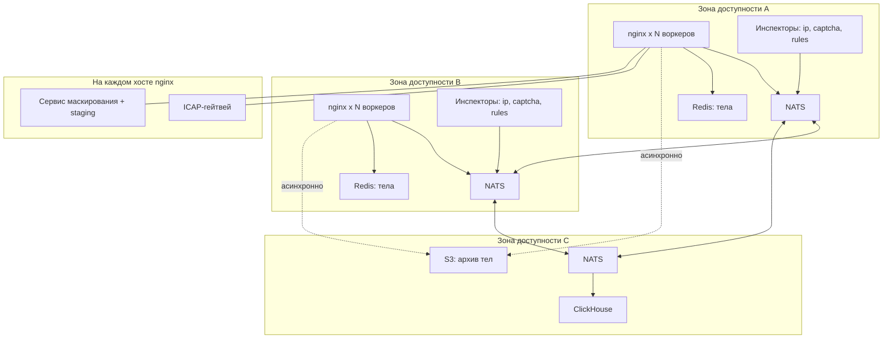
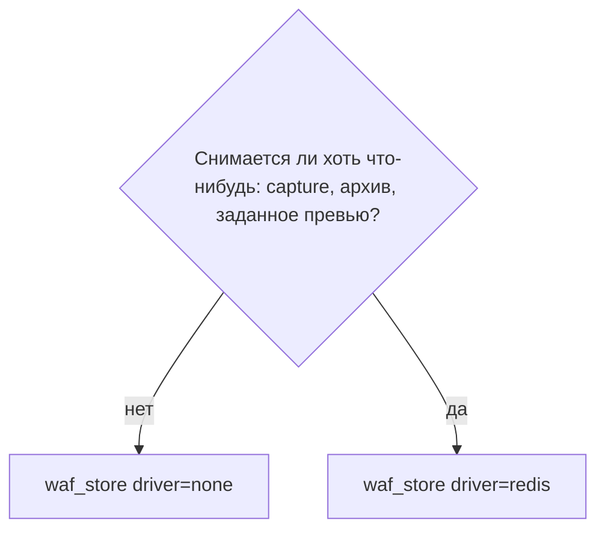

# Развёртывание

## Топология



Принципы размещения:

**Инспекторы горячего пути — в каждой зоне.** Межзональный RTT в пять-десять миллисекунд, добавленный
к каждому запросу на волне 0, съедает весь бюджет. NATS маршрутизирует к ближайшему подписчику при
использовании кластеров с локальными queue group; проверяйте это, а не предполагайте.

**Redis — локально в зоне.** Тело кладётся и читается в горячем пути, и межзональный RTT здесь стоит
столько же.

**ClickHouse и S3 — где удобно.** Они вне горячего пути, и их латентность не важна.

**ICAP-гейтвей и сервис маскирования — сайдкарами на хостах nginx.** Сервис маскирования видит тела
в открытом виде и потому не должен получать их по сети. Оригиналы в staging-store не покидают хост,
и это проверяется при `nginx -t`. ICAP читает тело по локатору из Redis, как остальные инспекторы.

## Сайзинг

### Латентность

Добавленная латентность равна сумме максимумов по волнам, отдельно для каждой фазы:

```
latency = Σ max(latency(i) : i ∈ волна w)  +  время размещения тела
          w
```

Пример для типового API-маршрута:

| Компонент | p50 | p99 |
| --- | --- | --- |
| Волна 0: ip | 0.6 ms | 2 ms |
| Размещение тела: inline | 0 | 0 |
| Волна 1: captcha, sqli, repu | 1.2 ms | 5 ms |
| Итого фаза запроса | 1.8 ms | 7 ms |
| Фаза ответа: dlp | 1.0 ms | 4 ms |
| Итого | 2.8 ms | 11 ms |

При выносе тела в Redis добавьте один RTT записи в фазу запроса — обычно 0.2–0.5 ms в пределах зоны. При
подключённом сервисе маскирования добавьте его время обработки: через Unix-сокет это единицы
миллисекунд для типичных API-тел и линейно растёт с размером.

Для кадрированного трафика расчёт другой. В режиме `gate` значение имеет не добавленная латентность, а
предельная пропускная способность соединения: не более одного вердикта на направление одновременно, то
есть примерно `1/RTT` сообщений в секунду. При RTT в полмиллисекунды это около двух тысяч сообщений в
секунду на направление, и увеличение дедлайна этого не меняет.

Важная поправка на квантили: вероятность, что хотя бы один из N инспекторов волны окажется за своим
p99, равна `1 − 0.99^N`. Для четырёх инспекторов это около четырёх процентов запросов. Чтобы держать
общий p99 запроса, от каждого инспектора требуется квантиль `1 − 0.01/N`, то есть p99.75 при четырёх.
Планируйте таймауты по этому квантилю, а не по p99.

### Нагрузка на шину

Каждый клиентский запрос порождает по два сообщения на каждого опрашиваемого инспектора плюс аудит:

```
сообщений/с = RPS × (2 × число_инспекторов_запроса
                   + 2 × число_инспекторов_ответа)
            + RPS × sample_аудита / batch
```

Для десяти тысяч RPS, трёх инспекторов запроса и одного ответа:

```
10 000 × (2×3 + 2×1) = 80 000 сообщений/с
```

Для кадрированного трафика в основе лежит частота сообщений, а не запросов:

```
сообщений/с = соединений × сообщений_в_секунду_на_соединение
            × 2 × число_инспекторов_кадров × waf_frame_sample
```

Сто тысяч соединений с одним сообщением в секунду и двумя инспекторами дают четыреста тысяч сообщений в
секунду — и это спокойный режим, без атаки. Отсюда практическая необходимость `waf_frame_sample` и
локальных ограничителей.

Это восьмикратное усиление. Именно оно делает обязательным локальный слой: без него всплеск мусорного
трафика умножается на восемь и приходит на шину и на инспекторы.

Один узел NATS обрабатывает миллионы сообщений в секунду на подобных полезных нагрузках, поэтому сама
шина не является узким местом. Узким местом становятся инспекторы волны 0, которые видят весь поток.

### Память

Основные потребители на воркер:

```
память ≈ запросов_в_полёте × (размер_слота + буфер_ответа + тело_в_памяти)
```

Слот ожидания — сотни байт. Буфер ответа при включённом `waf_response_body_access` — до
`waf_response_buffer_max` на запрос, и это доминирующая величина. Тысяча одновременных запросов при
лимите в один мегабайт даёт до гигабайта на воркер в худшем случае.

Отсюда два практических вывода. Первый: `waf_response_buffer_max` нужно ставить по реальному
распределению размеров ответов, а не «с запасом». Второй: инспекция ответа с `preview=64k` вместо
`full` снижает требования к памяти на порядок и почти не снижает качество детекта.

Две поправки. Маршруты с сервисом маскирования держат две версии тела одновременно — оригинал в staging и
обработанную копию, — поэтому для них расчёт удваивается. Инспекция кадров со включённой сборкой добавляет
до `waf_message_max` на каждое направление каждого соединения, и это самая опасная величина в расчёте:
сто тысяч соединений при лимите двести пятьдесят шесть килобайт дают теоретический потолок в десятки
гигабайт. Метрика `waf_reassembly_bytes` существует именно для контроля этого.

### Хранилище тела

```
объём_в_полёте ≈ RPS_с_телом × средний_размер × (латентность_фазы + запас)
```

Для тысячи запросов в секунду с телами по сто килобайт и фазы в десять миллисекунд это около одного
мегабайта постоянно занятой памяти в Redis. Цифра мала, потому что тела живут миллисекунды. Опасность
не в среднем, а в хвосте: один залипший инспектор при `waf_deadline ... pass` и дедлайне в секунду
превращает тот же поток в сто мегабайт. Ограничитель `waf_body_max_holds` существует именно для этого.

## Выбор драйвера тела



Выбора, по существу, нет: горячий путь требует драйвера с сетевой, а не удалённой латентностью, и
такой драйвер в модуле один. Обменник при этом один на контур, так что и решать приходится один раз, а
не на каждом маршруте. Архив — не альтернатива этому выбору, а то, что происходит после вердикта:
`waf_archive request` не участвует в горячем пути вовсе, потому что перекладывает объекты агент.

## Архив: три бакета

Ключ объекта: `<yyyy>/<mm>/<dd>/<node>/<ray>[.<фаза>].<hdr|arg|body>` (у фазы запроса сегмента фазы нет, у ответа — `.response`: ray у них общий). Тем же `PUT` ставится тег
`waf-retain-ttl=<секунды>` — в составе `PutObject` тегирование бесплатно, а отдельным
`PutObjectTagging` это второй round-trip и окно, в котором объект живёт без правила удаления. Срок в
ключ не выносится: тег и так фильтруется lifecycle-правилом, а две записи одной величины рано или
поздно разойдутся.

```
s3 {
    endpoint    https://s3.example.com
    region      ru-1
    credentials /etc/waf/s3.creds
    bucket headers waf-headers
    bucket args    waf-args
    bucket body    waf-bodies
}
```

Файл — `nginx/agent/agent.conf` (`WAF_AGENT_CONFIG`). Окружение `WAF_RETAIN_*` перекрывает его.

Разделение по видам оправдано не аккуратностью. У тела, заголовков и строки запроса разная
чувствительность — платёжные данные против `Cookie` против query, — а значит разные политики доступа и
при желании разные ключи KMS. Разный объём и разный разумный срок. И на регуляторное «удалите все
тела» отвечает операция над одним бакетом, а не выборка по префиксам в общем.

Пустое имя бакета выключает архивацию этого вида у агента: объект уедет в запись как
`archive_error`, а модуль удерживать его перестанет только после того, как правку внесут в nginx.
Проверять согласованность двух конфигураций некому — это единственное место, где настройка модуля и
настройка агента обязаны знать друг о друге.

### Lifecycle

По одному правилу на каждый срок, встречающийся в `waf_archive request`. Фильтр — по тегу
`waf-retain-ttl`: срок задаётся на маршруте, а ключ о нём ничего не знает, и менять правило задним
числом можно, не переписывая объекты.

Правила отвечают не только за уборку. Хранилище называет по ним срок объекта в `x-amz-expiration`
тем же ответом на `PUT`, агент кладёт его в локатор записи, и разбор инцидента по нему видит, лежит
ли объект ещё на месте — не обращаясь к бакету. Без правил срока в записи нет, и карточка идёт за
объектом, даже когда его давно нет.

```json
{
  "Rules": [
    { "ID": "ttl-2592000",  "Status": "Enabled",
      "Filter": { "Tag": { "Key": "waf-retain-ttl", "Value": "2592000" } },
      "Expiration": { "Days": 30 } },
    { "ID": "ttl-15552000", "Status": "Enabled",
      "Filter": { "Tag": { "Key": "waf-retain-ttl", "Value": "15552000" } },
      "Expiration": { "Days": 180 } },
    { "ID": "abort-multipart", "Status": "Enabled", "Filter": { "Prefix": "" },
      "AbortIncompleteMultipartUpload": { "DaysAfterInitiation": 1 } },
    { "ID": "noncurrent", "Status": "Enabled", "Filter": { "Prefix": "" },
      "NoncurrentVersionExpiration": { "NoncurrentDays": 7 } }
  ]
}
```

Срок без правила означает объект, который не удалится никогда, и это не отказ, а тихий рост счёта.
Ровно так же ведёт себя `waf_archive request` без `ttl=` — «хранить вечно» здесь буквально.

Последние два правила обязательны, а не желательны. Без первого недозагруженные части копятся
невидимо для `ListObjects` и оплачиваются годами. Без второго — при включённом версионировании —
удаление создаёт delete marker, а прежняя версия остаётся навсегда, то есть весь механизм сроков
работает вхолостую.

Ограничения S3, которые лучше знать заранее, чем обнаружить:

- Срока жизни у отдельного объекта не существует. Есть только правило бакета, и никакого способа
  сказать «этот объект удалить через час» нет.
- Минимальная гранулярность — сутки, с округлением до полуночи UTC. Объект, положенный в 23:59, и
  объект, положенный в 00:01, живут почти на сутки по-разному.
- Исполнение асинхронное и батчевое: удаление происходит «в течение суток после», а не в момент.
  Платить за объект приходится до фактического удаления, а не до наступления срока.

Точный срок в минутах есть только у Redis. Это ещё одна причина, по которой горячий слой остаётся на
нём, а архив не пытается его заменить.

### Сколько это весит

```
объём/сутки = RPS × доля_архивации × средний_размер × 86400
```

Десять тысяч запросов в секунду, двадцать процентов удержания, тело в четыре килобайта — около 690 ГБ
в сутки, то есть примерно 120 ТБ на классе `180d`. Это не аргумент против архивации, а причина
выбирать `when=`, `sample=` и класс осознанно: та же нагрузка с `when=deny` при доле блокировок в
полпроцента даёт около 17 ГБ в сутки.

Пропускная способность агента считается оттуда же: 690 ГБ в сутки — это порядка 8 МБ/с исходящего
трафика на узел и около двух тысяч `PUT` в секунду. Первое незаметно, второе требует внимания к
корзинам (`archive.batch` в `agent.conf`): секции вспыхивают независимо, запись аудита ждёт все
свои виды. Переполнение очереди решений (`archive.queue`) не теряет события — теряет полезную
нагрузку, помечая локаторы `overload`.
Рост счётчика `overload` — сигнал, что очередь или корзины не успевают.

## Сборка и установка

Модуль собирается как динамический и подключается без замены nginx:

```bash
./configure --with-compat --add-dynamic-module=/path/to/ngx_http_waf_module
make modules
cp objs/ngx_http_waf_module.so /etc/nginx/modules/
```

Флаг `--with-compat` обязателен: он обеспечивает бинарную совместимость с дистрибутивными сборками
nginx, включая nginx-plus. Без него модуль придётся собирать против точной конфигурации целевого
nginx.

Зависимости времени сборки: клиент NATS (`nats.c`) с поддержкой внешнего цикла событий через
`natsOptions_SetEventLoop`, OpenSSL для HMAC и AES-GCM, клиенты драйверов тела. Драйверы, требующие
тяжёлых зависимостей, имеет смысл выделять в отдельные динамические модули, чтобы базовая установка не
тянула их за собой.

Проверка перед выкладкой:

```bash
nginx -t                  # валидация графа, драйверов, каталогов
nginx -T | grep -c waf_   # убедиться, что конфигурация та, что ожидается
```

## Интеграция с циклом событий

Клиент шины не должен иметь собственного потока и собственного цикла. Он регистрируется в цикле
событий nginx, иначе появляется межпоточная передача вердиктов, блокировки и непредсказуемая
латентность.

`nats.c` поддерживает это через `natsOptions_SetEventLoop`: библиотека вызывает предоставленные
колбэки присоединения сокета и управления интересом к чтению и записи, а модуль реализует их через
`ngx_add_event`, `ngx_handle_read_event` и `ngx_handle_write_event`. Обработка входящих сообщений
происходит в обработчике события чтения соединения, то есть в том же потоке, где живут запросы.

Драйверы тела подчиняются тому же правилу, см.
[body-storage.md](body-storage.md#интерфейс-драйвера). Реализация драйвера на блокирующем SDK
останавливает воркер целиком и является ошибкой, а не проблемой производительности.

## Перезагрузка конфигурации

При `nginx -s reload` старые воркеры продолжают обслуживать принятые запросы, а новые начинают
принимать новые соединения. Для модуля это означает следующее.

Завершающийся воркер прекращает публиковать новые запросы на шину. Уже висящие вердикты дренируются с
отдельным таймаутом; по его истечении оставшиеся запросы разрешаются по политике `waf_deadline`, а не
бросаются молча.

Имя инбокса содержит nonce процесса, поэтому вердикты старого поколения не могут попасть в новые
воркеры. Без nonce номера слотов у старых и новых воркеров совпадают, и ответ старого поколения
разбудил бы чужой запрос — тот самый класс ошибок, который потом ищут месяцами.

Наборы данных для локального слоя перечитываются с keeper ([keeper.md](https://github.com/exemt/placitum-keeper/blob/develop/docs/spec.md)): снапшот по запросу, дельты и тики core NATS,
поэтому новый воркер получает актуальный снапшот сразу, не проигрывая историю.

Долгоживущие соединения `reload` не переносит: апгрейженные WebSocket-соединения остаются на старых
воркерах со старой конфигурацией до своего закрытия. Изменения в правилах инспекции кадров начинают
действовать только на новых соединениях, и для чатоподобной нагрузки с многочасовыми сессиями это может
означать сутки на раскатку. Если изменение нужно немедленно, соединения придётся закрыть принудительно.

Изменение размера shm-зоны требует полного перезапуска, а не reload. Это ограничение nginx.

Как поколение доезжает до ноды: оператор делает `send` в контроллере, агент забирает шаблон и
объекты `store:<uuid>`, собирает дерево, гоняет `nginx -t` и только потом `reload`. Подробности —
[config-distribution.md](config-distribution.md). Агента нет в воркере: модуль не читает store и не
сигналит мастеру.

## Отказоустойчивость

| Отказ | Поведение | Что настроить заранее |
| --- | --- | --- |
| Один инспектор недоступен | `waf_exception <фаза> absent`; при `deny` маршрут перестаёт обслуживаться | Алерт на `waf_absent_total`, чтобы отличить это от таймаутов |
| Инспектор отвечает медленно | Circuit breaker открывается, дальше по политике `waf_deadline` | Порог и окно breaker по реальным данным из аудита |
| Узел NATS упал | Клиент переподключается к другому узлу кластера | Все узлы в `waf_bus`, `max_reconnect=-1` |
| Кластер NATS недоступен целиком | `waf_exception <фаза> bus` | Осознанный выбор между доступностью и защитой |
| Redis недоступен | `waf_exception <фаза> body`; инспекторы без тела продолжают работать. Конфигурационный store в Redis не живёт | Реплики в зоне, `op_timeout` в единицы миллисекунд |
| ClickHouse недоступен | События копятся в JetStream до retention | Мониторинг лага потребителя, retention с запасом |
| S3 недоступен | Архивация тел прекращается, трафик не затронут. Конфигурационный store в S3 не живёт | Алерт на ошибки архивации |
| Postgres / контроллер недоступен | Трафик не затронут. `send` и apply нового поколения встанут: агент не заберёт ciphertext | Реплика базы; объекты уже на ноде переживают простой контроллера |
| Сервис челленджа сломан | Молчит — исход по политике `waf_deadline`; зациклился — редиректы прекращаются, как только его убрали из `waf_inspect` маршрута | Предел попыток и понятная страница отказа на стороне сервиса; `waf_redirect_allow` только там, где челлендж нужен |
| Сервис маскирования недоступен | `waf_on_transform_error`; при `meta` тело не размещается, проверка тела деградирует | Алерт на `waf_transform_total{result="error"}`; значение не должно быть `pass` |
| Инспектор кадров недоступен | `waf_on_frame_timeout`; при `block` соединения закрываются | Осознанный выбор: закрытые сессии против непроверенных сообщений |

Главное решение принимается один раз и осознанно: чем вы жертвуете при отказе — доступностью или
защитой. `waf_deadline ... block` на всех маршрутах означает, что отказ инспектора роняет сайт.
`waf_deadline ... pass` означает, что отказ инспектора тихо выключает защиту. Практичная схема — `pass`
для основного трафика с алертом на долю `timeout_pass`, и `block` для маршрутов, где цена пропуска
выше цены недоступности: платежи, административные интерфейсы, загрузка файлов.

## Внедрение на живом трафике

Порядок, при котором внедрение не приводит к аварии:

1. Все инспекторы ставятся в `waf_inspect` с `mode=passive`. Вердикты собираются в аудит, на трафик не влияют.
2. Аудит включается с полным сэмплом на ограниченном наборе маршрутов. По данным из ClickHouse
   считается доля срабатываний и подбираются таймауты по квантилю `1 − 0.01/N`.
3. Оценивается доля ложных срабатываний запросом из [audit.md](audit.md#типовые-запросы). До перевода
   в обязательные она должна быть объяснена, а не просто мала.
4. Инспекторы переводятся в `mode=active` по одному, начиная с самых дешёвых и предсказуемых, с
   `waf_deadline ... pass`.
5. Включается локальный слой и `waf_local_rate` — до того, как трафик вырастет, а не после.
6. Только после стабилизации метрик отдельные маршруты переводятся на `waf_deadline ... block`.
7. Маскирование включается с `waf_on_transform_error meta` и проверяется по полю
   `body_transform_rules` в аудите: правила должны применяться там, где ожидается, и не применяться там,
   где не ожидается. Слепые зоны нужно увидеть в данных до того, как на них станут полагаться.
8. Инспекция кадров включается с `waf_frame_mode monitor` и полным сэмплом, чтобы измерить реальную
   частоту сообщений. Переход в `gate` возможен только если измеренная частота имеет кратный запас до
   границы `1/RTT`.

Шаг с `mode=passive` обычно хочется пропустить. Не стоит: именно он показывает реальное
распределение латентностей и реальную долю ложных срабатываний, а не предполагаемую.
