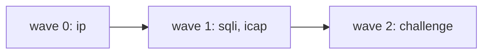

# Модель исполнения

## Волны

Порядок опроса задаёт `wave=` на `waf_inspect`. Номер — свойство вызова на маршруте, не реестра.
Внутри волны инспекторы идут параллельно. Следующая волна публикуется, когда все обязательные
предыдущей ответили, ни один не потребовал `deny` или `redirect`, и счёт не достиг порога отказа.

```nginx
waf_inspector ip        subject=waf.req.ip;
waf_inspector sqli      subject=waf.req.sqli;
waf_inspector icap      subject=waf.req.icap;
waf_inspector challenge subject=waf.req.chal;

waf_inspect ip        wave=0 timeout=5ms;
waf_inspect sqli      wave=1 timeout=15ms;
waf_inspect icap      wave=1 timeout=30s;
waf_inspect challenge wave=2 timeout=10ms;
```

Три волны: `[ip]`, `[sqli, icap]`, `[challenge]`. Пустая волна пропускается: location без `wave=0`
стартует с первого непустого номера.



Вердикт `score` ниже порога волну не останавливает. Модель счёта —
[verdict-protocol.md](verdict-protocol.md#скоринг).

Челлендж стоит последним: ему нужен накопленный счёт в секции `score`. Модуль порога челленджа не
имеет.

`after=` снят. Графа зависимостей, отброшенных рёбер и предупреждений про них больше нет.

### Валидация набора

| Ситуация | Реакция |
| --- | --- |
| `waf_inspect` неизвестного имени | Ошибка конфигурации |
| Повтор имени и фазы на одном уровне | Ошибка конфигурации |
| Нет `wave=` | Ошибка конфигурации |
| Шаблон `waf_redirect_allow` не разбирается | Ошибка конфигурации |

## Маски ожидания
## Маски ожидания

Каждому имени инспектора при разборе конфигурации выдаётся индекс бита. Ожидаемый набор каждой волны
хранится в location conf как готовая битовая маска, посчитанная при загрузке конфига. В горячем пути
не остаётся ни поиска по строкам, ни обращений к реестру.

```c
#define WAF_MAX_INSPECTORS  64

typedef struct {
    uint64_t    mandatory;      /* кого обязаны дождаться и кто гейтит   */
    uint64_t    passive;        /* ждём ради лога, но не гейтит          */
    uint64_t    all;            /* объединение: кому публиковать         */
} ngx_http_waf_wave_t;

typedef struct {
    ngx_array_t          *req_waves;    /* массив ngx_http_waf_wave_t     */
    ngx_array_t          *rsp_waves;
    ngx_msec_t            deadline;     /* общий бюджет на фазу           */
    ngx_uint_t            on_timeout;   /* WAF_PASS | WAF_BLOCK           */
    ngx_uint_t            deny_mode;    /* WAF_DENY_FAST | WAF_DENY_STRICT */
    ngx_int_t             score_deny;      /* 0 => порог выключен         */
    ngx_array_t          *redirect_allow;  /* NULL => редирект запрещён   */
} ngx_http_waf_loc_conf_t;

typedef struct {
    ngx_uint_t            wave;         /* индекс текущей волны           */
    uint64_t              got;          /* кто ответил                    */
    uint64_t              allowed;
    uint64_t              denied;
    ngx_http_waf_reply_t  reply[WAF_MAX_INSPECTORS];
} ngx_http_waf_slot_t;
```

Из масок бесплатно получаются три свойства.

**Дедупликация.** Повторная доставка не меняет уже выставленный бит, поэтому дубль сообщения не
засчитывается как второе подтверждение.

**Изоляция.** Ответ от инспектора, которого в этой волне не спрашивали, не выставляет ни одного бита
и отбрасывается со счётчиком. Скомпрометированный инспектор не может ответить за другого.

**Полнота.** Условие перехода к следующей волне — `(got & awaited) == awaited`, одно сравнение, где
`awaited = mandatory | passive`.

Предел в 64 имени на конфигурацию проверяется при разборе и даёт внятную ошибку, а не молчаливое
переполнение. При необходимости `uint64_t` заменяется на массив слов без изменения интерфейса.

Обратите внимание, чего в слоте нет: накопленного счёта. Маски и ответы относятся к текущей волне, а
счёт — к фазе целиком, поэтому сумма живёт в контексте запроса (`ctx->score`). Это не стилистика:
слот освобождается перед публикацией следующей волны, чтобы опоздавший ответ предыдущей не попал в
набор текущей, и сумма в нём не пережила бы переход между волнами.

## Режимы на вызове

`mode=` стоит на `waf_inspect`, не в реестре. Один и тот же `sqli` бывает боевым на `/` и
наблюдаемым на `/api/`.

| Режим | Бит | Ждут | Гейтит | Счёт | Переопределения |
| --- | --- | --- | --- | --- | --- |
| `active` | `mandatory` | да | да | `total` | да |
| `passive` | `passive` | да | нет | теневая сумма | нет |

Нет строки `waf_inspect` — инспектор не бежит. `ignore` и `advisory` сняты: выкатка — `passive`.

Пассивного ждут: иначе вердикт почти всегда терялся бы. Его `deny` и `redirect` исход не меняют,
счёт идёт в `ctx->shadow`, заголовки и cookie не применяются, молчание не включает `waf_deadline`.

`profile=` — поле реестра, в сообщении `route.profile`. На маску волны не влияет.

## Латентность

Добавленная латентность фазы равна сумме максимумов по волнам, а не максимуму по всем инспекторам:

```
latency(фаза) = Σ  max( latency(i) для i из волны w )
                w
```

Полная добавка к запросу — сумма по двум фазам. Три волны по пять миллисекунд дают пятнадцать вместо
пяти при полном параллелизме. Это осознанная плата за то, что дорогие инспекторы не видят трафик,
который отсекается дешёвыми.

Ожидание всех инспекторов волны смещает вас в более далёкий квантиль: вероятность, что хотя бы один
из N окажется за своим p99, равна `1 − 0.99^N`. При четырёх инспекторах это около четырёх процентов
запросов. Чтобы держать общий p99, от каждого инспектора нужен квантиль `1 − 0.01/N`. Расчёт бюджета
— в [deployment.md](deployment.md#сайзинг).

## Дедлайны и таймауты

Работают два уровня, и оба обязательны.

**Таймаут инспектора** (`timeout=` на `waf_inspect`) ограничивает ожидание одного ответа.
Его истечение отмечается в слоте и обрабатывается по политике.

**Дедлайн фазы** (`waf_deadline`) ограничивает суммарное время всех волн фазы. Он вооружается один
раз и гарантирует клиенту верхнюю границу независимо от числа волн и поведения инспекторов. Сумма
таймаутов волн может превышать дедлайн — тогда побеждает дедлайн.

При срабатывании дедлайна дальнейшие волны не публикуются, а решение принимается по политике отказа
с тем набором ответов, который успел прийти.

## Политики отказа

Причины неполучения вердикта различаются, и сводить их в одну директиву значит терять управление.

| Директива | Событие | Значения | Рекомендация |
| --- | --- | --- | --- |
| второе слово `waf_deadline` | Дедлайн или таймаут обязательного инспектора | `pass` \| `block` | Зависит от маршрута; для сервиса челленджа почти всегда `pass`: иначе его недоступность закрывает маршрут вместо того, чтобы просто снять проверку |
| `waf_exception … absent` | Инспектор выбран в конфигурации, но на его subject нет подписчиков | `pass` \| `deny` | `deny` плюс громкий алерт: это ошибка развёртывания |
| `waf_exception … bus` | Шина недоступна, публикация не удалась | `pass` \| `deny` | `pass` для доступности, `deny` для строгих контуров |
| `waf_exception … body` | `waf_capture` снял тело, драйвер не разместил | `pass` \| `deny` | `deny`, иначе проверка тела молча выключается |
| `waf_on_transform_error` | Сервис маскирования не ответил или не разобрал тело | `meta` \| `block` \| `pass` | `meta`; `pass` равносилен выключению маскирования |
| второе слово `waf_body_limit` | Тело больше размера | `block` \| `trim` \| `pass` | Осознанное решение о дыре в покрытии |

Событие «нет подписчиков» стоит выделить отдельно: core NATS сообщает об отсутствии отвечающих
немедленно, не дожидаясь дедлайна. Это не перегрузка, а неверная конфигурация или незапущенный
сервис, и смешивать его с таймаутом — верный способ не заметить выключенную защиту.

При частичном наборе ответов переопределения от успевших инспекторов применяются: они валидны сами
по себе. Это зафиксированное поведение, а не деталь реализации.

Со счётом частичный набор ведёт себя иначе, чем с бинарным вердиктом, и это стоит осознать до
выкладки. Отсутствующий ответ вносит ноль, поэтому таймаут инспектора не «пропускает его мнение», а
занижает сумму: замедлить один сервис — это способ увести запрос под порог. Circuit breaker даёт то
же самое, только надолго и сразу для всего маршрута. Если основная нагрузка по блокировке лежит на
счёте, а не на явных `deny`, значения `waf_deadline ... pass` и `breaker=on` перестают быть
безобидными настройками доступности.

## Короткое замыкание и режимы отказа

Первый `deny` позволяет не ждать остальных и сэкономить весь остаток бюджета — на атакующем трафике
это заметная экономия, и именно она защищает дорогие инспекторы от нагрузки. Плата в том, что при
двух почти одновременных `deny` победитель определяется гонкой, и клиент может получать разные
страницы на одинаковых запросах.

```nginx
waf_deny_mode fast;          # ответить на первом deny (по умолчанию)
waf_deny_mode deterministic; # дождаться всю волну, выбрать по приоритету
```

В режиме `deterministic` победитель выбирается по порядку объявления инспекторов в конфигурации. В
обоих режимах остальные ответы всё равно собираются в слот и попадают в аудит — клиент их просто уже
не ждёт.

Вердикт `redirect` замыкает фазу так же, как `deny`: дальнейшие волны не публикуются.

### Замыкание по счёту

Достижение `waf_score_deny` замыкает фазу наравне с явным `deny`. Это безопасно ровно потому, что
вклады неотрицательны: сумма монотонно растёт, пересечение порога необратимо, и ответы, которых мы не
стали ждать, изменить исход не могли бы. Гонки здесь нет вообще — в отличие от выбора страницы
отказа при двух одновременных `deny`, где режим `deterministic` действительно нужен.

Вердикт `redirect` от сервиса челленджа замыкает волну на тех же правах, что `deny`, и отсюда следует
требование к топологии, а не к модулю. В режиме `fast` замыкание происходит по первому такому ответу,
поэтому сервис челленджа, поставленный в одну волну со скорящими инспекторами, может увести на капчу
запрос, который через долю миллисекунды набрал бы сотню и получил бы отказ. Лестница решения от этого
не спасает: она ставит обе формы отказа выше редиректа, но выбирает только среди тех ответов, которые
успели прийти.

Поэтому челлендж ставят отдельной поздней волной (`wave=` больше, чем у скорящих): к его вызову
счёт предыдущих уже накоплен, а `redirect` соревнуется только с ответами своей волны.
Режим `deterministic` даёт то же внутри волны ценой полного ожидания на каждом отказе.

Практическое следствие для дорогих инспекторов: набранный на ранних волнах счёт до них не доходит,
если он уже перевалил за порог. Разбор тела и ICAP защищены от нагрузки не только явными `deny`
дешёвых проверок, но и накопленным счётом.

## Локальный слой

Локальный слой стоит перед волной 0 и работает до того, как о запросе узнает кто-либо на шине.
Порядок внутри него — сначала проверки по наборам, затем счётчики частоты, и он не произволен:
разрешающий набор — это список того, что проверять не надо вовсе (собственные пробы, партнёрские
интеграции, служебные адреса), и если бы лимит частоты применялся раньше, разрешающий список перестал
бы что-либо значить ровно там, где он нужен — на нагрузочном тесте со своего же адреса.

Проверки по наборам разрешаются в порядке объявления, и первое сработавшее правило решает. Отказ
локального слоя проходит тем же путём, что и отказ по вердикту: страница отказа, каталог `response=`,
запись в лог с указанием сработавшего правила.

Счёт по волнам (`count=waves`) начисляется после публикации, а не до неё. Отменять волну в этой точке
поздно, и решения здесь уже не принимается: превышение учтётся на следующем запросе того же ключа.
Иначе счёт по волнам требовал бы знать их число заранее — то есть считать набор волн до его исполнения,
включая волны, которые не состоятся из-за короткого замыкания.

Без объявленной `waf_shm_zone` локального слоя нет, но и конфигурации с его директивами нет: они
отвергаются при загрузке. Проверить состояние зоны в рантайме дешевле, чем объяснять, почему лимит не
срабатывал.

## Circuit breaker

Состояние инспектора хранится в разделяемой памяти и общее для всех воркеров. При превышении доли
таймаутов на скользящем окне инспектор переводится в открытое состояние: запросы к нему не
публикуются, а вердикт сразу считается неполученным и обрабатывается по политике `waf_deadline`. Через
период проб пропускается ограниченная доля запросов для проверки восстановления.

Это принципиально важно именно из-за волн: инспектор, залипший на таймауте в волне 0, иначе добавляет
свой таймаут к каждому запросу и делает недоступным весь маршрут.

Отказом считается отсутствие годного вердикта: молчание, мусор и `verdict: "error"` — собственное
«проверить не смог». Молчание и мусор здесь неотличимы нарочно:
ответ, не прошедший проверку, для волны и есть молчание (см.
[verdict-protocol.md](verdict-protocol.md#ограничения-канала)), и если не считать его отказом, то
присылать мусор становится выгоднее, чем не отвечать вовсе. Сам вердикт отказом не считается никогда:
`deny`, `redirect` и счёт — это работающий инспектор, а отключение инспектора за то, что он блокирует
трафик, было бы выключателем защиты в руках атакующего.

Настройки живут в `waf_inspector` (`breaker=`, `breaker_threshold=`, `breaker_window=`,
`breaker_probe=`) и по умолчанию включены: половина отказов на окне 10 секунд, проба каждые 5 секунд.
Доля не считается, пока на окне меньше двадцати наблюдений, — иначе первый же таймаут единственного
запроса за окно даёт сто процентов и выключает инспектор на маршруте с редким трафиком.

Состояние общее, поэтому и проба общая: право сделать пробу разыгрывается между воркерами одним
`cmp_set`. Иначе «ограниченная доля запросов» на восьми воркерах означала бы восемь проб вместо одной,
то есть проверку восстановления нагрузкой на неработающий сервис.

Открытое состояние — это тихое ослабление защиты, и в лог оно пишется на уровне `warn`. Уровень
главного `error_log` при этом должен быть не строже: всё, что модуль пишет вне запроса — подключение к
шине, подписки на наборы данных, переходы предохранителя, — идёт в лог цикла, а не в лог `http`.

## Реализация ожидания в фазах nginx

Ожидание вердикта выполняется в `NGX_HTTP_ACCESS_PHASE`.

Счётчик `r->main->count` в access-фазе инкрементировать нельзя. Для этой фазы nginx не вызывает
`ngx_http_finalize_request()`, декрементировать счётчик будет некому, и запрос никогда не
освободится. Инкремент — приём content-фазы и подзапросов. Корректный паттерн взят из
`ngx_http_limit_req_module`: обработчик возвращает `NGX_AGAIN` или `NGX_DONE`, а колбэк с шины
возвращает запрос в фазы через `ngx_http_core_run_phases()`.

```c
static ngx_int_t
ngx_http_waf_access_handler(ngx_http_request_t *r)
{
    ngx_http_waf_ctx_t  *ctx;
    ngx_int_t            rc;

    ctx = ngx_http_get_module_ctx(r, ngx_http_waf_module);

    if (ctx == NULL) {
        ctx = ngx_pcalloc(r->pool, sizeof(ngx_http_waf_ctx_t));
        if (ctx == NULL) {
            return NGX_HTTP_INTERNAL_SERVER_ERROR;
        }
        ctx->request = r;
        ngx_http_set_ctx(r, ctx, ngx_http_waf_module);

        /* локальный слой: без единого сообщения на шину */
        rc = ngx_http_waf_local_checks(ctx);
        if (rc != NGX_DECLINED) {
            return rc;
        }

        return ngx_http_waf_wave_start(ctx, 0);
    }

    switch (ctx->state) {

    case WAF_ST_WAITING:
        return NGX_DONE;                 /* повторный вход из run_phases */

    case WAF_ST_NEED_BODY:
        rc = ngx_http_read_client_request_body(r, ngx_http_waf_body_ready);
        if (rc >= NGX_HTTP_SPECIAL_RESPONSE) {
            return rc;
        }
        return NGX_DONE;

    case WAF_ST_ALLOW:
        ngx_http_waf_apply_request_overrides(ctx);
        return NGX_DECLINED;             /* дальше по фазам */

    case WAF_ST_REDIRECT:
        return ngx_http_waf_send_redirect(ctx);

    case WAF_ST_DENY:
        return ngx_http_waf_send_deny(ctx);

    default: /* WAF_ST_TIMEOUT, WAF_ST_BUS_ERROR, WAF_ST_BODY_UNAVAILABLE */
        if (ctx->clcf->fail_open) {
            return NGX_DECLINED;
        }
        return NGX_HTTP_SERVICE_UNAVAILABLE;
    }
}
```

Публикация волны и засыпание:

```c
static ngx_int_t
ngx_http_waf_wave_start(ngx_http_waf_ctx_t *ctx, ngx_uint_t wave)
{
    ngx_http_request_t  *r = ctx->request;

    if (ngx_http_waf_wave_needs_body(ctx, wave) && !ctx->body_ready) {
        ctx->state = WAF_ST_NEED_BODY;
        return ngx_http_waf_access_handler(r);   /* повторный вход за телом */
    }

    ctx->slot = ngx_http_waf_slot_insert(ctx);   /* таблица в памяти воркера,
                                                    НЕ в r->pool: поздний ответ
                                                    после освобождения пула
                                                    иначе даёт use-after-free */
    ngx_http_waf_bus_publish_wave(ctx, wave);

    if (wave == 0) {
        ctx->deadline.handler = ngx_http_waf_on_deadline;
        ctx->deadline.data    = ctx;
        ctx->deadline.log     = r->connection->log;
        ngx_add_timer(&ctx->deadline, ctx->clcf->deadline);
    }

    /* заметить обрыв клиента, пока мы ждём вердикт */
    r->read_event_handler  = ngx_http_test_reading;
    r->write_event_handler = ngx_http_request_empty_handler;

    ctx->state = WAF_ST_WAITING;
    return NGX_DONE;
}
```

Обработка ответа и переход к следующей волне:

```c
static void
ngx_http_waf_on_reply(ngx_http_waf_slot_t *s, ngx_uint_t idx,
                      ngx_http_waf_reply_t *rep)
{
    ngx_http_waf_wave_t  *w = ngx_http_waf_current_wave(s);
    uint64_t              bit = 1ULL << idx;

    if (!(bit & (w->mandatory | w->passive))) {
        ngx_http_waf_stat_inc(WAF_STAT_REPLY_UNEXPECTED);
        return;
    }
    if (s->got & bit) {
        ngx_http_waf_stat_inc(WAF_STAT_REPLY_DUPLICATE);
        return;
    }

    s->got |= bit;
    s->reply[idx] = *rep;

    if (bit & w->mandatory) {
        /*
         * Вклад пассивных в сумму не входит: их ответы уже в слоте и
         * попадут в аудит, но решение принимается без них. Очки ложатся как
         * присланы; у совещательного deny -- сотня.
         */
        s->ctx->score += rep->score;

        if (s->ctx->score >= ngx_http_waf_score_deny(s->ctx)) {
            s->ctx->by_score = 1;                /* монотонно: исход уже ясен */
            ngx_http_waf_resume(s);
            return;
        }
    }

    if (rep->verdict >= WAF_V_REDIRECT) {        /* deny или redirect */
        s->denied |= bit;
        if (s->deny_mode == WAF_DENY_FAST) {
            ngx_http_waf_resume(s);
            return;
        }
    } else {                                     /* allow или score */
        s->allowed |= bit;
    }

    if ((s->got & w->mandatory) != w->mandatory) {
        return;                                  /* ждём остальных */
    }
    if (s->denied & w->mandatory) {
        ngx_http_waf_resume(s);                  /* deterministic-режим */
        return;
    }
    if (s->wave + 1 < ngx_http_waf_wave_count(s)) {
        ngx_http_waf_wave_start(s->ctx, ++s->wave);
        return;
    }
    ngx_http_waf_resume(s);
}
```

Проверка порога блокировки стоит до разбора вердикта намеренно: она замыкает фазу независимо от
режима `waf_deny_mode`, тогда как ветка `deny` в режиме `deterministic` продолжает ждать волну.
`ngx_http_waf_score_deny()` возвращает заведомо недостижимое значение при выключенном пороге, чтобы в
горячем пути не появилось ветвление на «порог не задан».

Второй проверки счёта здесь нет и не будет: порог у модуля один, и всё, что из счёта следует, — отказ.
Волна закрывается и уступает следующей, ничего не решив, потому что решение по накопленной сумме — дело
сервиса челленджа в одной из этих следующих волн.

Возврат в фазы:

```c
static void
ngx_http_waf_resume(ngx_http_waf_slot_t *s)
{
    ngx_http_request_t  *r = s->ctx->request;

    if (s->ctx->deadline.timer_set) {
        ngx_del_timer(&s->ctx->deadline);
    }
    ngx_http_waf_slot_remove(s);
    ngx_http_waf_resolve_verdict(s->ctx);        /* см. verdict-protocol.md */

    r->read_event_handler  = ngx_http_block_reading;
    r->write_event_handler = ngx_http_core_run_phases;

    ngx_http_core_run_phases(r);
}
```

## Фаза ответа

Инспекторы фазы ответа имеют собственный набор `waf_inspect` и собственные волны. Отличия от фазы запроса:

- Ответ удерживается в модуле целиком до вердикта, в пределах `waf_response_buffer_max`. При
  превышении лимита срабатывает политика `waf_body_limit`.
- Готового временного файла для ответа нет: буферизацию проксированного ответа nginx ведёт внутри
  upstream, и как контракт для фильтра её использовать нельзя. Если локальному инспектору нужен файл,
  модуль создаёт его сам через `ngx_create_temp_file`.
- Вердикт `redirect` на фазе ответа запрещён: перенаправлять клиента после того, как приложение уже
  выполнило запрос, бессмысленно и опасно. Допустимы `allow`, `score` и `deny`.
- Счёт фазы ответа накапливается отдельно от счёта фазы запроса и сравнивается с
  `waf_response_score_deny`. Из него, как и в фазе запроса, следует только отказ.
- Переопределение заголовков применяется к заголовкам ответа и возможно всегда, потому что заголовки
  ещё не отправлены.

Обход обязателен для случаев, где буферизация неприемлема: `Content-Type: text/event-stream`,
апгрейд соединения (WebSocket), ответы с `Content-Length` больше лимита, `206 Partial Content`.
Список задаётся директивой `waf_response_bypass`.

Для такого трафика существует отдельная модель, где единицей инспекции является кадр, а не ответ, со
своим набором директив и своей ценой, — см. [streaming.md](streaming.md).
