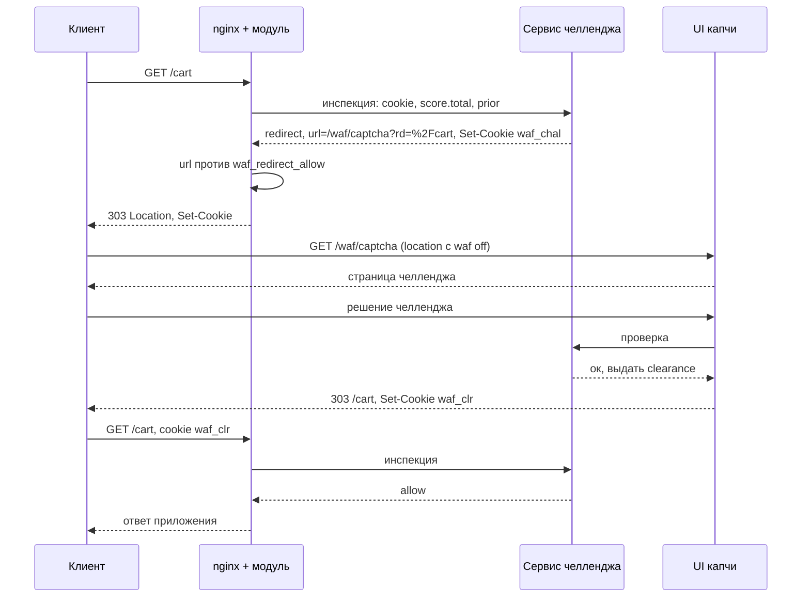

# Инспекторы

## Каталог -- встроенный, несносимый

Каталог инспекторов -- фиксированный набор, а не пользовательский CRUD. Инспектор оператором
не создаётся и не удаляется: каждый -- отдельный процесс/движок со своим subject, фазой и
контейнером, и каталог лишь отражает то, что развёрнуто в контуре. Это справочник; страница
«Инспекторы → Каталог» показывает его в режиме чтения, а колонка «Запущено» -- живой счёт реплик
из пульса, а не поле базы.

Встроенные инспекторы: `ip`, `modsec`, `vlai`, `json`, `counter`, `captcha`, `auth`,
`action`, `cookie`. Добавить новый -- значит развернуть новый сервис и внести его в сид каталога, а
не завести запись через UI.

Что оператор настраивает -- не сам инспектор, а:

- **объявление в http** -- реестр `waf_inspector` на пространстве (`timeout`/`needs`/`after`/
  `profile`), из него компилируются строки `waf_inspector <name> subject=...`;
- **вызов на маршруте** -- `waf_inspect` в `location {}` (какие инспекторы звать, режим, волна);
- **профили инспектора** -- его наборы правил, списки, пороги (у каждого свои).

Где что лежит (всё в Postgres контроллера, не на нодах): каталог -- таблица `inspectors`
(сеет миграция `028_inspector_catalog_real.sql`, из UI не правится); объявления в http --
JSON-поле `http_spaces.waf` (ключ `inspectors`). Ноды каталог не хранят -- им приезжают только
скомпилированные строки `waf_inspector` в поколении (см.
[inspector-config-distribution.md](inspector-config-distribution.md)).

Панель правит у записи каталога описание, `inspector.conf` и уровень журнала процесса.
Первые два до процесса не доезжают (`inspector.conf` монтируется файлом из compose);
уровень журнала -- единственное свойство записи, которое едет процессу: блоком `settings`
его поколения при следующей рассылке канала, и применяется без рестарта
([inspector-config-distribution.md#настройки-процесса](inspector-config-distribution.md#настройки-процесса)).
Словарь -- `error_log` nginx без `emerg`, те же слова, что у модуля на краю.

## Контракт

Инспектор — процесс, который подписан на свой subject в NATS, получает сообщение, описанное в
[verdict-protocol.md](verdict-protocol.md#запрос-на-инспекцию), и отвечает в указанный reply-to.
Требования к нему минимальны и все важны.

**Отвечать всегда.** Молчание неотличимо от перегрузки и обрабатывается по политике `waf_deadline`. Если
внутренняя логика упала, правильный ответ — `allow` или `deny` в зависимости от роли сервиса, но не
отсутствие ответа.

**Уважать дедлайн.** В сообщении есть `deadline_ms`. Если работа заведомо не успевает, лучше сразу
вернуть вердикт по деградированной логике, чем прислать точный ответ после того, как модуль перестал
ждать. Ответ после дедлайна не находит слот и отбрасывается — работа сделана впустую.

**Быть stateless между запросами.** Любое состояние, нужное для решения, приходит в сообщении или
лежит во внешнем хранилище инспектора. Модуль не гарантирует, что два запроса одного клиента попадут в
один экземпляр инспектора.

Внутри одного запроса состояние между фазами держать можно, но только по просьбе маршрута: `keep=on`
на строке фазы запроса присылает `resume.want`, и тогда инспектор вправе оставить транзакцию открытой
и вернуть `continue`; без признака он обязан выбросить её, ответив. Поздняя фаза приходит с тем же
ключом и `require`, и липкость остаётся оптимизацией: без состояния инспектор при `prefer` отвечает
тем же вердиктом меньшей полноты, при `require` -- отказывает. Подробно --
[verdict-protocol.md](verdict-protocol.md#продолжение-и-липкость) и
[directives/list/inspect.md](directives/list/inspect.md#keep-и-resume).

**Масштабироваться очередью.** Несколько экземпляров подписываются на один subject в одной queue
group. NATS распределяет сообщения между ними, и ответ приходит в инбокс того воркера, который
спрашивал. Никакой координации между экземплярами не требуется.

**Держать свою очередь, не буфер клиента NATS.** Сообщение забираем с шины сразу: pending —
только полёт в колбэк. Дальше решаем сами. Прокисший `deadline_ms` выкидываем из своего буфера
(`*_DEADLINE`), чтобы слот занял свежий запрос — иначе шина держит мусор, и новые не проходят.
У каждого инспектора свой `inspector.conf`: `queue_max`, `queue_full` (`drop` | `wait`) и
`queue_expand` (`off` | `ask`, пока не отправляется). `drop` отвечает `verdict: error` с `*_QUEUE_LIMIT` (судьбу запроса выбирает `waf_exception … inspector`),
когда очередь полна *живыми*; решение по причине — у модуля. `wait` держит уже снятое сообщение
до места или до своего дедлайна.

**Строки перегрузки — одинаковые у всех.** В профиле любого отправителя канала есть условие
`on: overload` с порогом `at` — заполнение очереди в процентах в миг постановки запроса, 25..100,
без порога — 100. Ниже порога строка молчит; от порога до края запрос проверяется как обычно и
получает настоящий вердикт, а действие строки уезжает рядом; на сбросе по полной очереди
(`*_QUEUE_LIMIT`) срабатывают все строки перегрузки, и действие едет рядом с `verdict: error`, где
модуль исполнит только свои глаголы. Протухший бюджет перегрузкой не считается. Строки -- только на
фазе запроса, без пути и условий; действие -- любое из тех, что умеет строка профиля. Смысл порога
держит один файл, одинаковый в каждом Go-инспекторе (`internal/overload`), у vlai -- константы
`OVERLOAD_AT_*` в `profiles.py`, у контроллера -- `model/overload.ts`, у панели -- `src/overload.ts`.

Там же, в `inspector.conf`, живут адреса Redis -- блоком `redis { url …; internal …; }`, той же
формой, что в `agent.conf`: `url` -- общий обменник (тела, заголовки, строка запроса), `internal` --
внутренний Redis контура (блобы поколений, корзины, роастеры, зеркала keeper). Окружение
`REDIS_URL` и `REDIS_INTERNAL_URL` их перекрывает. Ключ, которого инспектор не читает, отвергается
на старте: ip не принимает `url`, json, rewrite и vlai -- `internal`.

**Не пытаться отвечать за других.** Ответ учитывается только если поле `inspector` входит в маску
текущей волны. Ответ от чужого имени отбрасывается.

**Отдавать свой журнал в общий поток.** Всё, что процесс печатает в stdout, он обязан класть той
же строкой в `waf.log` — пачкой `kind=log` в `WAF_LOG`, как это делает агент ноды со строками
nginx. Копия, а не перенос: `docker compose logs` остаётся на месте. Причина в том, что отказ на
контуре почти никогда не виден там, где его заметили: запрос отклонила нода, а причина — в
профиле, который инспектор не смог разобрать три минуты назад, и спрашивать об этом надо не
угадывая контейнер. Готовый приёмник — `logkit.Sink` из `placitum-shared` (Go) и `src/logsink.py` (Python), он же
задаёт форму на проводе; подробно — [logger/logs.md](logger/logs.md#дорога-процесса-шина).

**Возвращать решение, а объяснение публиковать.** В ответе — вердикт, `score` и машинный код
причины; всё, что объясняет вердикт, уходит событием `kind=inspector` в subject из `audit_subject`
сообщения, и уходит **после** ответа. Модуль подробностями не пользуется, а на горячем пути они
раздувают ответ; в аудите же они нужны целиком, и там их ждёт общая форма находки.

**Ходить в обменник только за тем, что в capture.** Содержимого запроса в сообщении нет: заголовки,
строка запроса и тело едут локаторами. Поле `needs` — объекты `waf_capture` маршрута, одинаковые у
всех инспекторов вызова. Объект, которого нет в capture (лежит только ради archive/preview),
приезжает как `null`.

**Брать на себя ровно то решение, которое обосновано.** Вердикт `deny` уместен, когда факт не
зависит ни от чего внешнего: найден вирус, адрес в списке, подпись не сошлась. Всё остальное —
сигнатуры, эвристики, поведенческие модели — это `score` с оценкой уверенности от 0 до 100.
Инспектор, который сам решает блокировать по одной подозрительной подстроке, обречён либо на ложные
блокировки, либо на то, что его выключат на проде. Инспектор, который честно сообщает 60, оставляет
решение туда, где видно всю картину и где политику можно поменять без выкатки.

## Выбор между score и deny

Практическое правило: если на вопрос «а если ошибусь?» ответ «ну, значит, пользователь не зайдёт», —
это `score`. Если «значит, я пропустил вирус», — это `deny`.

| Инспектор | Типичный вердикт | Почему |
| --- | --- | --- |
| Адрес в списке блокировки | `deny` | Решение принято заранее и явно, оценивать нечего |
| ICAP, антивирус | `deny` | Факт обнаружения, а не оценка |
| Проверка подписи, целостности | `deny` | Двоичный результат по построению |
| Сервис челленджа | `redirect` или `allow` | Собственная логика жизненного цикла проверки, о которой модуль не знает ничего |
| Сигнатуры SQLi, XSS | `score` | Одна сигнатура — признак, а не доказательство |
| Репутация адреса, ASN | `score` | Вероятностное утверждение по определению |
| Поведенческие и ML-модели | `score` | Оценка — это и есть их выход |
| Разбор аномалий протокола | `score` | Порознь безобидны, вместе значимы |

Смешанное поведение нормально: один и тот же инспектор может отвечать `deny` на бесспорную находку
и `score` на пограничную. Движок с набором правил CRS — ровно этот случай, см.
[research/modsecurity-inspector.md](research/modsecurity-inspector.md).

Калибровка шкалы — обязанность инспектора, и она важнее точного значения. Сотня должна означать
«я в этом уверен настолько, насколько вообще бываю», а не «сработало самое строгое правило». Если
инспектор выдаёт 90 на каждом втором запросе, порог придётся поднимать, и все остальные инспекторы
потеряют влияние на решение. Проверять это надо в `mode=passive` по распределению счёта на реальном
трафике, см. [operations.md](operations.md#подбор-порогов-и-весов).

## Скелет инспектора

Пример на Go, ключевые места помечены.

```go
package main

import (
	"encoding/json"
	"time"

	"github.com/nats-io/nats.go"
)

type Request struct {
	V          int             `json:"v"`
	RID        string          `json:"rid"`
	Ray        string          `json:"ray"`   // ключ склейки с аудитом
	Phase      string          `json:"phase"`
	Inspector  string          `json:"inspector"`
	DeadlineMS int             `json:"deadline_ms"`
	// Куда публиковать подробности находок. nil -- деталей не ждут.
	AuditSubject *string       `json:"audit_subject"`
	Conn       Conn            `json:"conn"`
	HTTP       HTTPPart        `json:"http"`
	// Объекты waf_capture маршрута. Одинаковы у всех инспекторов вызова.
	Needs      []string        `json:"needs"`
	// Заголовки, строка запроса и тело: одна форма локатора на все три.
	// Содержимого в сообщении нет вовсе.
	Store      Store           `json:"store"`
	Route      Route           `json:"route"`
	Score      ScoreState      `json:"score"`
	Prior      []PriorVerdict  `json:"prior"`
}

type Store struct {
	Headers *Locator `json:"headers"`
	Args    *Locator `json:"args"`
	Body    *Locator `json:"body"`
}

// Накопленный счёт фазы и порог отказа маршрута. Порог здесь один: отказ --
// единственное, что модуль выводит из счёта. Обычному инспектору эта пара
// нужна, чтобы соразмерить ответ; сервису челленджа -- чтобы решить, пора ли
// требовать проверку, потому что за него этого не решит никто.
type ScoreState struct {
	Total  int `json:"total"`
	DenyAt int `json:"deny_at"`
}

// Только решение. Подробности -- отдельным событием kind=inspector в
// audit_subject: модуль их не применяет, а на горячем пути они раздувают ответ.
type Reply struct {
	V         int               `json:"v"`
	RID       string            `json:"rid"`
	Inspector string            `json:"inspector"`
	Verdict   string            `json:"verdict"`   // allow | score | redirect | deny
	Score     int               `json:"score"`     // 0..100, при verdict=score
	Reason    *Reason           `json:"reason,omitempty"` // только code
	Response  *ResponseRef      `json:"response,omitempty"` // при verdict=deny
	Redirect  *RedirectRef      `json:"redirect,omitempty"` // при verdict=redirect
	Headers   *HeaderOps        `json:"headers,omitempty"`
}

// Имя записи каталога waf_deny_response: код и страницу отдаёт nginx.
type ResponseRef struct {
	Name string `json:"name"`
}

// Здесь наоборот -- адрес, а не имя: куда вести клиента, знает только тот, кто
// ведёт челлендж. Модуль сверит присланное с waf_redirect_allow маршрута.
type RedirectRef struct {
	URL    string `json:"url"`
	Status int    `json:"status,omitempty"` // 302, 303 или 307; по умолчанию 303
}

func main() {
	nc, err := nats.Connect("nats://nats-1:4222",
		nats.UserCredentials("/etc/inspector/sqli.creds"),
		nats.MaxReconnects(-1))
	if err != nil {
		panic(err)
	}

	// queue group: горизонтальное масштабирование без координации
	_, err = nc.QueueSubscribe("waf.req.sqli", "sqli", func(m *nats.Msg) {
		var req Request
		if err := json.Unmarshal(m.Data, &req); err != nil {
			// нераспарсенное сообщение: fail open, чтобы баг сериализации
			// не превратился в отказ обслуживания
			respond(m, &req, "allow", nil)
			return
		}
		if req.V != 2 {
			respond(m, &req, Reply{Verdict: "allow",
				Reason: &Reason{Code: "UNSUPPORTED_VERSION"}})
			return
		}

		// работаем в пределах присланного дедлайна
		budget := time.Duration(req.DeadlineMS)*time.Millisecond - 2*time.Millisecond
		respond(m, &req, analyze(&req, budget))
	})
	if err != nil {
		panic(err)
	}

	select {}
}

func analyze(req *Request, budget time.Duration) Reply {
	findings := match(req, budget)
	if len(findings) == 0 {
		return Reply{Verdict: "allow"}
	}

	// Бесспорная находка блокирует сама по себе и порогов не смотрит.
	if f := decisive(findings); f != nil {
		return Reply{
			Verdict:  "deny",
			Reason:   &Reason{Code: f.Code},
			Response: &ResponseRef{Name: "blocked"}, // только символьное имя
		}
	}

	// Всё остальное -- оценка уверенности. Решает модуль.
	return Reply{
		Verdict: "score",
		Score:   confidence(findings), // 0..100, шкала наша и калиброванная
		Reason:  &Reason{Code: findings[0].Code},
	}
}

func respond(m *nats.Msg, req *Request, rep Reply) {
	rep.V, rep.RID, rep.Inspector = req.V, req.RID, "sqli"
	b, _ := json.Marshal(rep)
	_ = m.Respond(b)
}
```

Находки публикуются отдельно и **после** ответа в инбокс: событием аудита дедлайн волны двигать
нельзя. Subject берётся из `req.AuditSubject`, а не зашивается в сервисе, — куда складывать
подробности, решает тот, кто описывает топологию контура, и `null` там означает, что деталей с этого
инспектора не ждут. Форма события одна на всех:
[inspector-audit.schema.ts](messages/inspector-audit.schema.ts), склейка с `kind=request` — по `ray`.

Четыре ошибки, которые стоит не допустить с самого начала: не отвечать при панике внутри обработчика,
не делать блокирующие вызовы без таймаута внутри обработчика, не игнорировать `deadline_ms` и считать
время самому, не выдавать `score` вне диапазона 0–100 — такой ответ отбраковывается целиком, то есть
инспектор молча выпадает из решения.

Поле `req.Score` позволяет закончить работу раньше: если `Total + мойМаксимум < DenyAt`, никакая
находка уже ничего не изменит, и остаток дедлайна тратить не на что. Это оптимизация, а не обязанность:
порог в любом случае применяет модуль.

Оговорка для инспекторов, которые сами что-то решают по счёту. Раннее завершение верно ровно потому, что
из счёта следует только отказ. Если ваш инспектор — сервис челленджа, `Total` для него не подсказка, а
основание решения, и обрывать разбор по нему нельзя.

## Получение содержимого

Заголовки, строка запроса и тело лежат в обменнике и приходят локаторами одной формы, поэтому и загрузка
одна на все три. Обработать нужно все варианты, включая недоступность.

```go
func load(loc *Locator) ([]byte, error) {
	switch {
	case loc == nil:
		return nil, nil                       // объект не клали

	case loc.Unavailable != "":
		// oversize, store_error, store_unconfigured
		return nil, ErrUnavailable

	case loc.Key == "":
		// body=meta: размер и хеш просили, содержимого не просили
		return nil, nil

	case loc.Driver == "redis":
		return redisGet(loc.Store, loc.Key)

	case loc.Driver == "s3":
		return s3Get(loc.Store, loc.Key)
	}
	return nil, ErrUnknownDriver
}
```

Ходить в обменник надо только за тем, что заявлено в `needs`: объект, которого инспектор не просил,
приезжает как `null`, даже когда он лежит для других. Заголовки в обменнике — JSON-массив пар: порядок
получения значим, а дубликаты имён (`Set-Cookie`, `Forwarded`) в объекте потерялись бы. Строка
запроса лежит сырой, как пришла: кодировки, повторяющиеся ключи, `;` против `&` — это интерпретация,
и модуль, выбрав одну, навязал бы её всем.

При включённом `waf_body_encrypt` тело зашифровано AES-256-GCM, а `kid` в локаторе указывает ключ,
который инспектор получает из своей системы секретов. Проверка `sha256` после расшифровки одновременно
подтверждает целостность и даёт ключ для кеширования вердикта по содержимому — на повторяющихся телах
это существенно снижает стоимость анализа.

При `truncated: true` инспектор обязан решить явно, что означает частичное тело для его логики.
Молчаливая трактовка префикса как полного тела — источник ложных пропусков.

Два рода недоступности различаются, и путать их нельзя. Причина, приехавшая **в локаторе**
(`unavailable`), обнаружена модулем: маршрут ею уже распорядился классом `body` у `waf_exception`, и
раз сообщение всё-таки дошло, решение было «продолжать» — инспектор разбирает это своей политикой.
Причина, обнаруженная **самим инспектором** (обменник не ответил, не расшифровалось, не сошёлся
`sha256`), модулю неизвестна: он положил объект и считает его на месте. Проверки не было по нашей
вине, и ответ на это — `verdict: error` ([verdict-protocol.md](verdict-protocol.md#вердикт-error)),
а не «пусто» и не «тела нет».

«Своя политика» на недоступность из локатора бывает и такой: без объекта проверки нет. Инспектору,
которому объект нужен целиком, всё равно, кто его не донёс: modsec отвечает `error` и на
`unavailable` из локатора (`MODSEC_BODY_UNAVAILABLE`), и на префикс (`truncated: true`,
`MODSEC_BODY_TRUNCATED`), а пропустить непроверенное или отказать, решает `waf_exception … inspector`
маршрута. Инспектор, которому хватает части объекта (json со строками `unavailable`/`truncated` в
профиле), разбирает её сам.

## IP фильтр и User-Agent

Задача — блокировать по адресу, сети, автономной системе, гео и шаблонам User-Agent. Он идёт первой
волной, потому что дальше его вердикт защищает всё остальное.

```nginx
waf_inspector ip subject=waf.req.ip;

location / {
    waf_inspect ip wave=0 timeout=5ms;
    waf_capture request headers args;
}
```

Адрес и путь едут в самом сообщении. Если в `waf_capture` нет `body`, `store.body` — `null`,
похода в обменник за телом нет. Волна 0 не ждёт тела, которого нет в capture.

Реализация внутри: радиксное дерево для сетей IPv4 и IPv6, хеш-множество для точных адресов,
предкомпилированный набор для User-Agent. Списки перезагружаются атомарной подменой указателя, чтобы
обновление не блокировало обработку.

Стоимость модели round-trip нужно видеть честно. Сервис адреса обслуживает полный RPS всего флота,
поэтому:

- держите волну 0 состоящей из него одного;
- разворачивайте его в каждой зоне доступности, чтобы не платить межзональный RTT на каждом запросе;
- обязательно включайте локальный слой перед ним, см. ниже.

### Локальный слой перед волной 0

Локальный слой не заменяет инспектора, а режет то, что не должно доходить до шины вообще. Без него
шина усиливает один клиентский запрос в четыре и более внутренних и сама становится целью атаки.

```nginx
waf_local_dataset blocked_nets type=cidr limit=1000000 active;
waf_local_dataset allowlist    type=cidr limit=100000  internal;

waf_local_rate $binary_remote_addr rate=200r/s burst=400 action=block;

location / {
    waf_local_check allowlist    $binary_remote_addr action=allow;
    waf_local_check blocked_nets $binary_remote_addr action=block response=ratelim;
    waf_inspect ip        wave=0 timeout=5ms;
    waf_inspect challenge wave=2 timeout=10ms;
}
```

Явно заблокированные сети и очевидный флуд отсекаются за наносекунды и не создают ни одного сообщения.
Инспектору достаётся содержательная работа: репутация, скоринг, свежие данные.

Исход локального слоя — только отказ или пропуск, и это следствие его положения, а не ограничение
реализации: смягчить отказ челленджем здесь нельзя, потому что решает про челлендж сервис, а на этом
слое о запросе не знает ещё никто. Отсюда практическое требование к порогу `waf_local_rate`: ставить его
с запасом над реальным пиком, иначе за общим NAT под отказ попадут люди.

## Поставщик данных

Инспектор-поставщик ничего не решает по запросу. Он публикует состояние в поток JetStream, а модуль
применяет его в разделяемую память и решает локально. Desired-состав набора хранит контроллер
(`dataset_addresses` в Postgres). Активный список контроллер сам пишет в шину и принимает
автобан с края; подробно — [lists.md](lists.md). Воркер nginx базу не читает.
Это не раскатка `nginx.conf`: ключи, сертификаты и шаблон директив едут другим контуром, см.
[config-distribution.md](config-distribution.md).

```nginx
waf_local_dataset blocked_nets type=cidr limit=1000000 active;
```

Протокол набора данных — [lists.md](lists.md#протокол-шины) и
[keeper.md](https://github.com/exemt/placitum-keeper/blob/develop/docs/spec.md): состав живого набора держит keeper, край подписан на
`waf.sets.<имя>`, применяет дельты по номерам и сверяет `(epoch, seq, hash)` на
каждом кадре; снапшот страницами и хвост — запросом. JetStream в проводе
наборов не участвует.

## Сервис челленджа

Единственный инспектор, которому передано решение целиком: он опрашивается на каждом запросе маршрута и
сам выбирает между `allow`, `deny` и `redirect`. Модуль не пытается угадывать за него ни по наличию
cookie, ни по накопленному счёту — порога челленджа у модуля нет вовсе. Вся логика в одном месте, и это
место — сервис.

Для конфигурации он ничем не выделен: обычное объявление `waf_inspector`, обычное место в волнах,
плюс граница, за которую ему не выйти.

```nginx
waf_inspector challenge subject=waf.req.chal;

location / {
    waf_inspect sqli      wave=1 timeout=15ms;
    waf_inspect repu      wave=1 timeout=10ms;
    waf_inspect challenge wave=2 timeout=10ms;
    waf_redirect_allow /waf/captcha;
}
```

Поздняя волна после скорящих — не украшение: сервис решает по накопленному счёту, а тот приезжает ему
в секции `score`, поэтому в одной волне со скорящими он видел бы неполную картину. Очков он не даёт:
он не оценивает, а решает. Белого списка cookie нет: имена с провода принимает `waf_cookie_defaults`.

Поток:



Существенные детали.

**Адрес и параметр возврата собирает сервис.** Модуль к присланному адресу не дописывает ничего: что
положить в цель, знает только тот, кто её назвал. Из этого следует и обязанность экранировать исходный
URI, и свобода вести на разные адреса разных клиентов.

**Граница — `waf_redirect_allow`.** Адрес, не совпавший ни с одним шаблоном маршрута, отбраковывает ответ
целиком: это молчание инспектора для волны, и исход определяет политика `waf_deadline`. Пустой список означает,
что редиректы на маршруте запрещены, поэтому включение сервиса в набор без этой директивы даст волну без
единого редиректа — и `waf_redirect_rejected_total` покажет, почему.

**Токены подписываются, а не хранятся.** Cookie clearance — это подписанный HMAC-SHA256 токен с
полями: версия, время выдачи, срок, привязка к подсети клиента, отпечаток User-Agent, счётчик попыток,
область действия. Сервис проверяет подпись без обращения к базе, поэтому остаётся stateless и
масштабируется горизонтально. Привязка к подсети, а не к полному адресу, нужна из-за мобильных сетей,
где адрес меняется в течение сессии. Модуль эту cookie не читает и не проверяет — она едет сервису как
обычный заголовок.

**Location цели исключается из проверок.** `waf off` внутри `location = /waf/captcha` обязателен и
проверяется при `nginx -t`. Иначе челлендж получает челлендж.

**Не-идемпотентные методы теряют тело.** При редиректе POST превращается в GET, и тело исчезает. Это
принятое ограничение. Практически оно почти не проявляется, потому что сервис опрашивается на каждом
запросе и clearance выдаётся на навигационном GET раньше отправки формы. Для маршрутов, где это
критично, сервис должен возвращать `deny` с информативной страницей вместо `redirect`, чтобы
пользователь осознанно повторил действие. Выбор поведения — за сервисом, модуль поддерживает оба.

**Защита от цикла — обязанность сервиса.** Считать попытки и признавать свой же clearance больше некому:
модуль не выводит редирект ни из чего сам и потому не может ни зациклить клиента, ни разорвать цикл, см.
[verdict-protocol.md](verdict-protocol.md#челлендж-и-цикл-редиректов). Аварийная мера со стороны контура —
убрать сервис из `waf_inspect` затронутого маршрута; невыбранный инспектор не опрашивается, и
редиректов не возникает.

**API-маршруты требуют отдельного решения.** XHR-запрос, получивший 303 на HTML-страницу капчи,
приводит к невнятной ошибке в интерфейсе. Для таких маршрутов либо сервис не включается в набор — это и
есть новая идиома «инспектор необязателен», — либо он возвращает `deny` с кодом 403 и машиночитаемым
телом, по которому фронтенд сам открывает челлендж.

## ICAP-гейтвей

ICAP — это отдельный мир по латентности. Сканирование содержимого измеряется секундами и десятками
секунд, а не миллисекундами, а ответ может дожидаться распаковки архива. В общий бюджет запроса это не
помещается принципиально, и попытка втиснуть его туда ломает всё остальное.

Поэтому ICAP выделяется в отдельный маршрут с отдельным дедлайном:

```nginx
waf_inspector icap subject=waf.req.icap;

location /upload/ {
    waf_inspect ip   wave=0 timeout=5ms;
    waf_inspect icap wave=1 timeout=30s;
    waf_capture             request headers args body;
    waf_archive request     body ttl=180d when=deny;
    waf_body_limit          64m block;
    waf_deadline            60s block;
    client_max_body_size    64m;
    proxy_pass http://uploads;
}
```

Гейтвей подписан на subject, читает тело по локатору из Redis и говорит по ICAP с реальным
сканером (`c-icap`, коммерческие ICAP-серверы). Для тел в десятки мегабайт дедлайн маршрута
должен это покрывать.

**ICAP Preview** (RFC 3507) стоит использовать всегда: гейтвей отправляет первые несколько килобайт, и
сканер отвечает `204 No Content`, если остальное ему не нужно. На типичном трафике это отсекает
большинство передач целиком.

Расширение `Allow: 204` обязательно: без него сканер вернёт тело обратно даже когда не изменял его.

**Приоритеты по волнам.** `wave=1` после адреса означает, что до ICAP доходит только то, что прошло
дешёвые проверки. Это и есть защита сканера от исчерпания: заддосить дорогой разбор напрямую невозможно,
надо сначала пройти адрес и сигнатуры.

## Инспектор утечек

Работает в фазе ответа и предотвращает выход данных наружу: номера карт, персональные данные, ключи,
внутренние трассы стека, содержимое конфигураций.

```nginx
waf_inspector dlp subject=waf.rsp.dlp;

location /api/ {
    waf_inspect response dlp wave=0 timeout=20ms;
    waf_capture             request headers args body;
    waf_preview             body=64k;
    waf_response_buffer_max  1m;
    waf_response_bypass      sse upgrade partial oversize;
    proxy_pass http://api;
}
```

Особенности фазы ответа:

- Ответ удерживается целиком до вердикта. Это цена возможности его заблокировать, и она отражается на
  памяти: количество одновременных ответов, умноженное на средний размер.
- Превью тела (`waf_preview body=64k`) вместо полного ответа — практичное решение: подавляющее
  большинство утечек детектируется в начале, а буферизация полного ответа многократно дороже.
- Вердикт `redirect` в этой фазе запрещён.
- Блокировка ответа не отменяет того, что приложение уже сделало. Списание уже произошло, письмо уже
  отправлено. Инспектор ответа предотвращает утечку, но не является транзакционной защитой.
- Список `waf_response_bypass` обязателен и его надо проверять на реальном трафике: стриминговые
  ответы, апгрейды соединения и диапазонные запросы буферизовать нельзя.

Отдельно про сочетание с маскированием. Если сервис трансформации замаскирует номера карт до инспекции,
DLP не найдёт ничего — обе функции взаимно уничтожаются. Разрешается это порядком: инспектор утечек
работает с оригиналом на хосте, а маскирование применяется после него директивой
`waf_transform_after dlp`. За пределы хоста уходят только находки, но не данные. Подробно в
[body-transform.md](body-transform.md#парадокс-с-dlp).

## Пассивные инспекторы

Инспектор с `mode=passive` на `waf_inspect` получает сообщение и его ждут, но вердикт не участвует
в решении. Применение — вывод новой логики детекта в продакшен без риска.

```nginx
waf_inspector ml subject=waf.req.ml;

location / {
    waf_inspect ip wave=0 timeout=5ms;
    waf_inspect ml wave=1 timeout=15ms mode=passive;
}
```

Вердикты попадают в аудит и в теневую сумму, по ним считается доля ложных срабатываний на реальных
данных. После проверки достаточно сменить `mode=passive` на `mode=active` (или убрать `mode=`).

Со счётом пассивный режим точнее, чем был с бинарным вердиктом. Вклад в боевую сумму не входит, но
пишется отдельно, поэтому по историческим данным считается не «сколько раз он сказал бы deny», а
«каким был бы счёт, если бы он был обязательным» — и сразу видно, сколько запросов перешло бы порог
и какие именно. Порог подбирается на тех же данных до того, как инспектор получит право влиять на
трафик. Запросы — в [operations.md](operations.md#подбор-порогов-и-весов).

Пассивный вердикт не гейтит следующую волну: гейтит только обязательный `deny` / `redirect` и порог.

## Совещательные инспекторы

Между «наблюдает» и «решает» есть третья ступень — `mode=vote`: инспектор считает, но не решает.
Его `score` ложится в живую сумму, его `deny` читается как сто очков, а `redirect` и правки трафика
не применяются; ждут его как боевого, соседям он виден, просить и управлять вправе.

```nginx
location /search/ {
    waf_score_deny request 200;
    waf_inspect request sqli   wave=1 timeout=15ms   mode=vote;
    waf_inspect request modsec wave=1 timeout=1000ms mode=vote;
}
```

Так один профиль служит двум маршрутам: на `/api/` тот же `modsec` стоит боевым и режет, на
`/search/` — голосует, и отказ наступает лишь при двух голосах. Множителя `weight=` на вызове больше
нет: очки ложатся как присланы, единственный рычаг оператора — порог.

## Наблюдение профиля

У загрузчиков профилей — `auth`, `captcha`, `counter`, `json`, `rewrite`, `vlai` — остался второй
рычаг того же назначения: `mode: observe` в **файловом** профиле. Из панели и документов
контроллера режим профиля снят (06.09.2026): включён ли инспектор и гейтит ли он, оператор решает
на маршруте — `waf_inspect … mode=active|passive|vote|off` и управляющие глаголы канала действий, — а
контроллер печатает в YAML `mode: enforce` (профилю калитки без источника — `"off"`). Ниже —
контракт ключа для тех, кто кладёт профили файлами; семантика у него одна на всех:

**Инспектор работает целиком, заглушён только его ответ модулю.**

| Что | В `enforce` | В `observe` |
| --- | --- | --- |
| Обменник, инференс, суд по правилам, учёт корзин, сессии и клиренсы | работает | работает так же |
| Просьбы соседей из `prior` (`skip`, `threshold`, `note`, `reauth`, …) | принимаются | принимаются так же |
| Вердикт модулю | `deny` / `redirect` / `score` | всегда `allow`, без счёта, с кодом `<ИМЯ>_OBSERVE` |
| Страница отказа, редирект на форму или виджет, билет, правка ответа | применяются | нет: это и есть заглушённый вердикт |
| Информационные заголовки приложению (`X-WAF-User`, `X-WAF-Captcha`) | ставятся | ставятся так же |
| Инициаторы: просьбы соседям в `actions` и записи в наборы | стреляют по решению | стреляют так же — по решению `enforce` и под его поводом |
| Событие `kind=inspector` | как обычно | плюс `engine.passive: true` и `would_*` |

Код `<ИМЯ>_OBSERVE` (`AUTH_OBSERVE`, `CAPTCHA_OBSERVE`, `COUNTER_OBSERVE`, `JSON_OBSERVE`,
`REWRITE_OBSERVE`, `VLAI_OBSERVE`) уходит только там, где было что глушить: если `enforce` и так
ответил бы `allow`, ответ от боевого не отличается. Так наблюдение видно уже в записи модуля
`kind=request` и в `X-WAF-Debug`, без похода в подробности.

В `kind=inspector` наблюдение описывают ключи `engine`, общие для всех шести:

| Ключ | Когда | Что |
| --- | --- | --- |
| `mode` | всегда | режим файлового профиля, здесь `observe`; у профилей контроллера — `enforce` |
| `passive` | на каждой записи профиля в `observe` | `true`: ответ модулю заглушён |
| `would_verdict` | было что глушить | что ответил бы `enforce`: `deny`, `redirect`, `score` |
| `would_code` | вместе с `would_verdict` | повод того решения — тот же, что ушёл бы модулю в `enforce` |
| `would_score` | `would_verdict: score` | заявка, уже с коэффициентом соседа |
| `would_apply` | `rewrite` | группы правки, которые применились бы |

Своё у инспектора остаётся своим: `trigger` у капчи, `judge` у счётчика, `asks`/`bans` у vlai
лежат рядом и в наблюдении заполняются так же, как в бою. Строка `verdict` в журнале процесса
несёт те же `passive` и `would_*`.

### Чем отличается от `mode=passive` модуля

Оба режима существуют, чтобы выкатить логику на живой трафик, ничего не заблокировав, но глушат
они разное, и это не дубль одного рычага:

| | `waf_inspect … mode=passive` | профиль `mode: observe` |
| --- | --- | --- |
| Кто решает | модуль; инспектор не знает | сам инспектор |
| Область | маршрут: один инспектор боевой на `/`, теневой на `/api/` | профиль: все маршруты с этим профилем |
| Вердикт | приходит настоящий, модуль кладёт счёт в `score.shadow` и не гейтит | приходит `allow`, счёта нет |
| Заголовки и cookie ответа | модуль отбрасывает все | инспектор не ставит те, что были решением |
| Просьбы соседям | **не доставляются**: записи пассивного в `prior` нет ([почему](inspector-actions.md#пассивного-в-prior-нет)) | **доставляются** как в бою |
| Записи в наборы | инспектор пишет как обычно | пишет как обычно |
| Где видно | `role: passive` у участника и `actions[].passive` в `kind=request` | код `*_OBSERVE` в ответе, `engine.passive` в `kind=inspector` |

Разница в просьбах — намеренная. Пассивный на маршруте — «инспектора для решения нет», и чужими
руками влиять он не должен. Наблюдение профиля — «инспектор в строю, но сам не бьёт»: он
продолжает разговор с соседями, потому что калибруют его собственный вердикт, а контур в целом
должен вести себя так же, как после включения. Нужен инспектор, которого не слышат и соседи, — это
`mode=passive` на вызове или профиль без `outcomes`. Нужен инспектор, который слышен и считается,
но не решает, — `mode=vote` на вызове.

Модуль о профильном наблюдении не знает и знать не должен: для него это активный инспектор,
ответивший `allow`. Поэтому наблюдающий инспектор по-прежнему держит бюджет волны, а его молчание
по-прежнему включает `waf_deadline`.
