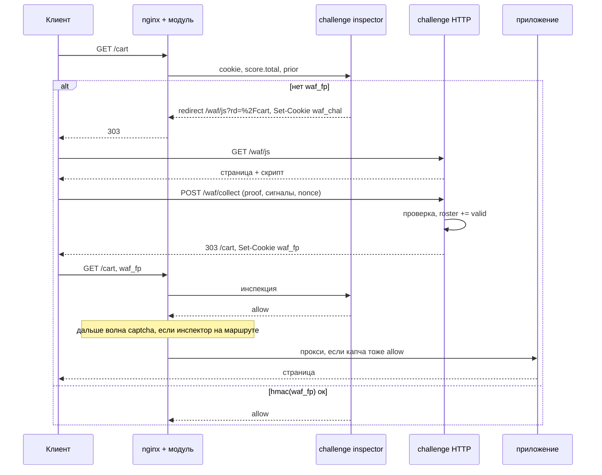

# Челлендж (JS)

> **Статус.** Черновик для обсуждения. Кода нет. Контракт модуля, на который
> опираемся, уже зафиксирован: [inspectors.md](../../inspectors.md#сервис-челленджа),
> [verdict-protocol.md](../../verdict-protocol.md#вердикт-redirect), этап 10 в
> [roadmap.md](../../roadmap.md#этап-10-сервис-челленджа-и-icap).
>
> Капча — **другой** модуль: [../captcha/README.md](../captcha/README.md).
> Общего ключа, образа и subject у них нет.

Инспектор, которому передано решение целиком: модуль не знает, что такое JS
и не назначает проверку по счёту. Сервис смотрит свою cookie, `score`,
`prior` и свой список допущенных — и отвечает `allow`, `redirect` или `deny`.

Этот документ — только JS-ступень: «клиент умеет исполнять браузер».
Доказать, что он человек, — соседний модуль.

## Зачем два контейнера, а не один

Две разные нагрузки и два разных SLO.

| | Инспектор | HTTP |
| --- | --- | --- |
| Где живёт | шина, `waf.req.chal`, queue group | `location` с `waf off`, `proxy_pass` |
| Когда зовут | каждый запрос маршрута | только те, кого увели на проверку |
| Бюджет | `timeout=10ms` | сотни миллисекунд (исполнение JS) |
| Ответ | вердикт: `allow` / `redirect` / `deny` | HTML, скрипт, `Set-Cookie`, 303 назад |
| Падение | политика `waf_deadline` маршрута | инспектор перестаёт выдавать новые билеты и рвёт цикл `deny` |

Один процесс, который и отвечает за 10 мс, и принимает телеметрию браузера,
смешивает горячий путь с медленным. Масштаб тоже разный: инспектор растёт с
RPS контура, HTTP — с долей 303 на `/waf/js`.

Поэтому **два контейнера, один образ, один каталог** — внутри *этого*
модуля. Ключ HMAC и форма `waf_fp` общие только у `inspector-challenge` и
`challenge-http`. С капчей они не делятся: чужой ключ, чужой тег
`waf-captcha`, чужой subject.

Как ставить пару контейнеров JS — в [deploy/README.md](deploy/README.md).

Модулю nginx по-прежнему всё равно. Для него это обычный
`waf_inspector challenge`, который не даёт очков. HTTP он видит только как цель в
`waf_redirect_allow`.

```nginx
waf_inspector challenge subject=waf.req.chal;
waf_inspector captcha   subject=waf.req.captcha;

location / {
    waf_inspect sqli      wave=1 timeout=15ms;
    waf_inspect repu      wave=1 timeout=10ms;
    waf_inspect challenge wave=2 timeout=10ms;
    waf_inspect captcha   wave=3 timeout=10ms;
    waf_redirect_allow /waf/js /waf/captcha;
}
```

```nginx
location = /waf/js      { waf off; proxy_pass http://challenge_http; }
location = /waf/collect { waf off; proxy_pass http://challenge_http; }
location = /waf/c.js    { waf off; proxy_pass http://challenge_http; }
location = /waf/captcha { waf off; proxy_pass http://captcha_http; }
```

Обязательно здесь снять **инспекторов** — иначе челлендж получает челлендж.
Сам модуль выключать не нужно: рецепт защищённой ручки (`waf on` +
`waf_inspect request none` + снятые снятие, превью и архив + локальный слой)
описан у [капчи](../captcha/README.md#конфигурация-nginx) и
[auth](https://github.com/exemt/placitum-auth/blob/develop/docs/README.md#конфигурация-nginx); `waf off` остаётся допустимым
сокращением там, где локальный слой на ручке не нужен.

## Два модуля, не две ступени одного сервиса

JS и капча решают разное и падают по-разному: провайдер виджета не должен
гасить proof-of-execution, а выкатка обфусцированного скрипта не должна
трогать ключ капчи. Поэтому это два инспектора и две HTTP-пары, не один
каталог с профилем `mode: captcha`.

| | `challenge` | `captcha` |
| --- | --- | --- |
| Subject | `waf.req.chal` | `waf.req.captcha` |
| Образ | `waf-challenge` | `waf-captcha` |
| Контейнеры | `inspector-challenge` + `challenge-http` | `inspector-captcha` + `captcha-http` |
| Секрет | `waf_challenge_hmac` | `waf_captcha_hmac` |
| Redis | `chal:` | `cap:` |
| Cookie задания / билета | `waf_chal` / `waf_fp` | `waf_cap` / `waf_clr` |
| Цель 303 | `/waf/js` | `/waf/captcha` |
| Что доказывает | исполнение JS | человек у виджета |

Они **не вызывают друг друга**. Нет RPC, общего пакета `internal/token`
и общего ключа: компрометация JS не даёт выписать `waf_clr`. Состав на
маршруте — конфигурация nginx: только JS, только капча, или оба.

Чтобы оба не прислали `redirect` в одной волне (в `fast` победит кто
ответил первым — гонка), капча стоит на более поздней волне. Тогда:

1. Нет `waf_fp` → челлендж уводит на `/waf/js`, капча эту волну не видит.
2. Есть `waf_fp`, челлендж `allow` → волна капчи: нет `waf_clr` и счёт
   выше порога профиля — 303 на `/waf/captcha`.
3. Есть `waf_clr` → капча `allow`.

Высокий счёт без JS не прыгает сразу на виджет: сначала JS, потом капча.
Пропустить JS — не ставить `challenge` в `waf_inspect` маршрута.
Пропустить капчу — не ставить `captcha`. «JS провален → капча» сами
модули не делают: челлендж после `max_attempts` отвечает `deny`, капчи
в его URL нет.

`waf_redirect_allow` на маршруте сейчас общий, не по инспектору. Каждый
сервис уводит только на свой путь. Чужой адрес в чужом allow-списке
модуль технически пропустит — это дисциплина сервиса, не новая директива.

## Что уже решено модулем — не трогаем

Повторять контракт незачем, но границы, которые черновик обязан уважать:

- Модуль не выводит редирект из счёта. Порог челленджа живёт в профиле сервиса.
- Цель редиректа собирает сервис, включая параметр возврата. Модуль сверяет её
  с `waf_redirect_allow` и больше ничего к URL не дописывает.
- С провода принимаются `name`, `value`, `path`, `max_age` cookie.
  `secure` / `http_only` / `same_site` форсирует `waf_cookie_defaults`.
  Значит скрипт **не читает** cookie: билет ставит HTTP-ответ `/waf/collect`.
- `redirect` в фазе ответа запрещён. Челлендж — только фаза запроса.
- HTML с шины не принимается. Страницу отдаёт только HTTP-процесс.
- POST при редиректе теряет тело. На маршрутах, где это критично, сервис
  отвечает `deny` со страницей, а не `redirect`.
- Лестница `deny` > порог счёта > `redirect` > `allow`. Ни JS, ни капча
  не предлагаются тому, кого уже решили не пускать.
- API/XHR: либо инспектора нет в наборе, либо `deny` с машиночитаемым телом.
  303 на HTML капчи для `fetch` — это сломанный фронт, не защита.

## Что решает этот модуль

Отсекает клиента без исполнения JS. Капча — не наша ступень и не наш
редирект.

```
hmac(waf_fp) ок и не отозван     → allow
попытки waf_chal исчерпаны       → deny
нет waf_fp                       → redirect /waf/js
```

Стоит на волне после скорящих, если капча на том же маршруте должна увидеть
полную сумму — но сам челлендж порог капчи не читает и на `/waf/captcha`
не уводит. Эвристика «похоже на автомат» значит: `waf_fp` не выписать,
не «сейчас капча».

## Список допущенных и cookie — не одно и то же

Идея «динамический список валидных клиентов» хорошо ложится на сервис, плохо —
на замену cookie.

Инспектор должен уложиться в 10 мс и остаться горизонтально масштабируемым.
Контракт уже говорит: **токены подписываются, а не хранятся**. HMAC-SHA256,
поля внутри: версия, время, срок, подсеть, отпечаток UA, счётчик попыток,
область, ступень (`js` | `captcha`). Проверка подписи — без базы.

Список (roster) тогда не «все, кого пускать вместо cookie», а серверная
сторона билета:

| Запись | Кто пишет | Кто читает | Зачем |
| --- | --- | --- | --- |
| `pending` (nonce) | HTTP, GET `/waf/js` | HTTP, POST `/waf/collect` | одноразовость, антиreplay |
| `valid` | HTTP, после принятого proof | инспектор, опционально | отзыв, диагностика |
| `banned` (подсеть / fp) | HTTP или инспектор, по лимиту попыток | оба | разрыв цикла без новой 303 |

Горячий путь инспектора:

1. Есть cookie → проверить HMAC. Не сошлась — как будто cookie нет.
2. Сошлась и не истекла → `allow`, в Redis не ходить.
3. Сошлась, но `jti` в отзыве (короткое множество) → считать недействительной.
4. Нет cookie → `redirect` на `/waf/js`.

Roster в Redis нужен для nonce, отзыва и бана. Не для того, чтобы на каждом
запросе флота искать отпечаток. Иначе 10 мс не держатся, и «stateless»
из контракта становится фикцией.

Привязка билета — к подсети и отпечатку UA, не к полному IP: мобильные сети
меняют адрес в течение сессии. Это уже записано в контракте челленджа.

Имена cookie этого модуля — два: `waf_chal` (задание: nonce, попытки) и
`waf_fp` (прошёл JS). `waf_clr` принадлежит [капче](../captcha/README.md)
и другим ключом не проверяется.

## Инъекция скрипта в GET — где идея ломается

Запрос звучит так: кого нет в списке, на GET вставить в тело ответа скрипт;
скрипт снимет свойства браузера, отправит их сервису, сервис поставит cookie
с отпечатком.

Так **не получается сделать калитку**. Получается телеметрия.

Калитка требует: клиент не видит содержимое приложения, пока не доказал, что
он браузер. Инъекция в HTML апстрима делает обратное — инспектор уже ответил
`allow`, приложение ответило, скрипт дописывается *после* того, как тело уже
есть у клиента. Бот, который JS не исполняет, всё равно забирает страницу.
Скрыть её стилем или `document.write` бессмысленно: исходник у него в ответе.

Поэтому тихий JS на том же URL, что и приложение, — это режим наблюдения:
набрать roster, потом решать. Не режим защиты.

Калитка на текущем модуле делается только *до* апстрима, в фазе запроса:



Это тот поток, который модуль уже умеет: 303, `waf_redirect_allow`, cookie
с инспектора или с HTTP-процесса (второе — обычный `Set-Cookie` за
`waf off`, модуль его не ставит).

Три UX, которые стоит различать, а не смешивать в одном «вставим скрипт»:

| Режим | Что видит клиент | Калитка? | Нужна ли доработка модуля |
| --- | --- | --- | --- |
| Редирект на `/waf/js` | вспышка промежуточной страницы, URL меняется | да | нет, этап 4 уже умеет |
| Страница отказа с скриптом | тот же URL, статус из каталога `waf_deny_response` | да, но это `deny` | нет, но семантика плохая: JS-челлендж выглядит как отказ, лестница ставит его выше капчи |
| Инъекция в HTML приложения | обычная страница плюс `<script>` | нет, только телеметрия | да: нового вердикта нет, `waf_transformer` меняет копию для обменника, не ответ клиенту |

`waf_transformer` сюда не подходит принципиально. Он маскирует тело *для
контура WAF*; приложение и клиент получают оригинал. Инъекция клиенту — это
другой фильтр ответа, его в модуле нет, фаза ответа ещё этап 7, и `redirect`
там запрещён.

Если когда-нибудь понадобится тихая инъекция, это отдельное решение модуля
(`waf_response_inject` или аналог), не работа сервиса челленджа. И даже тогда
это не калитка, пока первый ответ не удерживается. Удержание первого HTML до
`/waf/collect` — это второй RTT внутри одного запроса, которого у нас нет:
collect приходит *следующим* запросом браузера.

**Предложение v1:** калитка этого модуля — редирект на `/waf/js`. Капча —
соседний модуль и соседний `/waf/captcha`. Инъекцию в тело приложения не
обещать. Если нужна «невидимость», делать её на стороне HTTP: `/waf/js` —
пустая страница, скрипт сам уходит назад за сотни миллисекунд. Для человека
это вспышка, для curl — тупик.

## Что собирает скрипт

Цель — не уникальный fingerprint в рекламном смысле и не слежка. Цель —
доказательство исполнения и противоречие заявлений.

### Что нельзя подделать, а что можно

У клиента нет секрета. Скрипт у атакующего в открытом виде. Любое поле
про браузер (`webdriver`, GPU, языки) он отправит каким хочет. Готовый
`waf_fp` можно украсть. Задачу можно решить не в Chrome, а в Node. Это не
дыра реализации — так устроен клиент.

Неподдельным делается не «я настоящий браузер», а **билет** и **проверка
работы, которую сервер сам загадал**.

| Что | Подделать без секрета / без работы | Роль |
| --- | --- | --- |
| Cookie `waf_fp` | нет, если ключ HMAC только на сервере | калитка |
| Cookie `waf_chal` | нет: её ставит инспектор, `httpOnly` | одноразовое задание |
| Proof-of-work / ответ от nonce | нет, не подобрав `x` и не имея свежего nonce | доказательство исполнения |
| JSON «у меня GeForce, `webdriver=false`» | да, руками | эвристика, не калитка |

Скрипт ничего не подписывает и cookie не ставит. Иначе ключ вынут из JS.
`waf_fp` появляется в `Set-Cookie` ответа `/waf/collect` только после
проверки на сервере.

Задание одноразовое и с сервера: nonce живёт в `waf_chal` и в
`chal:pend:*`. Collect без этой cookie, с чужим или уже сожжённым nonce
не принимается. Повтор того же POST бесполезен. Ответ привязан к заданию:
`proof = f(nonce, …)` — вчерашний proof на сегодняшний nonce не проходит.
Чужой `waf_fp` на другой подсети или другом UA — тоже, если поля билета
это проверяют.

Предикат `/waf/collect`:

```
hmac(waf_chal) сходится
и nonce == тот, что в cookie
и nonce ещё не использован
и proof проверяется от этого nonce
и подсеть/UA совпали с билетом
→ только тогда Set-Cookie waf_fp
```

Без любого пункта «результат работы скрипта» — JSON, который пишется руками.

Бот, который честно берёт 303, считает PoW и постит collect, получит тот
же билет, что браузер. JS-челлендж отсекает тех, кто JS не исполняет.
Того, кто исполняет в автоматике, отделяет цена PoW; человека — соседний
модуль капчи, если он на маршруте. Обфускация и «уникальный скрипт на
каждый заход» только поднимают стоимость переписывания. Это не криптография.

### Что сервер уже знает без скрипта

В сообщении инспектора есть IP, UA, TLS (`conn.tls`). Скрипт добавляет то,
чего без исполнения нет. Сверять имеет смысл **противоречия**: UA говорит
«Chrome 120 / Windows», а JS — нет `userAgentData`, нулевой экран, нет
WebGL при том, что обычный Chrome его отдаёт. Одно поле само по себе
доказательством не является.

### Сигналы браузера

Два слоя в одном POST. Первый сервер проверяет математически. Второй
смотрит как эвристику и решает: выдать `waf_fp` или отказать. На капчу
этот HTTP не редиректит.

**Исполнение — калитка.** Proof-of-work или challenge-response: сервер
загадал nonce, знает, как проверить ответ. Подделать, не посчитав, нельзя.
Сюда же — сам факт, что скрипт добежал до `fetch('/waf/collect')`.

**Среда — эвристика.** Всё, что браузер рассказывает о себе. Подделать
можно; дешёвый headless часто врёт несогласованно.

| Группа | Что смотреть | Зачем |
| --- | --- | --- |
| Автомат | `navigator.webdriver`, следы automation в `window` / `cdc_` и аналоги | прямой признак управления |
| Клиент vs заголовок | `userAgentData` (брэнд, платформа, mobile) против UA из cookie | headless часто не совпадает с тем, что послал |
| Локаль | `languages`, `language`, часовой пояс, смещение | ферма в одном TZ при «разных странах» |
| Экран | `width`/`height`, `devicePixelRatio`, `colorDepth`, `maxTouchPoints` | нули и 800×600 у «мобильного» UA |
| CPU / память | `hardwareConcurrency`, `deviceMemory` | 1 ядро и 0.25 ГиБ у «десктопа» |
| GPU | WebGL `VENDOR`/`RENDERER` (через `WEBGL_debug_renderer_info`, если есть), WebGL2, `failIfMajorPerformanceCaveat` | нет GPU у клиента, который притворяется обычным Chrome; SwiftShader / llvmpipe / «Google SwiftShader» — типичный headless |
| GPU, шире | WebGPU `adapter.info` (vendor, architecture, device), если API есть | то же, но новее и не везде |
| Холст | хеш маленького 2D/WebGL сцены | одинаковый отпечаток у тысячи «разных» сессий; сырой пиксель не хранить |
| Звук | короткий хеш `AudioContext` (профиль, не v1) | тот же смысл, что холст; хрупко и шумно |
| Платформа | `platform`, `oscpu`, `maxTouchPoints` против UA | iPhone без тача, Win без `Win32` |
| Время | разрешение `performance.now`, наличие `performance.memory` | окружения автоматизации часто другие |
| Изоляция | `crossOriginIsolated`, `SharedArrayBuffer` | не улика сама по себе, контекст |

GPU здесь не «достать серийник карты». Достаточно: контекст создался или
нет, что ответил renderer, это аппаратный адаптер или софтверный
(SwiftShader, ANGLE поверх llvmpipe). Обычный браузер с дискретной или
встроенной картой и браузер без GPU в CI отвечают по-разному. Атакующий
может прислать строку «GeForce» руками — поэтому GPU сидит во втором
слое, не в предикате выдачи `waf_fp`.

Холст и WebGL дороги по приватности и хрупки (драйвер, обновление
браузера, блокировщики). В профиле — отдельный флаг, не обязательный
минимум. Минимум v1: proof от nonce, `webdriver`, языки/пояс, экран,
доступность WebGL/WebGPU (да/нет + класс renderer: `hw` / `sw` / `none`),
сверка `userAgentData` с UA.

В roster и в cookie — **хеш** принятого вектора и код вердикта, не сырые
`RENDERER` и не пиксели холста. В аудит — машинный код (`JS_OK`,
`JS_WEBDRIVER`, `JS_NOEXEC`, `JS_GPU_SW`, `JS_UA_MISMATCH`), не payload.

Инспектор сырые сигналы не видит и не должен. Ему cookie и, если нужно,
отзыв в roster.

## Решение инспектора

Псевдокод горячего пути. Всё, что здесь, обязано уложиться в остаток
`deadline_ms`.

```
читать Cookie: waf_fp, waf_chal
если hmac(waf_fp) ок и не в revoke     → allow
если попытки по waf_chal исчерпаны     → deny  (response=too_many)
иначе                                  → redirect /waf/js
```

URL, включая `rd=`, собирает инспектор. Цель — только `/waf/js…`, даже
если в `waf_redirect_allow` маршрута есть `/waf/captcha`. Параметр возврата
— только локальный путь, иначе открытый редирект.

`waf_chal` инспектор ставит в вердикте `redirect` (nonce + попытка + `rd`).
HTTP его читает и на collect без этой cookie тело не принимает.

## Состав каталога

Код ещё не пишем. Карта — чтобы было куда класть следующее.

```
inspectors/challenge/
├── cmd/inspector/     шина: вердикт allow / redirect / deny
├── cmd/http/          /waf/js, /waf/collect, выдача waf_fp
├── cmd/probe/         healthcheck инспектора тем же путём, что модуль
├── internal/token/    HMAC, поля, проверка подсети и срока
├── internal/decide/   профиль → allow / redirect / deny
├── internal/roster/   pending / valid / banned
├── internal/signals/  разбор POST браузера; только HTTP
├── web/js/            скрипт и страница JS-челленджа
├── profiles/default/  TTL, пути, лимит попыток
└── deploy/            один Dockerfile → один тег, два контейнера
```

Капча живёт в [`inspectors/captcha`](../../../inspectors/captcha/README.md),
не здесь. Документ, который вы читаете, — описание JS-модуля, пока нет кода.
Короткий указатель — [inspectors/challenge/README.md](../../../inspectors/challenge/README.md).

## Что сознательно не входит в v1

- Инъекция `<script>` в HTML приложения и любой клиентский rewrite ответа.
- Хранение сырого вектора браузера.
- Порог челленджа в модуле.
- Публикация roster в `waf_local_dataset`: имеет смысл потом, когда список
  станет отсечением *до* шины. Сейчас решение всё равно за сервисом, потому
  что ему нужны `score` и попытки.
- Сохранение тела POST через редирект.
- Виджет капчи и ключ `waf_clr` — модуль
  [captcha](../captcha/README.md).

## Открытые вопросы

Два модуля закрыты: `challenge` и `captcha`, каждый со своей парой
контейнеров. Остальное — прежде чем писать код.

1. **`roster.store` с первого дня.** Предложение deploy: инспектор по
   умолчанию без Redis (HMAC + попытки в `waf_chal`); Redis обязателен
   HTTP при `scale > 1` ради nonce. Отзыв `chal:rev:*` — опция профиля.
2. **Инъекцию в GET оставляем как будущий режим телеметрии или вычёркиваем?**
   Как калитку она не работает; как observe-профиль — может.
3. **Что из сигналов браузера включить в v1 сверх минимума?** Минимум
   зафиксирован: proof, `webdriver`, языки/пояс, экран, GPU как
   hw/sw/none, сверка UA. Хеш холста, `AudioContext`, WebGPU `adapter.info`
   — по флагу профиля. Сырые строки renderer в аудит не писать.
4. **Профили челленджа.** Предлагаю `default` (нет `waf_fp` → JS),
   `observe` (всегда `allow`, collect всё равно принимает).
