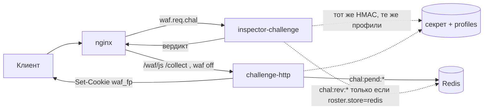

# Два контейнера

> Фрагмент ещё не стоит в [`deploy/docker-compose.yml`](../../../../deploy/docker-compose.yml):
> образов нет. Этот файл — контракт пары JS. Капча собирается отдельно:
> [../../captcha/deploy/README.md](../../captcha/deploy/README.md).
> Сборка — из [`inspectors/challenge`](../../../../inspectors/challenge).

Два контейнера, один образ, один git SHA. Так закрывается вопрос «как не
разъехаться ключу и полям билета»: в проде едет один тег
`waf-challenge:<sha>`, compose запускает его дважды с разной командой.

```
inspectors/challenge/          контекст сборки
        │
        ▼
  waf-challenge:<sha>          один слой: inspector, http, probe
        │
        ├── inspector-challenge    NATS, без порта
        └── challenge-http         :8080 внутри сети, без публикации на хост
```

Два образа из двух Dockerfile не нужны и вредны: кто-то выкатит
`inspector` вторника и `http` понедельника, HMAC сойдётся, а поле `tier`
уже другое — модуль этого не увидит, клиенты уйдут в цикл. Два *контейнера*
нужны: разный SLO, разный масштаб, разный взрывной радиус.

Имена в compose — как у остальных: инспектор на шине начинается с
`inspector-`, HTTP-сервис нет. `challenge-http` в таблице флота —
`kind=service`, не второй инспектор.

## Кто куда ходит

Контейнеры **не вызывают друг друга**. Ни HTTP из инспектора, ни NATS-вердикт
из HTTP. Связь только общая и пассивная.



| Канал | Инспектор | HTTP |
| --- | --- | --- |
| NATS `waf.req.chal` | подписка, queue group | нет |
| NATS `WAF_STATUS.*` | `inspector.challenge.<id>` | `service.challenge-http.<id>` |
| TCP :8080 | нет | слушает, только сеть compose |
| Redis | не на горячем пути; отзыв — опция профиля | nonce `pending`, если реплик больше одной |
| Секрет HMAC | читает | читает и пишет билеты |
| `profiles/` | `decide` | TTL, пути, те же пороги |
| Провайдер капчи | нет | нет — другой модуль |

Если появится соблазн «инспектор сходит на `/healthz` HTTP и не будет
редиректить на мёртвую страницу» — это второй RTT в бюджете 10 мс и
сцепка, ради которой контейнеры как раз разводили. Мёртвый HTTP ловится
иначе, см. [отказы](#отказы).

## Образ

Один `Dockerfile`, контекст — корень `inspectors/challenge`, как у
[ip](../../ip/deploy/README.md). В образ кладутся три бинарника:

| Бинарник | Кто запускает | Зачем |
| --- | --- | --- |
| `challenge-inspector` | `inspector-challenge` | вердикт |
| `challenge-http` | `challenge-http` | `/waf/js`, collect, `waf_fp` |
| `challenge-probe` | healthcheck инспектора | публикация на тот же subject |

`web/` в образе есть у обоих: инспектору не нужен, слой общий, это дешевле
расхождения тегов. Профили в слой не печём — монтируются с хоста, правка
плюс перечитывание, как у `ip`.

```sh
docker build -f deploy/Dockerfile -t waf-challenge .
```

Compose не собирает дважды: якорь на один `build`, у сервисов разные
`command`.

```yaml
x-challenge: &challenge
  build:
    context: ../inspectors/challenge
    dockerfile: deploy/Dockerfile
  image: waf-challenge:local
  secrets:
    - waf_challenge_hmac
  volumes:
    - ../inspectors/challenge/profiles:/app/profiles:ro

inspector-challenge:
  <<: [*resources, *challenge]
  scale: 3
  command: ["challenge-inspector"]
  environment:
    NATS_URL: nats://nats:4222
    WAF_CHAL_SUBJECT: waf.req.chal
    WAF_CHAL_NAME: challenge
    WAF_CHAL_VERSIONS: "2"
    WAF_CHAL_PROFILES: /app/profiles
    WAF_CHAL_HMAC: /run/secrets/waf_challenge_hmac
    REDIS_URL: redis://redis:6379
    WAF_CHAL_REDIS_PREFIX: "chal:"
  depends_on:
    nats:
      condition: service_healthy
    redis:
      condition: service_healthy
  healthcheck:
    test: ["CMD", "challenge-probe", "--quiet", "--timeout", "1s", "--expect", "redirect"]
    interval: 5s
    timeout: 2s
    retries: 5
    start_period: 5s

challenge-http:
  <<: [*resources, *challenge]
  scale: 2
  command: ["challenge-http"]
  environment:
    WAF_CHAL_HTTP_LISTEN: ":8080"
    WAF_CHAL_PROFILES: /app/profiles
    WAF_CHAL_HMAC: /run/secrets/waf_challenge_hmac
    REDIS_URL: redis://redis:6379
    WAF_CHAL_REDIS_PREFIX: "chal:"
    NATS_URL: nats://nats:4222          # только пульс, не вердикты
  expose:
    - "8080"
  depends_on:
    redis:
      condition: service_healthy
    nats:
      condition: service_healthy
  healthcheck:
    test: ["CMD", "wget", "-qO-", "http://127.0.0.1:8080/healthz"]
    interval: 5s
    timeout: 2s
    retries: 5
    start_period: 5s
```

Порт HTTP на хост не публикуем. Стенд ходит через nginx, как клиент.
Прямой заход на `challenge-http:8080` минует `waf_redirect_allow` и
проверку `rd=` в инспекторе — для отладки достаточно `compose exec`.

`nginx` в `depends_on` ждёт `healthy` оба, по той же причине, что
`inspector-modsec`: редирект в пустоту в первые секунды — это 502 на
`/waf/js` и вид «челлендж сломан», хотя инспектор уже отвечает.

Стендовый `/waf/captcha` остаётся статикой, пока не появится модуль
[captcha](../../captcha/README.md). Этот HTTP его не обслуживает.

## Секрет

Ключ подписи — не переменная окружения. Окружение видно соседям по машине
и уезжает в дампы; у агента та же форма уже принята для `contour.key`.

Файл — docker secret `waf_challenge_hmac`, смонтирован обоим контейнерам
в `/run/secrets/waf_challenge_hmac`. На стенде рядом с `secrets/contour.key`,
в git не кладётся. Генератор — расширение `deploy/secrets/gen.mjs`, когда
дойдёт дело.

Формат — два ключа сразу: текущий и предыдущий. Так требует
[security.md](../../../security.md#подделка-clearance-токена-капчи): ротация
с перекрытием на время жизни самого длинного билета (`waf_fp`, в черновике
12 ч).

```
# kid — то, что лежит внутри билета; ключ сырой, не пароль
current  1  <32+ байт>
previous 0  <32+ байт>
```

Правила:

- HTTP **подписывает** только `current`.
- Оба процесса **проверяют** `current`, затем `previous`. Незнакомый `kid` —
  как будто cookie нет.
- Смена: выкатить файл с новым `current` и старым в `previous` в оба
  контейнера, подождать TTL `waf_clr`, убрать `previous`.
- Расхождение файлов между контейнерами — самая дорогая авария семьи:
  HTTP выдаёт билеты, инспектор их не узнаёт, все живые клиенты снова
  идут на `/waf/js`. Отсюда один secret на оба сервиса, не два файла
  «чтобы было независимее».

Ключ контура (`contour.key`) сюда не подходит: его держат агент и
crypto-сервис, инспекторам он не выдаётся. HMAC челленджа — отдельный
секрет с отдельной поверхностью: его видят только эти два контейнера.

## Redis

Тот же инстанс, что обменник объектов, **с чужим префиксом**. На стенде второго
Redis нет, и писать roster ключами вида `<node>:<rid>:req` нельзя: агент
и модуль считают их своими. Префикс жёсткий, `chal:`.

| Ключ | TTL | Пишет | Читает | Зачем |
| --- | --- | --- | --- | --- |
| `chal:pend:<nonce>` | TTL `waf_chal` (минуты) | HTTP, GET `/waf/js` | HTTP, POST `/waf/collect` | одноразовость collect при `scale > 1` |
| `chal:rev:<jti>` | остаток жизни билета | HTTP, ручной/авто отзыв | инспектор, *если* `roster.store=redis` | снять билет раньше TTL |
| `chal:ban:<net>` | минуты | HTTP или инспектор | оба, опция | не слать новую 303 |

Инспектор на горячем пути Redis не обязан. Контракт: токен проверяется
подписью. `roster.store: none` в профиле — законный режим и ближе к
[inspectors.md](../../../inspectors.md#сервис-челленджа). Redis тогда
нужен только HTTP, и только потому что реплик две: nonce, выписанный
на одном инстансе, collect примет другой.

Отдельный Redis для челленджа — если запись nonce начнёт мешать обменнику
тел. Не в v1.

Недоступный Redis:

| Кто | Поведение |
| --- | --- |
| Инспектор | HMAC как обычно; отзыв и бан не работают, живут до TTL cookie |
| HTTP, `scale=1` | можно держать `pending` в памяти процесса |
| HTTP, `scale>1` | `/waf/collect` отвечает 503, новые билеты не выдаются; старые cookie инспектор по-прежнему принимает |

Инспектор из-за мёртвого Redis не молчит: иначе падение обменника объектов гасит
ещё и челлендж.

## Nginx

Стенд сейчас знает одну цель. Семье нужны две локальных и те же
`waf off` / `waf_redirect_allow`.

```nginx
waf_inspector challenge subject=waf.req.chal;

location / {
    waf_inspect ip        wave=0 timeout=5ms;
    waf_inspect challenge wave=2 timeout=10ms;
    waf_redirect_allow /waf/js /waf/captcha;
}

upstream challenge_http {
    server challenge-http:8080;
    keepalive 16;
}

location = /waf/js      { waf off; proxy_pass http://challenge_http; }
location = /waf/collect { waf off; proxy_pass http://challenge_http;
                          client_max_body_size 16k; }
location = /waf/c.js    { waf off; proxy_pass http://challenge_http; }
```

`/waf/captcha` в allow-списке — для соседнего модуля, этот HTTP его не
обслуживает.

`proxy_set_header` — `Host`, `X-Forwarded-For`, `X-Forwarded-Proto`,
`Cookie`. HTTP принимает решения по подсети и UA; без настоящего адреса
клиента привязка билета привяжется к адресу nginx.

`/healthz` контейнера HTTP через эти location не публикуем: это карта
«здесь живёт челлендж». Проба compose бьёт в `127.0.0.1` внутри контейнера.

`rd=` проверяют оба: инспектор, когда собирает Location, и HTTP, когда
ставит 303 назад. Иначе прямой POST на `/waf/collect` — открытый редирект
минуя модуль. Только локальный путь, как в ограничениях канала.

## Кто ставит какую cookie

Модуль cookie не выдумывает. Два писателя, один формат.

| Cookie | Кто ставит | Когда | Кто читает |
| --- | --- | --- | --- |
| `waf_chal` | инспектор, поле `cookies` вердикта `redirect` | нет действующего билета | HTTP на GET/POST; инспектор на следующем запросе (попытки) |
| `waf_fp` | HTTP, `Set-Cookie` ответа `/waf/collect` | JS принят | инспектор |

`waf_fp` инспектор не ставит: он не видел сигналов. `waf_clr` этому модулю
не принадлежит. `waf_chal` HTTP не перевыпускает, если cookie уже есть и
HMAC сошлась — иначе сбросится счётчик попыток.

Прямой заход на `/waf/js` без 303: HTTP может выписать свой `waf_chal` с
тем же ключом. Инспектор его потом узнает. `rd` без параметра — `/`.

Атрибуты `secure` / `http_only` / `same_site` у cookie *инспектора*
форсирует `waf_cookie_defaults`. Cookie HTTP ставит сам: на стенде
`secure=off`, иначе билет не вернётся. Расхождение атрибутов между двумя
писателями — отдельная дыра; HTTP читает те же значения из профиля или
из тех же env, что мы потом пропишем явно, не «как получится в коде».

## Health и пульс

Это разные вещи, как у всего контура.

**Healthcheck контейнера** решает, готов ли сервис принимать работу.

- Инспектор: `challenge-probe` публикует на `waf.req.chal` и ждёт
  `redirect` на запрос без cookie. Живы шина, подписка, ключ, профиль.
  TCP до NATS этого не скажет. Ожидание `allow` было бы слабо: так
  ответит и сломанный `decide`, который всех пускает.
- HTTP: `GET /healthz` с localhost. 200, если слушаем, ключ прочитался,
  и при `scale>1` — Redis `PING`. Чужой сервис (капча) здесь не проверяем.

**Пульс** — присутствие на флоте, не readiness.

| Контейнер | Subject | `kind` | Канал `io` |
| --- | --- | --- | --- |
| `inspector-challenge` | `WAF_STATUS.inspector.challenge.<id>` | `inspector` | `inspect` — доведённый до вердикта |
| `challenge-http` | `WAF_STATUS.service.challenge-http.<id>` | `service` | `collect` — POST; `issue` — выписанный билет |

HTTP без NATS страницы всё равно отдаёт; протухший пульс — жёлтая карточка,
не 502. Инспектор без шины бесполезен, это уже healthcheck.

## Отказы

Контейнеры падают порознь — в этом смысл разведения.

| Что умерло | Что видит клиент с валидным билетом | Что видит новый клиент | Кто рвёт цикл |
| --- | --- | --- | --- |
| Инспектор | политика `waf_deadline` маршрута | то же | модуль, не семья |
| HTTP | `allow`, приложение как обычно | 303 на `/waf/js` → 502 от nginx | счётчик в `waf_chal`: после `max_attempts` инспектор шлёт `deny`, не ещё одну 303 |
| Redis | `allow` по HMAC | JS-страница есть; collect при двух репликах — 503 | тот же счётчик попыток |
| Секрет не тот у инспектора | все «валидные» внезапно снова на JS | шторм на HTTP | мониторинг `waf_redirect_total` + доля несходящейся подписи |
| Секрет не тот у HTTP | старые билеты живут | collect выдаёт билеты, которые инспектор не узнает | то же |
| Модуль капчи | JS-билеты живут | как без `captcha` в наборе | не наша забота |

Инспектор **не** опрашивает HTTP перед редиректом. 502 на цели — это
видимый отказ страницы, не молчание волны. Цикл 303 ломает cookie
попыток, которую поставил сам инспектор: модуль, как и раньше, цикла не
видит.

Убрать челлендж с маршрута по-прежнему аварийный рубильник контура:
убрать `challenge` из `waf_inspect` маршрута. HTTP можно не трогать.

## Выкатка

Один тег на оба сервиса. Менять по одному — только если понимаешь, какое
изменение.

| Изменение | Сначала | Почему |
| --- | --- | --- |
| Новое поле билета, старое читается | инспектор | он должен уметь проверить то, что HTTP ещё не выдаёт |
| Новая страница JS, форма билета та же | HTTP | инспектору всё равно |
| Ротация HMAC | оба сразу, один secret | см. выше |
| Новый порог в `profile.yaml` | всё равно: том общий, перечитают оба | не пересобирать образ |

Откатить HTTP, оставив нового инспектора, безопасно, если билет
обратно совместим. Откатить инспектора, оставив новый HTTP, который уже
пишет незнакомый `v` в токене, — все свежие билеты мертвы.

## Масштаб и квоты

На стенде те же `x-resources` (2 CPU / 1 ГиБ), что у `ip`. По смыслу
инспектор дешёвый и растёт с RPS маршрута (`scale: 3`, queue group).
HTTP растёт с долей 303 (`scale: 2`): липкость не нужна, сессия — cookie
и `chal:pend:*`.

NATS ACL, когда появятся: инспектор — `sub waf.req.chal`, `pub` в свой
audit и `WAF_STATUS.inspector.challenge.*`. HTTP — `pub WAF_STATUS.service.challenge-http.*`,
без `sub` на вердикт. Иначе второй процесс начнёт «помогать» и сломает
маску волны.

## Переменные

Префикс `WAF_CHAL_`, чтобы не пересечься с `WAF_IP_` и ключом контура.

| Переменная | Кто | Умолчание | Назначение |
| --- | --- | --- | --- |
| `NATS_URL` | оба | `nats://127.0.0.1:4222` | шина; HTTP — только пульс |
| `WAF_CHAL_SUBJECT` | инспектор | `waf.req.chal` | подписка |
| `WAF_CHAL_NAME` | инспектор | `challenge` | имя в вердикте; должно совпасть с `waf_inspector` |
| `WAF_CHAL_QUEUE` | инспектор | имя | queue group |
| `WAF_CHAL_VERSIONS` | инспектор | `2` | схема протокола модуля |
| `WAF_CHAL_PROFILES` | оба | `/app/profiles` | каталог профилей |
| `WAF_CHAL_HMAC` | оба | `/run/secrets/waf_challenge_hmac` | ключи подписи |
| `WAF_CHAL_HTTP_LISTEN` | HTTP | `:8080` | адрес слушателя |
| `REDIS_URL` | оба | пусто = roster выкл | тот же Redis, что обменник, чужой префикс |
| `WAF_CHAL_REDIS_PREFIX` | оба | `chal:` | не пересечь локаторы тел |
| `WAF_HEARTBEAT_EVERY` | оба | `4s` | пульс |

Очередь инспектора — `inspector.conf`, как у `ip`: `queue_max`,
`queue_full`, `queue_expand`. У HTTP своей очереди шины нет.
