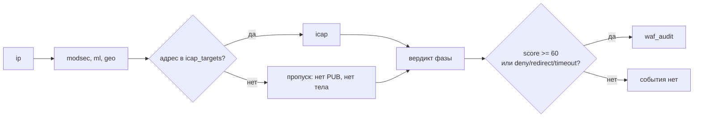
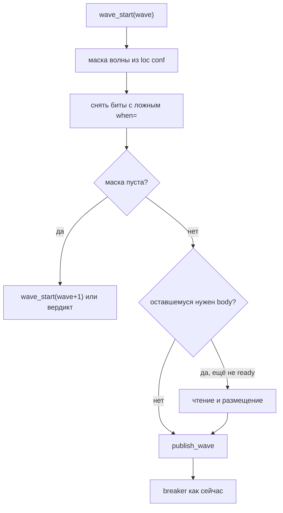

# Условный опрос инспектора (`when=`)

## Вопрос

Как задать пайплайн вида

```
[ip] → [modsec, ml, geo] → [icap] (только для списка адресов) → [запись в лог] (только при score > 60)
```

не ломая модель волн и не вводя в модуль язык выражений nginx.

Порядок первых трёх ступеней `wave=` уже даёт. Не хватает гейта: «этого
инспектора на этом запросе не спрашивать». Отдельно — куда поставить условие на
лог: в ту же цепочку волн или рядом с аудитом.

## Короткий ответ

Порядок оставить номерам `wave=`. Добавить предикат `when=`, который вычисляется в
`wave_start()` **до чтения тела и до публикации**. Ложный предикат снимает бит из
`awaited` (политика отказа не включается). `sample=` снят.

Лог в волну не ставить. Аудит публикуется после вердикта и в набор ожидания не
входит; условие `score > 60` — расширение `waf_audit on=`, не инспектор.

`if` nginx, блоки `waf_pipeline { wave … }` и решение «инспектор сам посмотрит
IP» отвергаются: первые два ломают предвычисленные маски или дублируют граф,
третье публикует сообщение и размещает тело до того, как станет ясно, что
опрашивать некого.

Решение не принято. Ниже — проработка: синтаксис, семантика пропуска, место в
горячем пути, валидация, отвергнутые варианты и то, что ещё надо решить.

## Зачем это не «ещё один wave=»

Целевой поток раскладывается на две разные вещи.



`wave=` отвечает на вопрос «в каком порядке». `when=` — на вопрос «публиковать
ли». Смешивать их в одном атрибуте нельзя: номер волны задаёт топологию
конфигурации и проверяется при загрузке, предикат зависит от запроса и от счёта
предыдущих волн.

Лог на схеме стоит после вердикта намеренно. В
[architecture.md](../architecture.md#поток-запроса) событие аудита «публикуется
после разрешения вердикта и никогда не входит в набор ожидания». Инспектор-логгер
на шине — это round-trip и слот ради побочного эффекта, у которого уже есть
канал: unix dgram на агента, затем JetStream. Этап 8,
[audit.md](../audit.md), [directives.md](https://github.com/exemt/placitum-node/blob/develop/docs/module/directives.md#этап-8--аудит).

## Что уже закрывает порядок

Для первых трёх ступеней новых директив не нужно:

```nginx
waf_inspector ip     subject=waf.req.ip;
waf_inspector modsec subject=waf.req.modsec;
waf_inspector ml     subject=waf.req.ml;
waf_inspector geo    subject=waf.req.geo;
waf_inspector icap   subject=waf.req.icap;

location / {
    waf_inspect ip     wave=0 timeout=5ms;
    waf_inspect modsec wave=1 timeout=15ms;
    waf_inspect ml     wave=1 timeout=15ms;
    waf_inspect geo    wave=1 timeout=8ms;
    waf_inspect icap   wave=2 timeout=30s;
    waf_capture request headers args body;
}
```

Волны: `[ip]`, `[modsec, ml, geo]`, `[icap]`. ICAP не стартует, если волна 0 или 1
дала `deny` / `redirect` либо сумма дошла до `waf_score_deny`. Тело читается
только если оно в `waf_capture` — до первой волны, которой оно нужно —
[execution-model.md](../execution-model.md),
[body-storage.md](../body-storage.md).

Дальше модуль публикует всех, кто попал в набор маршрута. Пропуски, которые уже
есть, отвечают на другие вопросы:

| Механизм | Когда решает | Что умеет | Почему не этот пайплайн |
| --- | --- | --- | --- |
| `wave=` | `nginx -t` | Порядок волн | Не умеет «пропустить этого» |
| нет строки `waf_inspect` | `nginx -t` | Выкинуть с маршрута | Не per-request |
| `mode=passive` | `nginx -t` | Спросить, не гейтить | Не «не публиковать» |
| circuit breaker | до `PUB` | Отключить мёртвого | Это отказ, не «не надо» |
| `waf_local_check` | до волны 0 | `allow` / `block` весь запрос | Не «пропусти только icap» |
| секция `score` в сообщении | внутри инспектора | Челлендж сам смотрит `total` | Сообщение уже уехало, тело уже в store |
| `waf_score_deny` | после волны | Закрыть фазу отказом | Один порог, и это `block`, не skip |
| `waf_audit on=` | после вердикта | `deny`, `redirect`, `timeout` | Нет `score>=N`; сам механизм — этап 8 |

Последние две строки важно не спутать с предлагаемым гейтом. Спецификация
скоринга фиксирует: порог отказа один, из счёта модуль выводит только блокировку,
решение о челлендже принимает сервис на шине
([verdict-protocol.md](../verdict-protocol.md#порог),
[directives/list/verdict.md](../directives/list/verdict.md)). `when=score>=N` на
инспекторе — это «не спрашивать», не «заблокировать» и не «увести на капчу».

## Рекомендация: предикат на публикации

Две формы, парные `mode=` на `waf_inspect` и `profile=` в реестре.

**На объявлении** — значение по умолчанию для всех маршрутов, где инспектор
выбран:

```nginx
waf_local_dataset icap_targets type=cidr active;
                  type=cidr max=100000;

waf_inspector icap subject=waf.req.icap;
waf_inspect icap wave=2 timeout=30s
             when=in(icap_targets,$binary_remote_addr);
```

**На маршруте** — замена, не конъюнкция с объявлением:

```nginx
waf_inspector_when icap in(icap_targets,$binary_remote_addr);

location /upload/ {
    waf_inspector_when icap always;
}

location /static/ {
    waf_inspector_when icap never;
}
```

Контекст `waf_inspector_when`: `http`, `server`, `location`, наследуемая.
Наследование — по значению, как у режима и профиля: заданное на `server`
действует во всех его `location`, пока не переопределено. Несколько директив на
одного инспектора в одном контексте — конъюнкция (`AND`). Заданная ниже по дереву
заменяет родительский набор предикатов целиком, а не дополняет: иначе сузить
условие на одном пути было бы нельзя.

Целевой пайплайн целиком:

```nginx
http {
    waf_local_dataset icap_targets type=cidr active;

    waf_inspector ip     subject=waf.req.ip;
    waf_inspector modsec subject=waf.req.modsec;
    waf_inspector ml     subject=waf.req.ml;
    waf_inspector geo    subject=waf.req.geo;
    waf_inspector icap   subject=waf.req.icap;


    location / {
        waf on;
        waf_inspect ip     wave=0 timeout=5ms;
        waf_inspect modsec wave=1 timeout=15ms;
        waf_inspect ml     wave=1 timeout=15ms;
        waf_inspect geo    wave=1 timeout=8ms;
        waf_inspect icap   wave=2 timeout=30s;
        waf_inspector_when icap in(icap_targets,$binary_remote_addr);
    }
}
```

`when=` на объявлении `icap` и `waf_inspector_when` в `location` одновременно не
нужны: второе перекрывает первое. В примере условие стоит на маршруте, чтобы
`/upload/` мог сказать `always` без правки глобального объявления.

### Аудит и архив — не волны

```nginx
waf_audit audit on=deny,redirect,timeout,score>=60 sample=1.0;
waf_archive request body ttl=180d when=score>=60;
```

Это расширение уже существующего словаря. У `waf_audit` сегодня `on=` принимает
исходы фазы (`all`, `deny`, `redirect`, `timeout` и комбинации). У
`waf_archive request` — `when=always|deny|redirect`. Порог счёта ложится туда же:
оба механизма смотрят на уже разрешённый вердикт и на `ctx->score`, никого не
ждут и в дедлайн фазы не входят.

`score>=60` в `on=` — дополнительное условие, а не замена списка исходов. Запись
`on=deny,redirect,timeout,score>=60` значит: событие пишется при любом из
перечисленных исходов **или** когда сумма фазы не ниже 60. Иначе блокировка с
суммой 20 (явный `deny` от `ip`) перестала бы попадать в аудит, а это как раз те
события, которые нужны всегда.

Практичная схема, симметричная уже описанной в
[audit.md](../audit.md):

```nginx
waf_audit audit on=deny,redirect,timeout sample=1.0;
waf_audit audit on=allow,score>=60 sample=1.0;
```

Вторая строка — полный аудит «подозрительного пропуска». Первая не меняется.
Повторение `waf_audit` с разными `on=` спецификация уже допускает; реализация —
этап 8.

## Закрытый язык предикатов

Не выражения nginx и не regex. Каждый атом — тег и операнды фиксированных типов.
Разбор при загрузке, в горячем пути — сравнение целых или lookup набора в shm
(уже есть, единицы микросекунд,
[execution-model.md](../execution-model.md#локальный-слой)).

| Предикат | Данные | Когда осмыслен | `nginx -t` |
| --- | --- | --- | --- |
| `always` / `never` | нет | любая волна | — |
| `in(<dataset>, <var>)` | набор в shm | любая волна | набор объявлен, зона есть, тип переменной совпадает с `type=` набора |
| `not_in(<dataset>, <var>)` | то же | любая волна | то же |
| `score >= <n>` / `score < <n>` / `score > <n>` / `score <= <n>` | `ctx->score` | `wave=` > 0 | ошибка, если инспектор на `wave=0`: счёт там всегда 0 |
| несколько директив / `and` | конъюнкция | оба валидны | — |

`<n>` — целое 0..64000, тот же потолок, что у суммы вклада
([verdict-protocol.md](../verdict-protocol.md#накопление)). Дробный счёт в модуле
не живёт.

`<var>` в первой версии — закрытый список, не произвольная переменная nginx.
Минимум: `$binary_remote_addr`, `$remote_addr`. Для `type=cidr` годится только
адрес; для `type=string` — точное сравнение по байтам, как у `waf_local_check`.
Расширение списка (хост, метод, `$http_…`) — отдельное решение: каждая новая
переменная должна оставаться дешёвой и не тянуть regex.

`or` в первую версию не входит. Нужен — одной директивой с явным `or`, без
скобок и без смешанного приоритета. Иначе появится язык, который придётся
объяснять в каждом location.

Regex в предикате запрещён по той же причине, что `type=regex` у набора: программа
PCRE не живёт в shm, а компиляция присланного выражения в воркере — исполнение
недоверенного кода в терминаторе TLS
([directives/list/dataset.md](../directives/list/dataset.md)).

Теневая сумма пассивных (`ctx->shadow`) в предикат не входит. Гейтить боевого
инспектора наблюдением — значит сделать `passive` частью решения, а режим
существует как раз для того, чтобы этого не делать
([execution-model.md](../execution-model.md#режимы-инспектора-на-маршруте)).

## Место в горячем пути

Сейчас `ngx_http_waf_wave_start()` сначала спрашивает, нужно ли волне тело, и
только потом публикует. Breaker живёт уже внутри
`ngx_http_waf_bus_publish_wave()`, после того как тело, если требовалось, прочитано
и размещено. `sample=` у инспектора снят.

```c
/* handler.c: ngx_http_waf_wave_start() */
if (!ctx->body_ready && ngx_http_waf_wave_needs_body(ctx, wave)) {
    ctx->state = NGX_HTTP_WAF_ST_NEED_BODY;
    return ngx_http_waf_access_handler(r);
}
/* … слот, затем: */
ngx_http_waf_bus_publish_wave(ctx, slot);   /* внутри — breaker */
```

Если `when=` поставить после решения о теле, ICAP «только для списка» всё равно
заплатит чтением тела и `put` в store: требование волны посчитано по полной
маске, до любых пропусков. Для тела в `waf_capture` это как раз та цена, которой
гейт должен избегать.

Поэтому предикат вычисляется **в начале** `wave_start()`, до
`wave_needs_body()`:



Шаги:

1. Взять предвычисленную маску волны. Граф не обходится.
2. Для каждого бита вычислить предикат маршрута. Ложь — `ctx->skipped |= bit`,
   бит из маски публикации снимается. Это не `ngx_http_waf_skip(…, TIMEOUT)`:
   таймаута нет, ждать некого.
3. По оставшимся пересчитать требование тела. Пустая волна — сразу следующая,
   без слота и без `count=waves`. Волны, которой не было, в корзине частоты нет.
4. Читать и класть тело только если оно в `waf_capture` и оставшимся оно нужно.
5. Публиковать. Дальше breaker без изменений.

Breaker после `when=` на месте: на адрес вне списка сообщение не уходит, и
открытый предохранитель ICAP этот запрос не штрафует. На адрес из списка —
как сейчас.

### Пустая волна и `wave=`

`wave=` — про порядок, не про «предшественник действительно ответил».
Пропущенный по `when=` инспектор не ломает следующие номера: следующая
непустая волна публикуется, как только закрылась текущая, пустая в том числе.
`icap` на `wave=2` не означает «icap только если волна 1 ответила»; оно означает
«icap не раньше волны 2».

Если из волны сняли всех обязательных, а пассивные остались — волну всё ещё
ждут: `passive` ждут ради лога. Если сняли всех, включая пассивных, — волны не
было.

Инспектор более ранней волны сам может быть пропущен. Это не ошибка при
загрузке: номер задаёт порядок, а не факт публикации. Предупреждение при `-t`
здесь было бы ложным: на другом запросе предикат сработает.

## Семантика пропуска

Четыре способа «не спросить» уже рядом в `publish_wave()`. Их нельзя слить в
один: у каждого своя политика.

| Событие | `PUB` | Ждут | Политика отказа | Тело |
| --- | --- | --- | --- | --- |
| `when=` ложен | нет | нет | нет | не читаем, если волна опустела |
| breaker open | нет | да → timeout | политика `waf_deadline` | да, если capture просил тело |
| нет подписчиков | нет | да | `waf_on_absent` | да, если capture просил тело |
| инспектор сам вернул `allow` | да | да | — | да, если capture просил тело |

Пропуск по `when=` — не отказ. Адрес вне списка не должен включать
политику `waf_deadline` и не должен занижать сумму как «инспектор промолчал». Вклада в
`ctx->score` нет, в `prior` записи нет: его не спрашивали. В отладке он виден
как `skip`.

Имеет смысл различить причину в `X-WAF-Debug` и в будущем событии аудита:
`skip:when`. Иначе на маршруте с несколькими гейтами непонятно, почему ICAP не
ответил. Поле в протоколе вердикта для этого не нужно: пропущенный инспектор
сообщения не получает.

`count=waves` начисляется после публикации. Волна, из которой `when=` снял всех,
не публикуется — и в корзину не идёт. Это согласуется с уже зафиксированным
правилом: считать надо усиление на шине, а не намерение конфигурации
([execution-model.md](../execution-model.md#локальный-слой)).

## Валидация при `nginx -t`

Предикат разбирается в структуру, не в строку «на потом». Ошибки — те же по
жёсткости, что у графа: молча проглотить условие, которое никогда не сработает,
хуже, чем не принять его.

| Ситуация | Реакция |
| --- | --- |
| Неизвестный атом (`when=foo`) | Ошибка |
| `in(` без объявленного набора | Ошибка |
| `in(` без `waf_shm_zone` | Ошибка, как у любой директивы локального слоя |
| Переменная не из закрытого списка | Ошибка |
| `type=cidr` и переменная не адрес | Ошибка, как у `waf_local_check` |
| `score …` у инспектора, который после индукции маршрута в волне 0 | Ошибка на этом location |
| `score …` у инспектора с `wave=0` | Ошибка уже на объявлении |
| `when=` у инспектора с `mode=passive` | Допустимо: не публиковать пассивного дешевле, чем публиковать |
| `waf_inspector_when` на имя вне `waf_inspect` маршрута | Предупреждение, предикат не применяется |
| `when=` на объявлении и `waf_inspector_when` на том же уровне | Маршрут побеждает, предупреждение — чтобы не гадать, какой текст действует |
| `or` / скобки / regex | Ошибка, «not implemented», не молчание |

`score …` проверяется на наборе `waf_inspect` location. Иначе инспектор с
`wave=0` получит условие по счёту, который там всегда 0 — мёртвый предикат,
и это ошибка при `-t`.

## Что видно снаружи

В `X-WAF-Debug` пропущенный по `when=` инспектор печатается с пометкой причины.
Заголовок и сейчас перечисляет `skip`
([directives/list/misc.md](../directives/list/misc.md)).

В аудите этапа 8 пропущенный не попадает в `inspectors` как опрошенный и не
появляется в `scores`. Имеет смысл отдельное поле `inspectors_skipped` или
суффикс в уже существующей карте латентностей: иначе выборка «все запросы, где
icap не работал» смешает «не в списке» и «не стоял в `waf_inspect`». Это деталь
каталога полей, не протокола вердикта.

Инспектору следующей волны в `prior` пропущенный предшественник не приезжает.
`score.total` его вклада не содержит. Это то же самое, что «инспектора не было в
наборе», и челлендж, который смотрит `prior`, не должен отличать эти два случая:
его не спрашивали в обоих.

## Почему не `if`, не блок пайплайна и не «пусть решит инспектор»

### `if` / `map` / `geo` nginx

`if` живёт в rewrite. К этому моменту фазы WAF ещё нет, `ctx->score` не
существует. Условие «лог при score > 60» в `if` записать нельзя в принципе.

Смена `waf_inspect` внутри `if` уничтожает предвычисленные маски
волн: горячий путь снова ищет по строкам и строит набор на запрос. Плюс `if`
ломает наследование location — это отдельный, давно описанный класс ошибок
nginx, и в [requirements.md](../requirements.md) `map`, `geo`, `if` уже
запрещены как отдельные поля контроллера: только через `raw`.

`map` + два `location` с разным набором инспекторов закрывает «ICAP только для
списка» ценой размножения путей. Список при этом статический и не из
`waf_local_dataset`. Счёт предыдущих волн так не посмотреть. Сопровождать два
дерева location ради одного гейта — то, чего как раз не должно быть в шаблоне.

### `waf_pipeline { wave ip; wave modsec ml geo; … }`

Второй язык порядка поверх `wave=`. Два источника истины, два валидатора
номеров. `wave=` уже даёт `[ip] → [modsec, ml, geo] → [icap]`. Нужен гейт
на вызове, не новый язык порядка.

Блок с `if` внутри ещё хуже: это тот же `if`, только в своём парсере, со своим
наследованием и без доступа к переменным nginx, которые оператор будет ждать по
привычке.

### Решение внутри инспектора

Сервис челленджа так и работает: смотрит `score.total` и `prior`, отвечает
`redirect` или `allow`. Это правильно, когда решение зависит от состояния,
которого в модуле нет (попытки, маркеры, доступность проверки).

Для ICAP «только для списка адресов» этот путь платит полную цену волны:

- сообщение на шине, даже если сразу вернётся `allow`;
- чтение тела и `put` в store, потому что тело в `waf_capture`, а
  требование волны считается до ответа;
- таймаут и breaker, если гейтвей завис, хотя спрашивать его не следовало.

Именно эту цену модуль уже умеет не платить для волны 0: запрос, заблокированный
по адресу, тело не читает. `when=` распространяет тот же принцип на более позднюю
волну.

Список адресов при этом уже есть в локальном слое. Гонять его на шину, чтобы
инспектор повторил lookup, который модуль делает за микросекунды, — инверсия
разделения на решающих и поставщиков
([architecture.md](../architecture.md#два-класса-инспекторов)).

## Связь с уже принятыми инвариантами

**Порог отказа один.** `when=score>=N` не вводит вторую ступень лестницы
решения. Лестница по-прежнему `allow < score < redirect < deny` плюс сравнение
с `waf_score_deny`. Предикат не меняет исход, он меняет состав опубликованных.

**Челлендж остаётся сервисом.** Ставить `when=score>=60` на инспектор челленджа
можно, и это даже близко к тому, что люди рисуют как «капча после 60». Но сервис
тогда не увидит запросы с суммой 40, на которых он, возможно, всё равно хочет
проверить маркер или исчерпанные попытки. Для челленджа прежний контракт —
смотреть секцию `score` самому — обычно вернее. `when=` на нём имеет смысл
только как жёсткая экономия: «ниже N не тратить даже публикацию».

**`mode=passive` по-прежнему не гейтит.** Предикат на пассивном снимает
публикацию; пассивный вердикт и так не закрывает фазу.
`when=` эту проверку не ослабляет.

**Нет строки `waf_inspect` сильнее `when=`.** Инспектора нет в волнах.
Предикат до него не доходит. Писать `waf_inspector_when` на имя вне набора —
предупреждение при `-t`.

**Профиль не участвует.** `route.profile` едет в сообщении тем, кого
опубликовали. Предикат решает, будет ли сообщение, не то, какой набор правил
внутри.

**Фаза ответа.** Тот же `waf_inspector_when` на инспекторах `phase=response`.
Счёт в предикате — счёт фазы ответа, не запроса: суммы раздельные
([directives/list/verdict.md](../directives/list/verdict.md)). Пока фазы
ответа нет (этап 7), директива разбирается и предупреждает так же, как
`waf_inspect` с `phase=response` (в текущем коде — `waf_response_inspectors`).

**Модель кадров.** Предикат по счёту на кадре обнуляется вместе со счётом кадра.
Предикат по датасету осмыслен: «кадры этого адреса не гонять в DLP». Это этап 12,
в первую версию не входит; синтаксис тот же, точка вычисления — другая машина
состояний.

## Контроллер

Пока решение не принято, в модель маршрута ничего не класть. `waf_inspector_when`
и `when=` на объявлении уходят в шаблон через `raw`, как `if` и `map`.

Если принимать — две сущности, симметричные уже существующим:

- на инспекторе контура (http-only): опция `when` рядом с `after`, `weight`,
  `sample`;
- на маршруте: карта `имя → предикат`, наследование заменой, как `modes` и
  `profiles`.

Предикат в UI — конструктор из закрытого списка атомов, не текстовое поле с
выражением. Иначе контроллер начнёт принимать то, что `nginx -t` отвергнет, и
дрейф шаблона станет нормой.

Наборы в `in(…)` — те же `waf_local_dataset`, что уже рисует страница datasets.
Новой сущности «список для ICAP» нет: это обычный CIDR-набор с другим subject.

## Что можно сделать сейчас, без синтаксиса

Порядок волн — уже. Условный ICAP — отдельный `location` с другим набором
инспекторов либо гейтвей, который смотрит `conn.client_ip` и сразу отвечает
`allow`. Второе работает и не требует патча модуля; цена — сообщение и
размещение `body=full` на каждый запрос вне списка.

Условный лог — фильтр в ClickHouse по `score_total` после этапа 8, либо ждать
`on=score>=N`. Писать инспектор-логгер на шине не стоит даже как временный
обход: он попадёт в волны, в дедлайн и в `count=waves`.

## Открытые вопросы

Именно они отделяют рекомендацию от спецификации.

1. **Первая версия — только `in`/`not_in` и `always`/`never`, без `score`?**
   Гейт по датасету закрывает ICAP и не трогает инвариант «порог один». Гейт по
   счёту полезен, но его легко принять за вторую ступень лестницы. Можно принять
   датасеты сейчас, счёт — отдельным решением вместе с этапом 8 (`on=score>=N`).

2. **`on=deny,…,score>=60` — дизъюнкция с исходами или фильтр поверх них?**
   Выше предложена дизъюнкция («или исход из списка, или сумма ≥ N»). Альтернатива
   — `on=allow when=score>=60`: исход отдельно, порог отдельно. Вторая форма
   чище, но это ещё одна опция у директивы, у которой опций уже пять.

3. **Различать `skip:when` и `skip:sample` в отладке обязательно с первого
   коммита?** Без различия выкладку не отладить. В протокол это не входит, только
   в debug-заголовок и в каталог полей аудита.

4. **Закрытый список переменных оставлять жёстким?** `$binary_remote_addr` и
   `$remote_addr` покрывают заявленный пайплайн. Метод и хост почти наверняка
   попросят следом. Каждый следующий — отдельная строка в валидаторе, не
   «любая переменная nginx».

5. **`when=` на объявлении нужен, или достаточно маршрутной директивы?**
   Объявление удобно, когда ICAP глобально «только для списка». Маршрут нужен
   всегда: `/upload/` скажет `always`. Можно начать с одной маршрутной формы и
   не трогать парсер `waf_inspector`.

6. **Этап.** В [roadmap.md](../roadmap.md) дырки под это нет. Логично не раньше
   этапа 8: `on=score>=N` живёт в аудите, а без него половина заявленного
   пайплайна всё равно не собирается. Гейт по датасету сам по себе может появиться
   раньше — он опирается только на уже закрытые этапы 3 и 5.

7. **Как предикат попадает в контроллер.** Не решать до пункта 5: от выбора
   «только маршрут» или «объявление плюс маршрут» зависит, в какую таблицу это
   класть.
