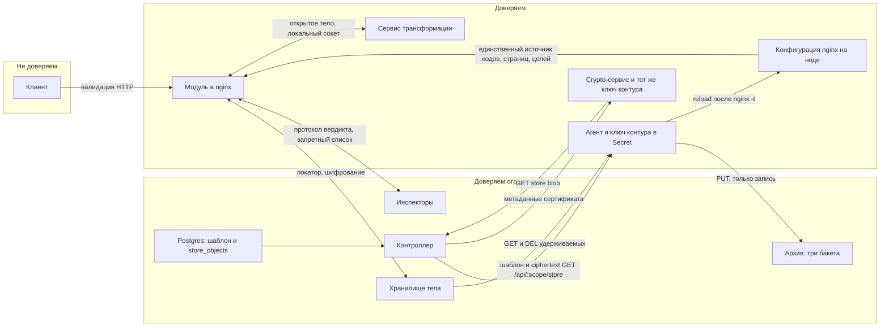

# Безопасность

## Границы доверия



Центральное решение архитектуры: инспекторам доверяют ограниченно. Инспектор — внешний процесс на
отдельной машине, часто написанный другой командой, иногда сторонний продукт. Инспектор, которому
разрешено подставить произвольный заголовок, cookie и код ответа, представляет собой удалённый
редактор вашего трафика и опаснее той атаки, от которой защищает.

Отсюда правило: конфигурация nginx — единственный источник истины для всего, что видит клиент.
Инспектор присылает символические имена, модуль превращает их в конкретные коды и страницы.
Контроллер шаблон видит и это нормально; содержимое `store:<uuid>` — нет. Секреты шифрует браузер,
приватный ключ контура живёт в Secret агента и в том же Secret у crypto-сервиса — отдельного
держателя ключа для метаданных сертификата, см. [crypto-service.md](https://github.com/exemt/placitum-crypto/blob/develop/docs/spec.md) и
[config-distribution.md](config-distribution.md).

Единственное исключение — цель редиректа: её знает только сервис, который ведёт челлендж, поэтому
адрес приезжает с провода. Роль конфигурации здесь не в том, чтобы назвать адрес, а в том, чтобы
очертить границу — `waf_redirect_allow`, см. [open redirect](#open-redirect-через-цель-челленджа).

## Модель угроз

### Скомпрометированный инспектор

**Может:** блокировать трафик на маршрутах, где он стоит боевым; вносить в счёт не более ста;
устанавливать заголовки, кроме запретного списка; устанавливать cookie (имена с провода, атрибуты —
`waf_cookie_defaults`); выбирать записи каталога ответов отказа; уводить клиента на любой адрес,
разрешённый `waf_redirect_allow` маршрута; читать объекты, которые маршрут снял в `waf_capture`.

**Не может:** подставить запрещённый заголовок (`Host`, `Authorization`, `Cookie`,
`Content-Length`, `Transfer-Encoding`, `Content-Encoding`, `Connection`, `Upgrade` и остальные из
запретного списка); внедрить перевод строки в значение (отбраковка CR, LF, NUL); вернуть 200 в
вердикте `deny`; передать содержимое страницы; ответить за другого инспектора (маска волны плюс
ограничения subject в NATS); дотянуться до тел на маршрутах, где он не включён, или до объектов вне
`waf_capture`; изменить свой режим вызова или порог маршрута; обнулить сумму глубже, чем на сотню
за одну просьбу `score` (вклад одного инспектора держится в −100…100), или увести её ниже нуля.
Снять чужие находки просьбой `score` со знаком минус он **может** — с той же оговоркой, что у
глаголов `off` и `passive` соседу: просить вправе любой спрошенный инспектор, и это решение о
доверии принимается тем, кто ставит его на маршрут.

**Остаточный риск:** отказ в обслуживании через массовые `deny` и утечка тех тел, которые ему
легитимно доступны. Первое митигируется мониторингом резкого роста блокировок по одному инспектору,
второе — осью захвата: маршрут решает `waf_capture`, что видят все инспекторы (тело в умолчание не
входит). Archive и preview в сообщение не добавляют.

Скоринг этот риск сокращает, но не устраняет: инспектор в `mode=vote` при `waf_score_deny 200` не
может заблокировать в одиночку даже отвечая `deny` на каждый запрос, но при пороге 100 разница
между его голосом и явным `deny` исчезает. Режим вызова и порог — это и есть настройка того,
насколько вы доверяете конкретному инспектору; выставлять её стоит осознанно, а не по умолчанию.

### Атака на шину

Клиент шины аутентифицируется, и каждому участнику выдаются минимальные права на subject:

```
# Модуль
publish:   waf.req.>, waf.rsp.>, waf.audit.>
subscribe: _INBOX.waf.<node_id>.>

# Инспектор sqli
subscribe: waf.req.sqli
publish:   _INBOX.waf.>          # только ответы
```

Инспектор не имеет права публиковать в `waf.req.*` и потому не может выдать себя за модуль и вызвать
работу других инспекторов. Он не может подписаться на subject чужого инспектора и потому не видит
данные, адресованные не ему. Права на `_INBOX.waf.>` необходимы для ответов, а адресность обеспечивает
маска волны на стороне модуля.

Транспорт TLS обязателен: в сообщениях едут адрес запроса и локаторы обменника (заголовки и тело
лежат в Redis, не на шине). mTLS или credentials NATS (JWT плюс nkey) — на выбор, важно чтобы
аутентификация была двусторонней.

### Атака на хранилище тела

Тела содержат персональные данные, платёжные реквизиты и содержимое документов.

Меры: `waf_body_encrypt on` для любого хранилища за пределами хоста nginx, чтобы хранилище не видело
открытый текст; ключ доставляется инспекторам вне канала вердиктов, в сообщении едет только `kid`;
ключ хранилища содержит `rid` и не угадывается; TTL в единицы десятков секунд для горячего хранилища;
явное удаление при разрешении вердикта, TTL только как страховка.

Для драйвера `s3` — приватный бакет, шифрование на стороне сервера дополнительно к шифрованию на
стороне модуля, lifecycle-политика вместо расчёта на явное удаление, отдельные учётные данные с
правами только на `PutObject` в свой префикс.

### Скомпрометированный контроллер

Контроллер видит шаблон nginx и каталог UUID, не plaintext объектов `store:<uuid>`.

**Может:** подменить шаблон (выключить инспектора, расширить `waf off`, подставить чужой
`store:<uuid>`); отдать фронту поддельный публичный ключ, если fingerprint не закреплён при деплое;
удалить или задержать `send`.

**Не может:** прочитать ключ TLS из `store_objects` — там ciphertext; расшифровать объекты без
Secret ноды; сделать `reload` в обход агента.

Crypto-сервис (спецификация — `docs/spec.md` его репозитория) — ещё один держатель приватного ключа контура, наравне с
агентом: он расшифровывает store-объекты сертификата по запросу контроллера, чтобы вернуть SAN,
срок и fingerprint. Границы те же, что у агента: контроллер передаёт ему только `scope` и UUID,
plaintext обратно не идёт, вставку метаданных в Postgres делает сам контроллер.

**Остаточный риск:** XSS на origin UI подменяет ключ шифрования. Мера: fingerprint публичной
половины зашит в выкладку контроллера из того же Secret контура, UI сверяет его с `/api/crypto`
до первой загрузки файла. Схема раскатки — [config-distribution.md](config-distribution.md).

### Утечка ключа контура

Приватный ключ один на контур и лежит в Secret агента и crypto-сервиса — двух процессов, не
одного. Кто его получил, открывает все объекты store этого контура и может подложить валидный
ciphertext под существующий UUID. Staging и prod не делят Secret. Ротация — смена Secret у обоих
держателей и повторная загрузка файлов либо rewrap живой нодой; у контроллера plaintext нет.

### Сервис трансформации

Сервис маскирования видит все тела в открытом виде и до шифрования, поэтому он привилегированнее любого
инспектора и находится внутри границы доверия, а не рядом с ней.

Практические следствия: сервис размещается на хосте nginx и общается через Unix-сокет, а не по сети;
staging-store с оригиналами обязан быть локальным, и это проверяется при `nginx -t`; права на сокет и на
каталог staging ограничены выделенным пользователем; ключ шифрования тел сервису не выдаётся, потому что
шифрование применяется после трансформации.

Отдельная угроза — обход маскирования через отказ сервиса. Если при таймауте или ошибке разбора
оригинал всё равно уйдёт в контур, достаточно перегрузить сервис или прислать невалидный JSON, чтобы
приватные данные оказались у инспекторов. Поэтому `waf_on_transform_error pass` требует явного указания
и учитывается отдельным счётчиком, а значение по умолчанию `meta` не размещает тело вовсе.

Второе следствие маскирования — гарантированные слепые зоны в детекте: инспектор не видит того, что
замаскировано, и полезная нагрузка в таком поле не будет обнаружена. Смягчается редактированием с
сохранением формы и узкой областью правил; обязательное условие — факт применения правил попадает в
аудит, иначе через полгода никто не сможет объяснить пропущенную атаку. Подробно в
[body-transform.md](body-transform.md#маскирование-создаёт-слепые-зоны).

### Расщепление ответа через переопределение заголовков

Классическая уязвимость этого класса систем. Инспектор присылает значение заголовка с CR и LF внутри,
и одно поле превращается в несколько заголовков или в дополнительный ответ.

Защита: отбраковка значений, содержащих CR, LF или NUL, проверяется и в имени, и в значении, до
любого использования; ограничение длины через `waf_header_value_max`; ограничение общего размера
ответа инспектора через `waf_reply_max`.

### Open redirect через цель челленджа

Цель редиректа — единственное, что модуль берёт с провода и отдаёт клиенту почти как есть, поэтому это
и единственное место, где скомпрометированный инспектор может увести трафик за пределы контура.
Ценность добычи высока: адрес приходит с домена, которому пользователь доверяет, и служит и для фишинга,
и для кражи токенов через `Referer`.

Защита — `waf_redirect_allow` на маршруте, и она устроена как список разрешённого, а не запрещённого:
пустой список означает, что редиректы здесь невозможны вовсе. Адрес до применения проходит перечень
проверок, каждая из которых закрывает известный способ обмануть сравнение хостов, — CR, LF и прочие
управляющие байты, обратный слеш, форма `//host`, схема вне `http` и `https`, `userinfo` в authority.
Полный перечень с обоснованием каждого пункта — в
[verdict-protocol.md](verdict-protocol.md#ограничения-канала).

Ответ с непрошедшим адресом отбраковывается целиком и попадает в лог на уровне `warn` с именем
инспектора и присланным адресом. Инспектор, который начал стучаться в границу, виден по этой записи, и
это не менее ценно, чем сам факт блокировки.

### Цикл редиректов как отказ в обслуживании

Сломанный или перегруженный сервис челленджа без защиты даёт бесконечный редирект для всех
пользователей одновременно. Это самостоятельный класс аварии, не требующий атакующего.

Модуль здесь не помощник и не участник: он не выводит редирект ни из чего сам и не знает ни про
попытки, ни про маркеры, поэтому защита живёт в сервисе, см.
[verdict-protocol.md](verdict-protocol.md#челлендж-и-цикл-редиректов). Со стороны контура остаётся
`waf off` в location цели и её присутствие в `waf_redirect_allow`, и оба обязательства проверяемы
конфигурацией, а не наблюдением за трафиком.

### Усиление нагрузки через шину

Один клиентский запрос порождает восемь и более внутренних сообщений. Это означает, что шина и
инспекторы усиливают любую атаку на трафик почти на порядок, и целью атаки становятся они, а не
приложение.

Защита строится по слоям, от дешёвого к дорогому: локальный слой в разделяемой памяти до единого
сообщения на шину; минимальный состав волны 0; дорогие инспекторы в поздних волнах (`wave=` больше);
порог `waf_local_rate` с запасом над реальным пиком, потому что исход локального слоя — только отказ, и
за общим NAT под него попадут легитимные пользователи. Смягчить отказ челленджем здесь нельзя:
локальный слой работает до того, как о запросе узнает хоть кто-то на шине, а назначать проверку
решает сервис, который её ведёт.

Для HTTP/2 усиление считается по потокам, а не по соединениям, и атака rapid reset попадает точно в
слабое место: волна публикуется, а поток немедленно сбрасывается. Отсюда `count=waves` в
`waf_local_rate` — счётчик по завершённым запросам этот трафик не видит.

Для кадрированного трафика усиление умножается на частоту сообщений, а не запросов: сто тысяч соединений
с одним сообщением в секунду и двумя инспекторами дают четыреста тысяч сообщений в секунду без всякой
атаки. Локальные ограничители по размеру кадра, частоте и опкодам обязательны, см.
[streaming.md](streaming.md#локальный-слой-для-кадров).

### Подделка clearance-токена капчи

Это угроза сервису челленджа, а не модулю: модуль cookie челленджа не читает и не проверяет, он лишь
передаёт её инспекторам вместе с остальными заголовками. Требования ниже относятся к тому, кто токен
выдаёт.

Токен clearance подписывается HMAC-SHA256 и содержит время выдачи, срок действия, привязку к подсети
клиента, отпечаток User-Agent, счётчик попыток и область действия. Подпись проверяется без обращения к
базе, что позволяет сервису капчи оставаться stateless.

Практическое ограничение: привязка к подсети, а не к точному адресу. В мобильных сетях адрес меняется
в течение сессии, и жёсткая привязка приводит к повторным челленджам у легитимных пользователей.

Ротация ключа подписи выполняется по идентификатору ключа в токене с перекрытием на время жизни
максимального clearance.

### Обход через маршруты без проверок

Каждый `waf off` — это дыра. Часть из них необходима (`/healthz`, location капчи, страницы отказов), но
их набор должен быть явным и проверяемым.

```bash
nginx -T | grep -B5 'waf off'
```

Практика: `waf on` в контексте `http`, чтобы значением по умолчанию была защита, а исключения были
явными и заметными в ревью конфигурации. Проверка `nginx -t` обязана требовать `waf off` в location
капчи — иначе цикл гарантирован.

### Информационная утечка через диагностику

`waf_debug_header on` раскрывает состав инспекторов, их латентности и коды причин. Это карта вашей
защиты, выданная атакующему.

Директива допустима только в тестовых контурах. `waf_status` обязан быть закрыт по адресам. Причина
блокировки (`deny_reason`, `deny_rule`) никогда не попадает в ответ клиенту — только в аудит.

### Агент как переносчик данных

До архивации агент полезной нагрузки не касался: он читал датаграмму с вердиктом и перекладывал её на
шину. С `waf_archive request` он получает реквизиты обменника, реквизиты архива и проходящие через него
тела. Это заметное расширение радиуса поражения, и стоит назвать его границы прямо.

**Может:** прочитать из обменника любой ключ, который назван в датаграмме; записать объект в
настроенные бакеты; удалить из обменника ключ, который сам же и прочитал; подменить в записи аудита
секцию `store` — то есть соврать о том, где лежит объект и лежит ли он вообще.

**Не может:** прочитать открытое тело при включённом `waf_body_encrypt` — ключа расшифровки у него
нет и по построению быть не должно, он копирует шифротекст и переносит блок `enc` как есть; изменить
что-либо в записи, кроме конверта и секции `store` (запись не разбирается в структуру, склейка
точечная); повлиять на вердикт — к моменту, когда датаграмма до него дошла, ответ клиенту уже
отправлен; сходить за ключом на произвольный узел — адрес берётся из подсказки локатора, но только
если он есть в `WAF_RETAIN_REDIS_NODES`, иначе используется адрес по умолчанию.

Последнее ограничение существует потому, что сокет вердиктов имеет режим `0666`: воркер nginx — это
другой uid, и права даны по необходимости. Кто угодно на ноде может послать в него датаграмму. Без
списка узлов подсказка в такой датаграмме была бы способом заставить агента постучаться по
произвольному адресу с реквизитами обменника в руках.

Сокет логов (`log_sock`) имеет тот же режим и по той же причине, и следствие у него такое же: кто
угодно на ноде может положить в журнал строку с любым `service` и любым уровнем от имени этой ноды.
Ущерб здесь ограничен формой записи — у строки лога нет ни адресата, ни ключа, по которому агент
куда-нибудь пойдёт: он её только разбирает и публикует. Журналу это даёт то же доверие, что и
самому файлу лога, — то есть доверие к тем, у кого есть доступ на ноду.

Практические следствия: реквизиты S3 лежат в файле с правами `0600`, а не в окружении процесса —
окружение видно соседям по машине и уезжает в дампы; учётная запись агента в бакетах имеет право
`PutObject` и `PutObjectTagging`, но не `GetObject` и не `DeleteObject` — писателю архива читать
архив незачем; учётная запись в обменнике может `GET` и `DEL`, но не `FLUSHDB`.

## Приватность данных

Три хранилища с разными свойствами, и каждое требует отдельного решения.

**Хранилище тела** живёт секунды, содержит данные пользователей, доступно инспекторам. Решение:
маскирование через сервис трансформации, чтобы приватные поля вообще не попадали в контур; шифрование,
короткий TTL, явное удаление, минимальный круг инспекторов с доступом.

**Staging-store** живёт секунды, содержит оригиналы без маскирования и потому не должен покидать хост
nginx. Решение: только локальные драйверы (проверяется при `nginx -t`), права `0600`, TTL в единицы
секунд.

**Архив** живёт неделями, содержит тела, заголовки и строки запроса заблокированных запросов.
Решение: три бакета по видам объектов (у `Cookie` и у платёжной формы разная чувствительность и
разный круг допущенных), отдельные права на каждый, lifecycle-политика по срокам обработки
персональных данных, `when=deny` вместо `always`, чтобы не архивировать легитимный трафик. Кто и
через что туда пишет — [ниже](#агент-как-переносчик-данных).

**Аудит** живёт месяцами, доступен широкому кругу аналитиков и потому наиболее вероятный канал
утечки. Решение: маскирование по умолчанию (`cookie`, `authorization`, `set-cookie`,
`proxy-authorization`), `args_hash` вместо `args`, `body_sha256` вместо `body_prefix`, TTL таблицы по
требованиям регулятора, а не по удобству аналитики.

Общее правило: хеш вместо значения всюду, где задача — сопоставить и сгруппировать, а не прочитать.
Хеша достаточно, чтобы связать события, найти повторяющиеся тела и подтвердить идентичность, и он не
создаёт обменника персональных данных.

## Чеклист перед выкладкой в продакшен

- TLS на шине включён, аутентификация двусторонняя.
- У каждого инспектора отдельная учётная запись с минимальными правами на subject; проверено, что
  инспектор не может публиковать в `waf.req.*`.
- Белые списки заголовков и cookie заданы для каждого инспектора, а не оставлены пустыми.
- Каталог `waf_deny_response` заполнен; ни один инспектор не присылает коды и страницы.
- `waf_redirect_allow` задан на тех маршрутах, где нужен челлендж, и не задан на остальных; проверено,
  что адрес вне списка отбраковывается и попадает в лог.
- `waf_body_encrypt on` для всех хранилищ за пределами хоста nginx.
- TTL хранилища тела в единицы десятков секунд; проверено, что явное удаление работает.
- Сервис трансформации размещён локально, staging-store использует локальный драйвер, права на сокет и
  каталог ограничены; `waf_on_transform_error` не равен `pass`.
- Проверено поведение при полностью недоступном сервисе трансформации: приватные данные не уходят в
  контур.
- Для маршрутов с маскированием и DLP инспектор утечек — локальный сайдкар, иначе одна функция
  уничтожает другую.
- Набор `waf_archive request` перечислен поимённо и обоснован по каждому маршруту; `when=` сужает его
  до того, что действительно нужно для разбора, а `ttl=` назван явно: без него объект хранится вечно.
- Реквизиты архива в файле с правами `0600`, а не в окружении агента; учётная запись умеет писать и
  тегировать, но не читать и не удалять.
- `WAF_RETAIN_REDIS_NODES` перечисляет узлы обменника; проверено, что подсказка с чужим адресом
  игнорируется.
- Lifecycle-правила заведены на каждый использованный `ttl=`, включая
  `AbortIncompleteMultipartUpload` и `NoncurrentVersionExpiration`; проверено, что объект
  действительно исчезает.
- `mask=` у `waf_capture` / `waf_preview` не сокращён относительно значения по умолчанию.
- TTL таблицы аудита соответствует требованиям к обработке персональных данных.
- Все `waf off` перечислены и обоснованы; location капчи среди них.
- `waf_debug_header off` во всех продакшен-контурах; `waf_status` закрыт по адресам.
- У сервиса челленджа задан предел попыток; проверено поведение при полностью недоступном сервисе —
  исход определяет политика `waf_deadline` маршрута, и это решение принято сознательно.
- `waf_local_rate` включён до вывода на реальный трафик.
- Пороги счёта подобраны по распределению на своём трафике, а не назначены из головы; для каждого
  инспектора решено, стоит ли он боевым, совещательным или пассивным и может ли дотянуть до порога в
  одиночку.
- Для маршрутов, где блокировка держится на счёте, а не на явных `deny`, осознано, что
  `waf_deadline ... pass` и открытый circuit breaker занижают сумму и уводят запрос под порог.
- Решение fail-open против fail-closed принято по каждому классу маршрутов и зафиксировано.
- Приватный ключ контура — в Secret агента, не в git и не в контроллере; fingerprint публичной
  половины закреплён при деплое UI.
- Ciphertext конфигурации живёт в Postgres контроллера, не в бакете тел и не в Redis горячего пути.
- `send` сверяет сходимость по `config_hash` шаблона, а не по факту публикации манифеста.
