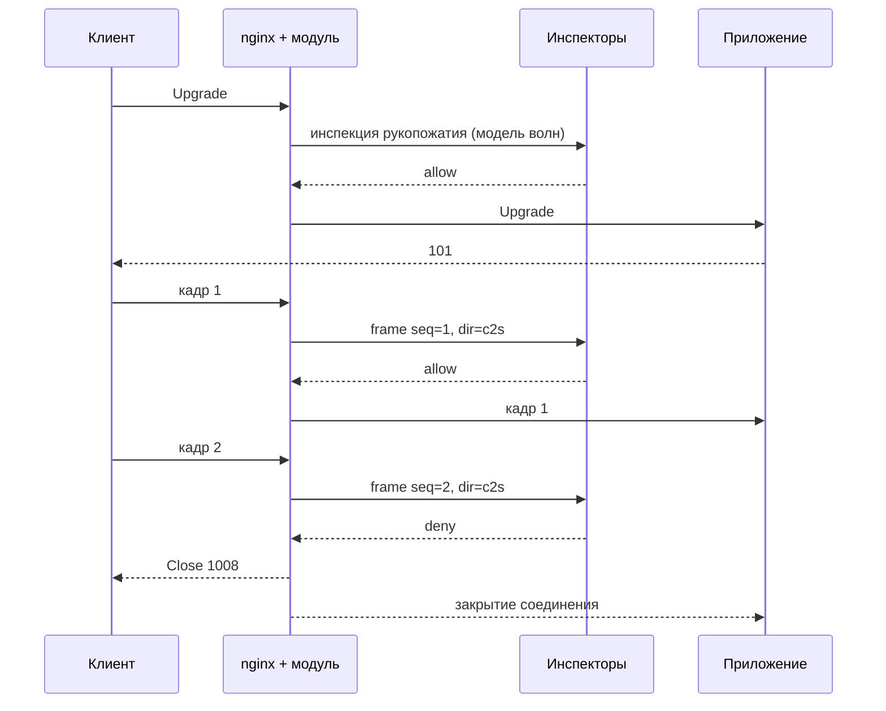

# Кадрированный и долгоживущий трафик

Модель запрос-ответ покрывает обычный HTTP полностью, но у неё есть край: трафик, у которого нет
понятия завершённого тела. WebSocket после апгрейда, стриминговые вызовы gRPC, `text/event-stream` —
это последовательности кадров в долгоживущем соединении, и вердикт для них выносится не один раз, а
непрерывно.

Этот документ описывает, что работает без изменений, что требует отдельной модели, и какой ценой.

## HTTP/2

Работает в основной модели без изменений. nginx терминирует соединение и превращает каждый поток в
отдельный `ngx_http_request_t`, поэтому модуль видит обычные запросы с уже разобранными HPACK
заголовками. Псевдо-заголовки отображаются штатно: `:method` в метод, `:path` в URI и аргументы,
`:authority` в `Host`.

Четыре места требуют внимания.

**Усиление считается по потокам, а не по соединениям.** При `http2_max_concurrent_streams 128` одно
клиентское соединение способно держать сто двадцать восемь одновременных запросов, каждый из которых
порождает полный набор сообщений на шине. Для трёх инспекторов запроса это тысяча сообщений с одного
TCP-соединения.

**Атака rapid reset попадает точно в слабое место схемы.** Клиент открывает поток и немедленно
присылает `RST_STREAM`; мы к этому моменту волну уже опубликовали, а запрос уже финализирован. Отсюда
два требования, оба обязательных: слот ожидания живёт вне `r->pool`, иначе поздний вердикт обращается к
освобождённой памяти; `waf_local_rate` считает опубликованные волны, а не завершённые запросы, иначе
счётчик в принципе не видит тот трафик, от которого защищает.

```nginx
waf_local_rate $binary_remote_addr rate=200r/s burst=400
               count=waves action=block;
```

**Размер тела заранее неизвестен.** DATA-фреймы идут до `END_STREAM`, `Content-Length` может
отсутствовать. Проверка `waf_body_limit` обязана быть потоковой и срабатывать по факту накопленного
объёма, а не по заявленному значению.

**Трейлеры приходят после тела.** К моменту вердикта фазы ответа их ещё не существует. Для обычного
HTTP это несущественно, для gRPC критично, см. ниже.

## HTTP/3

Тоже работает в основной модели, с двумя специфичными для QUIC поправками.

**Ранние данные воспроизводимы.** Запрос из 0-RTT приходит до завершения рукопожатия и по определению
может быть переигран атакующим. Директивы под это у модуля нет (этап 9, HTTP/3); целевое поведение:

Значение по умолчанию различает методы: `GET` и `HEAD` из ранних данных пропускаются, остальные
блокируются, потому что воспроизведение не-идемпотентного запроса имеет последствия.

**Миграция соединения меняет адрес клиента посреди сессии.** Это ломает привязку clearance-токена:
пользователь, чей адрес сменился, получает повторный челлендж на ровном месте. Привязка к подсети
смягчает проблему для мобильных сетей, но при миграции между сетями не помогает. Решение — включать в
токен идентификатор QUIC-соединения там, где он доступен, и считать смену адреса при неизменном
соединении легитимной. Делает это сервис челленджа: токен его, и модуль в него не смотрит — задача
контура лишь в том, чтобы идентификатор доехал до сервиса в сообщении.

## gRPC

Унарные вызовы через `grpc_pass` проходят цепочкой фильтров как обычный запрос, поэтому основная модель
применима. Стриминговые — нет.

### Что нужно добавить для унарных вызовов

**Кадрирование тела.** Тело gRPC — последовательность length-prefixed message: байт флага сжатия,
четыре байта длины в сетевом порядке, полезная нагрузка. Инспектору передаётся разобранная структура,
чтобы он не реализовывал разбор сам:

```json
"grpc": {
  "method": "/orders.OrderService/Create",
  "codec": "proto",
  "compressed": false,
  "messages": [ { "offset": 5, "size": 118 } ]
}
```

**Имя метода.** Без дескрипторов схемы анализ протобуфа бессмыслен, поэтому имя метода из `:path`
передаётся отдельным полем — по нему инспектор выбирает нужный дескриптор.

**Форма отказа.** Блокировка gRPC не может быть HTML-страницей с кодом 403: клиент получит невнятную
ошибку транспорта вместо понятного отказа. Корректный отказ — HTTP 200 с `grpc-status` в трейлерах либо
Trailers-Only ответ. Каталог ответов получает тип записи:

```nginx
waf_deny_response blocked     status=403 page=@waf_blocked;          # http
waf_deny_response grpc_denied type=grpc status=7 "message=blocked by policy";
waf_deny_response grpc_inval  type=grpc status=3 "message=invalid argument";
```

Коды соответствуют `grpc-status`: 7 это `PERMISSION_DENIED`, 3 это `INVALID_ARGUMENT`, 8 это
`RESOURCE_EXHAUSTED`. Модуль выбирает запись по типу маршрута автоматически, если инспектор прислал
имя записи неподходящего типа, и пишет об этом в аудит.

**Статус в трейлерах.** `upstream_status` равный 200 не говорит об успехе вызова: ошибка живёт в
`grpc-status`. Для аудита это отдельное поле, и добавляется точка чтения трейлеров после вердикта фазы
ответа. Инспектировать трейлеры в первой версии не требуется, но фиксировать в аудите — обязательно,
иначе статистика по ошибкам приложения не имеет смысла.

**gRPC-Web** использует другое кадрирование и в некоторых режимах base64. Он распознаётся по
`Content-Type` и передаётся инспектору с пометкой, но разбор остаётся на инспекторе.

### Стриминговые вызовы

Server-streaming, client-streaming и bidi не имеют завершённого тела и обрабатываются моделью кадров,
описанной ниже. Единица инспекции — одно length-prefixed message.

## WebSocket

После апгрейда HTTP-семантики не существует, а nginx копирует байты через
`ngx_http_upstream_process_upgraded`, минуя цепочку фильтров. Точка подключения есть на один вызов
раньше: `ngx_http_upstream_upgrade` сначала расставляет обработчики событий обеих сторон, а потом
гонит через фильтры тела пустой буфер с flush. Модуль ловит этот буфер, подменяет четыре обработчика
своими и с этого момента копирует байты сам — `src/stream/ngx_http_waf_frame.c`.

**Состояние (вторая итерация, 04.09.2026).** Работают обе стороны в режиме `gate`: каждый кадр
данных лежит в буфере своего направления до вердикта, инспекторы `waf_inspect frame:c2s`,
`frame:s2c` либо `frame` (обе стороны одной строкой) спрашиваются через ту же машину слотов, что на
запросе и ответе, `deny` и порог `waf_score_deny frame` закрывают соединение кадром Close с кодом
из записи каталога `type=websocket` (иначе 1008 с кодом причины). Один кадр в полёте на
соединение — на оба направления вместе: пока кадр одной стороны ждёт вердикта, кадры другой копятся
в её буфере не разобранными. Полезная нагрузка едет инспектору локатором обменника, как тело; контекст
рукопожатия — секциями `conn`, `http`, `request_store`. Секция `rewrite` реплая подменяет полезную нагрузку кадра: инспектор кладёт объект под ключ
`<node>:<rid>:frm:<суффикс>`, модуль поднимает его и собирает кадр заново с тем же опкодом и fin
(у `c2s` — с маской оригинала), кадр за кадром.

Кадры судят и правят четыре инспектора: modsec (кадр как поле формы, CRS по содержимому), json
(схема по типу сообщения, [inspectors/json/README.md](https://github.com/exemt/placitum-json/blob/develop/docs/README.md#кадры-websocket)),
counter (секция `frame` профиля: учёт и суд на одном кадре, селекторы — сторона и опкод, ось `conn`
на соединение, [inspectors/counter/README.md](https://github.com/exemt/placitum-counter/blob/develop/docs/README.md#кадры-websocket)) и
rewrite (кадровые группы `on: frame` с условиями по стороне и опкоду,
[inspectors/rewrite/README.md](../inspectors/rewrite/README.md#кадры-websocket)). Контроллер печатает
сторону у каждого вызова (`stream` строки набора), бюджет и порог словом `frame` на обе стороны,
снимок и предел тела — как записаны (`frame:c2s`, `frame:s2c`, `frame`); каталог знает фазу у всех
четырёх (миграции 077 и 078); панель ведёт сторону в секции инспекторов маршрута, обе стороны в
таблице снимка, кадровые группы в карточке rewrite и секцию «Кадры WebSocket» в карточке counter.
Проверяется прогоном [nginx/tests/ws](nginx/tests/websocket.md) с настоящими инспекторами.

Чего во второй итерации нет, и что конфигурация об этом говорит:

- `waf_hold frame monitor` — `nginx -t`: несколько кадров в полёте на соединение машина слотов не
  держит; вместе с этим нет и параллельной инспекции двух сторон — общий RTT-потолок на оба
  направления;
- сборки фрагментов нет: единица инспекции — кадр как пришёл, сигнатуру между `fin=false` и
  `continuation` резать можно, а подмена через границу фрагментов не совпадёт;
- контрольные кадры идут мимо без ограничителя частоты, кадры с rsv-битами (согласованное
  расширение) — мимо с одним предупреждением на соединение, `waf_ws_strip_extensions` ещё нет;
- кадр крупнее `waf_body_limit frame` при `block` закрывает соединение кодом 1009, при `pass` и
  `trim` идёт мимо инспекции целиком;
- аудит — запись агенту на кадр (`phase=frame`, по политике `waf_audit_frames`: `deny` — кадр с
  отказом, подменой или счётом; `all [sample=]` — каждый спрошенный) и запись на соединение при
  закрытии (`phase=session`); всё соединение под ray рукопожатия, кадр адресуется стороной и
  номером; см. `docs/audit.md`;
- канал действий между кадрами не переносится: просьбы соседей живут в пуле кадра и умирают с ним;
  внутри кадра он работает — `mutate` от соседа первой волны включает группу rewrite второй.

Остальное здесь — целевая модель, к которой первая итерация ведёт. Язык директив заложен тем же
кругом, что фаза ответа — [directives/plan-phases.md](directives/plan-phases.md).

### Рукопожатие инспектируется всегда

Запрос апгрейда — обычный HTTP-запрос, и он проходит полную модель волн: адрес, `Origin`, путь,
авторизация, капча. Это работает уже в базовой версии и покрывает существенную часть угроз.

Два приёма на этапе рукопожатия стоит применять всегда.

**Снятие сжатия.** Расширение `permessage-deflate` означает, что кадры придут сжатыми, и для инспекции
их придётся распаковывать — с лимитами, счётчиками и поверхностью декомпрессионной бомбы внутри
воркера. Гораздо дешевле не согласовать расширение: модуль убирает `permessage-deflate` из
`Sec-WebSocket-Extensions` в запросе, и дальше всё соединение работает в открытом виде. Работает
со второй итерации; контроллер печатает его на каждом websocket-пути сам.

```nginx
waf_ws_strip_extensions permessage-deflate;
```

**Только апгрейд.** Путь, объявленный под WebSocket (`protocol: websocket` в панели), обычный GET
получать не должен: фазы ответа у него нет, и проксировать непроверенный ответ нечем.
`waf_require_upgrade on response=upgrade_required` отказывает такому запросу локальным слоем
(426), до шины не доходя; контроллер печатает и это сам.

Цена — рост трафика на соединениях, где сжатие давало выигрыш. Для чатоподобной нагрузки с короткими
сообщениями выигрыш обычно и так невелик.

**Фиксация подпротокола.** `Sec-WebSocket-Protocol` определяет, как интерпретировать содержимое кадров.
Инспектор должен получать это значение, а неизвестные подпротоколы разумно отклонять на рукопожатии,
а не пытаться разобрать потом.

## Модель кадров

Единица инспекции — кадр: сообщение WebSocket, length-prefixed message gRPC, событие SSE. Вердикт
выносится по каждому в отдельности.



### Идентификация

`rid` у кадра есть, и это не идентичность запроса: в модуле `rid` — индекс слота ожидания и его
поколение, то есть транспортная корреляция вердикта с ожиданием. Кадр берёт обычный слот, поэтому
маршрутизация ответов, circuit breaker, дедлайны и аудит работают без второй таблицы ожидания.
Идентичность для инспектора — пара `conn_id` и `seq`:

```json
{
  "v": 1,
  "phase": "frame",
  "conn_id": "edge-07.4711.a1b2c3.0000012f",
  "seq": 42,
  "inspector": "ws_rules",
  "deadline_ms": 5,
  "stream": {
    "protocol": "websocket",
    "direction": "c2s",
    "opcode": "text",
    "fin": true,
    "subprotocol": "chat.v2"
  },
  "store": { "headers": null, "args": null,
             "body": { "store": "hot", "driver": "redis", "key": "w7:3f2a9c1e00000017:frm",
                       "size": 118, "sha256": "…", "complete": true, "truncated": false } },
  "conn": { "client_ip": "203.0.113.42", "client_port": 51544 },
  "http": { "method": "GET", "host": "app.example.com", "uri": "/ws/chat" },
  "request_store": { "headers": { "store": "hot", "key": "w7:3f2a9c1e00000017:req:hdr" } }
}
```

`conn_id` — ray рукопожатия: он уникален в контуре, он уже в аудите фазы запроса, и по нему кадры
склеиваются с рукопожатием без второго идентификатора. `ray` кадра равен ему — соединение это
один запрос, и все его записи (рукопожатие, кадры, сессия) лежат под одним ray; кадр внутри
адресуется `stream.direction` и `seq`. Свой у кадра только `rid` (слот на кадр); `seq` считает
кадры своего направления, включая контрольные и пропущенные мимо инспекции.

Контекст рукопожатия не копируется в каждый кадр: после апгрейда `ngx_http_request_t` жив, поэтому
`conn`, `http` и `request_store` заполняются из него так же, как на фазе запроса, а заголовки
рукопожатия остаются одним объектом в обменнике. Инспектор по-прежнему не хранит состояния по
соединениям и масштабируется очередью. Цена — `waf_store ttl=` обязан покрывать жизнь соединения,
иначе объекты рукопожатия станут `unavailable` посреди сессии.

Полезная нагрузка едет так же, как тело на других фазах — локатором обменника под ключом
`<node>:<rid>:frm`, снятым по `waf_capture frame:c2s body=`. Для режима `gate` это существенно —
поход в Redis на каждый кадр удваивает и без того ограниченный RTT потолок пропускной
способности.

### Вердикт по кадру

Допустимы `allow`, `score` и `deny`. Вердикт `redirect` в модели кадров смысла не имеет и запрещён:
перенаправлять некого — соединение уже установлено и апгрейд состоялся.

Счёт накапливается в пределах одного кадра по инспекторам его направления и сравнивается с
`waf_score_deny frame:<dir>`. На следующем кадре он обнуляется: единицей решения остаётся кадр, и
переносить подозрительность с предыдущих сообщений значило бы хранить состояние по соединениям —
ровно то, от чего избавляет передача контекста рукопожатия в каждом кадре.

Накопление «подозрительности сессии» — осмысленная задача, но она решается не здесь. Инспектор
кадров волен вести собственное состояние по `conn_id` и повышать свою оценку сам; модуль в этом не
участвует.

### Режимы

```nginx
waf_hold frame|frame:c2s|frame:s2c gate|monitor;
```

**Gate** — кадр удерживается до вердикта и уходит дальше только по `allow`. Значение по умолчанию.
Гарантирует, что ни один непроверенный байт не дошёл до приложения или до клиента.

Цена жёсткая, и её нужно понимать до включения. Порядок кадров обязан сохраняться, поэтому в пределах
одного направления одного соединения выносится не более одного вердикта одновременно. Это ограничивает
пропускную способность соединения величиной, обратной времени round-trip: при RTT в полмиллисекунды это
примерно две тысячи сообщений в секунду на направление. Для чата или панели управления запас
десятикратный, для рыночных данных или телеметрии режим неприменим.

**Monitor** — кадр уходит немедленно, инспекция идёт параллельно, при `deny` соединение закрывается.
Латентность не добавляется, пропускная способность не ограничена. Плата в том, что кадр с вердиктом
`deny` уже доставлен: защита работает как «прекратить сессию», а не «не пропустить сообщение».

Выбор осмысленно делать по направлению, а не по соединению целиком: от клиента к приложению обычно
низкая частота и `gate` уместен, от приложения к клиенту частота может быть высокой.

```nginx
location /ws/ {
    waf_inspect  frame:c2s ws_rules   wave=0;
    waf_inspect  frame:c2s ws_schema  wave=0;
    waf_inspect  frame:s2c dlp_frames wave=0;
    waf_hold     frame:c2s gate;
    waf_hold     frame:s2c monitor;
    waf_deadline frame     5ms block;
}
```

Своего словаря у кадров нет: направление — часть первого слова фазы, остальное пишется теми же
семьями, что запрос и ответ. Что не обобщается — механика RFC 6455 — в
[directives/list/frame.md](directives/list/frame.md).

### Формы отказа по протоколам

Закрытие соединения выглядит по-разному, и неправильная форма отказа для клиента неотличима от сетевой
ошибки.

| Протокол | Действие при deny |
| --- | --- |
| WebSocket | Кадр Close с кодом из каталога (1008 policy violation, 1003 unsupported data), затем закрытие TCP |
| gRPC streaming | Трейлеры с `grpc-status` из каталога, затем `RST_STREAM` |
| SSE | Событие с настраиваемым типом, затем закрытие; либо просто закрытие |
| HTTP/2 поток до отправки заголовков | Полноценный HTTP-ответ отказа |
| HTTP/2 поток после отправки заголовков | `RST_STREAM` с кодом `CANCEL` |

```nginx
waf_deny_response ws_policy  type=websocket code=1008 "reason=policy violation";
waf_deny_response ws_baddata type=websocket code=1003 "reason=unsupported data";
```

### Фрагментация и сборка сообщений

Сообщение WebSocket может быть разбито на кадры: первый с `fin=false`, продолжения с опкодом
`continuation`. Анализ отдельного фрагмента почти всегда бессмыслен — полезная нагрузка разрезана
произвольно, и атакующий может резать её специально, чтобы разнести сигнатуру по кадрам.

```nginx
waf_frame_reassemble on;
waf_body_limit frame 256k block;
```

При включённой сборке инспектируется собранное сообщение, а не фрагменты. Ограничение обязательно:
без него клиент бесконечной последовательностью фрагментов с `fin=false` исчерпывает память.
Потолок сборки и политика на превышение — `waf_body_limit` фазы кадров, отдельной директивы для
этого не нужно.

Собирается сообщение в том же буфере направления на месте: заголовки продолжений выбрасываются,
нагрузка подклеивается к первому фрагменту, и получателю сообщение уходит одним кадром — RFC 6455
(5.4) разрешает посреднику склеивать фрагменты. Памяти сборка не добавляет, а контрольные кадры
между фрагментами уходят вперёд сообщения сразу. Умолчание `off`: склейка меняет провод, и
приложение, которому важны границы фрагментов, включать её не должно.

Для gRPC аналогичная ситуация с length-prefixed message, разрезанным между DATA-фреймами: сборка до
границы сообщения обязательна, потому что граница определена протоколом.

### Контрольные кадры

Ping, pong и close по умолчанию не инспектируются: содержимого в них нет, а сообщений на шине они
добавляют столько же. При этом их частота — сама по себе вектор атаки, поэтому она ограничивается
локально:

```nginx
waf_frame_control_rate 10r/s;
```

Корзина на направление соединения, всплеск — секунда частоты; ping или pong сверх неё не
пересылается, соединение живёт, отброшенные считаются в записи сессии. Close не ограничивается.

### Локальный слой для кадров

Всё, что сказано про усиление в основной модели, для кадров умножается на частоту сообщений, а не на
частоту запросов. Сто тысяч соединений с одним сообщением в секунду при двух инспекторах дают
четыреста тысяч сообщений в секунду на шине — и это спокойный режим, без атаки.

Поэтому локальные проверки до публикации обязательны и дают больший эффект, чем в основной модели:

```nginx
waf_body_limit frame 64k block;        # отсечение по размеру без обращения к шине
waf_local_rate $waf_conn_id rate=50r/s count=frames action=block;
waf_local_dataset ws_opcodes type=string limit=8 internal;
waf_local_dataset ws_opcodes text;
waf_local_dataset ws_opcodes binary;
waf_local_check   ws_opcodes $waf_frame_opcode action=wave;   # прочие опкоды не идут дальше
waf_frame_sample  1.0;                 # доля кадров, уходящих на инспекцию
```

`waf_frame_sample` в режиме `monitor` — практичный компромисс для высокочастотных потоков: инспектируется
доля кадров, а найденное нарушение закрывает соединение целиком, что для сессионной защиты часто
достаточно. В режиме `gate` доля меньше `1.0` — `nginx -t`: это дыра в покрытии под видом настройки.

Локальный слой бежит на каждом спрошенном кадре теми же строками, что на рукопожатии: проверки
по наборам — все (бан адреса действует и на живую сессию), лимиты — только с `count=frames`,
ключ «на соединение» — `$waf_conn_id`. Отказ закрывает соединение записью `response=`.

### Кеш вердикта

Кадры повторяются: heartbeat подпротокола, служебные приветствия, одно сообщение приложения
тысяче клиентов по `s2c`. `waf_frame_cache frame[:dir] ttl=` запоминает чистый `allow` настоящей
инспекции по хешу нагрузки, маршруту и стороне, и тот же кадр шину больше не видит. Кладётся
только `allow` без счёта, подмены, правок и просьб; `deny` не кешируется; инспектор, судящий не
по содержимому, запрещает кеш реплаем (`"cache": false`). Таблица в `waf_shm_zone`, общая для
воркеров узла. Подробности — [directives/list/frame.md](directives/list/frame.md#waf_frame_cache).

### Аудит кадров

Событие на каждый кадр по объёму сопоставимо с самим трафиком, поэтому по умолчанию (`waf_audit_frames
deny`) пишутся только кадры, у которых есть что сказать — отказ, подмена, счёт, — и одна запись на
соединение при его закрытии (`phase=session`): кадры и байты по направлениям, отказы, подмены, код и
причина закрытия, длительность. Полный аудит (`all`, при желании `sample=n`) включается отдельно и
только для узкого набора маршрутов. Состав записей — `docs/audit.md`, «Кадры».

```nginx
waf_audit_frames off | aggregate | full;
```

## Что не покрывается

Инспекция кадров не даёт транзакционной защиты: как и на фазе ответа, к моменту блокировки приложение
уже могло выполнить действие по предыдущим сообщениям.

Двоичные подпротоколы без схемы инспектируются в той же мере, в какой инспектируется протобуф без
дескрипторов, то есть почти никак. Осмысленная проверка требует, чтобы инспектор знал формат.

Соединения, установленные до включения инспекции, продолжают работать без неё. При `reload` уже
апгрейженные соединения остаются на старых воркерах со старой конфигурацией до своего закрытия.
